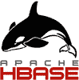

# HBase 数据库入门教程

> 原文：[`c.biancheng.net/hbase/`](http://c.biancheng.net/hbase/)

HBase 是一个开源的、分布式的、版本化的 NoSQL 数据库（也即非关系型数据库），它利用 Hadoop 分布式文件系统（Hadoop Distributed File System，HDFS）提供分布式数据存储。

与传统的关系型数据库类似，HBase 也以表的形式组织数据，表也由行和列组成；不同的是，HBase 有列族的概念，它将一列或者多列组织在一起，HBase 的每一个列都必须属于某个列族。

这套 HBase 入门教程重点讲解大数据场景下的分布式 NoSQL 数据库，所以对 HBase 的单机版或者本地模式没有过多讨论。

学习完本教程，你将了解：

*   HBase 的发展历史和基本特性；
*   HBase 的安装和部署；
*   HBase 的核心模块、数据模型和底层原理；
*   HBase Shell 客户端的使用；
*   如何使用 Java 和 Python 来操作 HBase；
*   HBase 的集群化管理。