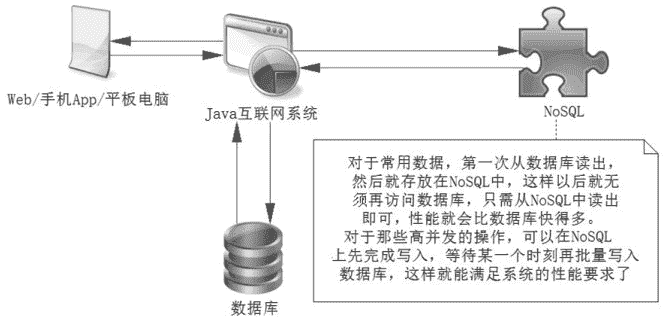

# Redis 是什么？它的优点有哪些？

> 原文：[`c.biancheng.net/view/4504.html`](http://c.biancheng.net/view/4504.html)

Redis 是当前互联网世界最为流行的 NoSQL（Not Only SQL）数据库。NoSQL 在互联网系统中的作用很大，因为它可以在很大程度上提高互联网系统的性能。

Redis 具备一定持久层的功能，也可以作为一种缓存工具。对于 NoSQL 数据库而言，作为持久层，它存储的数据是半结构化的，这就意味着计算机在读入内存中有更少的规则，读入速度更快。

对于那些结构化、多范式规则的数据库系统而言，它更具性能优势。作为缓存，它可以支持大数据存入内存中，只要命中率高，它就能快速响应，因为在内存中的数据读/写比数据库读/写磁盘的速度快几十到上百倍，其作用如图 1 所示。

图 1  NoSQL 的作用
目前 NoSQL 有很多争议，有些人认为它可以取代数据库，而笔者却不这么认为。

因为数据库系统有更好的规范性和数据完整性，功能更强大，作为持久层更为完善，安全性更高。而 NoSQL 结构松散、不完整，功能有限，目前尚不具备取代数据库的实力，但是作为缓存工具，它的高性能、高响应等功能，使它成为一个很重要的工具。

当前 Redis 已经成为了主要的 NoSQL 工具，其原因如下。

#### 1）响应快速

Redis 响应非常快，每秒可以执行大约 110 000 个写入操作，或者 81 000 个读操作，其速度远超数据库。如果存入一些常用的数据，就能有效提高系统的性能。

#### 2）支持 6 种数据类型

它们是字符串、哈希结构、列表、集合、可排序集合和基数。比如对于字符串可以存入一些 Java 基础数据类型，哈希可以存储对象，列表可以存储 List 对象等。这使得在应用中很容易根据自己的需要选择存储的数据类型，方便开发。

对于 Redis 而言，虽然只有 6 种数据类型，但是有两大好处：一方面可以满足存储各种数据结构体的需要；另外一方面数据类型少，使得规则就少，需要的判断和逻辑就少，这样读/写的速度就更快。

#### 3）操作都是原子的

所有 Redis 的操作都是原子的，从而确保当两个客户同时访问 Redis 服务器时，得到的是更新后的值（最新值）。在需要高并发的场合可以考虑使用 Redis 的事务，处理一些需要锁的业务。

#### 4）MultiUtility 工具

Redis 可以在如缓存、消息传递队列中使用（Redis 支持“发布+订阅”的消息模式），在应用程序如 Web 应用程序会话、网站页面点击数等任何短暂的数据中使用。

正是因为 Redis 具备这些优点，使得它成为了目前主流的 NoSQL 技术，在 Java 互联网中得到了广泛使用。

一方面，使用 NoSQL 从数据库中读取数据进行缓存，就可以从内存中读取数据了，而不像数据库一样读磁盘。现实是读操作远比写操作要多得多，所以缓存很多常用的数据，提高其命中率有助于整体性能的提高，并且能减缓数据库的压力，对互联网系统架构是十分有利的。

另一方面，它也能满足互联网高并发需要高速处理数据的场合，比如抢红包、商品秒杀等场景，这些场合需要高速处理，并保证并发数据安全和一致性。