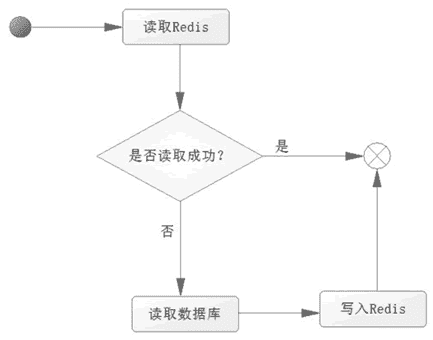
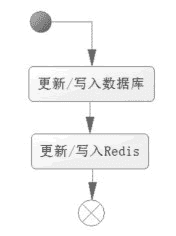
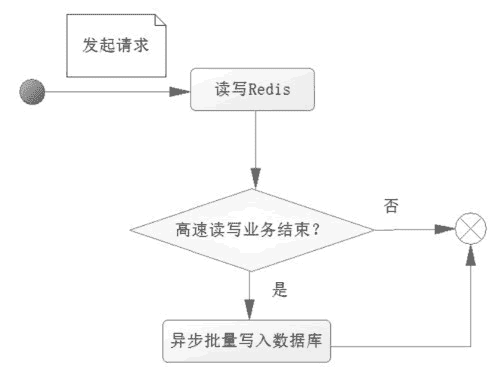

# Redis 在 Java Web 中的应用

> 原文：[`c.biancheng.net/view/4505.html`](http://c.biancheng.net/view/4505.html)

一般而言 Redis 在 Java Web 应用中存在两个主要的场景，一个是缓存常用的数据，另一个是在需要高速读/写的场合使用它快速读/写，比如一些需要进行商品抢购和抢红包的场合。

由于在高并发的情况下，需要对数据进行高速读/写的场景，一个最为核心的问题是数据一致性和访问控制。

## 缓存

在对数据库的读/写操作中，现实的情况是读操作的次数远超写操作，一般是 1:9 到 3:7 的比例，所以需要读的可能性是比写的可能性多得多。

当发送 SQL 去数据库进行读取时，数据库就会去磁盘把对应的数据索引回来，而索引磁盘是一个相对缓慢的过程。如果把数据直接放在运行在内存中的 Redis 服务器上，那么不需要去读/写磁盘了，而是直接读取内存，显然速度会快得多，并且会极大减轻数据库的压力。

而使用内存进行存储数据开销也是比较大的，因为磁盘可以是 TGB 级别，而且十分廉价，内存一般是几百个 GB 就相当了不起了，所以内存虽然高效但空间有限，价格也比磁盘高许多，因此使用内存代价较高，并不是想存什么就存什么，因此我们应该考虑有条件的存储数据。

一般而言，存储一些常用的数据，比如用户登录的信息；一些主要的业务信息，比如银行会存储一些客户基础信息、银行卡信息、最近交易信息等。一般而言在使用 Redis 存储的时候，需要从 3 个方面进行考虑。

1.  业务数据常用吗？命中率如何？如果命中率很低，就没有必要写入缓存。
2.  该业务数据是读操作多，还是写操作多，如果写操作多，频繁需要写入数据库，也没有必要使用缓存。
3.  业务数据大小如何？如果要存储几百兆字节的文件，会给缓存带来很大的压力，有没有必要？

在考虑过这些问题后，如果觉得有必要使用缓存，那么就使用它。使用 Redis 作为缓存的读取逻辑如图 1 所示。

图 1  Redis 的缓存应用
从图 1 中可以知道以下两点。

*   当第一次读取数据的时候，读取 Redis 的数据就会失败，此时会触发程序读取数据库，把数据读取出来，并且写入 Redis。
*   当第二次及以后读取数据时，就直接读取 Redis，读到数据后就结束了流程，这样速度就大大提高了。

从上面的分析可知，大部分的操作是读操作，使用 Redis 应对读操作，速度就会十分迅速，同时也降低了对数据库的依赖，大大降低了数据库的负担。

分析了读操作的逻辑后，下面再来分析写操作的流程，如图 2 所示。

图 2  写操作的流程
从流程可以看出，更新或者写入的操作，需要多个 Redis 的操作。如果业务数据写次数远大于读次数没有必要使用 Redis。如果是读次数远大于写次数，则使用 Redis 就有其价值了，因为写入 Redis 虽然要消耗一定的代价，但是其性能良好，相对数据库而言，几乎可以忽略不计。

## 高速读/写场合

在互联网的应用中，往往存在一些需要高速读/写的场合，比如商品的秒杀，抢红包，淘宝、京东的双十一活动或者春运抢票等。

以上这类场合在一个瞬间成千上万的请求就会达到服务器，如果使用的是数据库，一个瞬间数据库就需要执行成千上万的 SQL，很容易造成数据库的瓶颈，严重的会导致数据库瘫痪，造成 Java Web 系统服务崩溃。

在这样的场合的应对办法往往是考虑异步写入数据库，而在高速读/写的场合中单单使用 Redis 去应对，把这些需要高速读/写的数据，缓存到 Redis 中，而在满足一定的条件下，触发这些缓存的数据写入数据库中。先看看一次请求操作的流程图，如图 3 所示。

图 3  Redis 在高速读/写场合的应用
进一步论述这个过程：

当一个请求达到服务器，只是把业务数据先在 Redis 读/写，而没有进行任何对数据库的操作，换句话说系统仅仅是操作 Redis 缓存，而没有操作数据库，这个速度就比操作数据库要快得多，从而达到需要高速响应的效果。

但是一般缓存不能持久化，或者所持久化的数据不太规范，因此需要把这些数据存入数据库，所以在一个请求操作完 Redis 的读/写后，会去判断该高速读/写的业务是否结束。

这个判断的条件往往就是秒杀商品剩余个数为 0，抢红包金额为 0，如果不成立，则不会操作数据库；如果成立，则触发事件将 Redis 缓存的数据以批量的形式一次性写入数据库，从而完成持久化的工作。

假设面对的是一个商品秒杀的场景，从上面的流程看，一个用户抢购商品，绝大部分的场合都是在操作内存数据库 Redis，而不是磁盘数据库，所以其性能更为优越。只有在商品被抢购一空后才会触发系统把 Redis 缓存的数据写入数据库磁盘中，这样系统大部分的操作基于内存，就能够在秒杀的场合高速响应用户的请求，达到快速应答。

而现实中这种需要高速响应的系统会比上面的分析更复杂，因为这里没有讨论高并发下的数据安全和一致性问题，没有讨论有效请求和无效请求、事务一致性等诸多问题，这些将会在未来以独立教程讨论它。