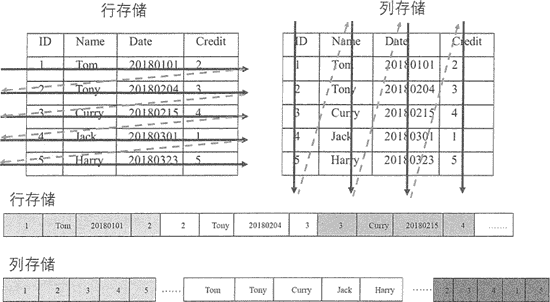

# HBase 的优势有哪些？

> 原文：[`c.biancheng.net/view/6500.html`](http://c.biancheng.net/view/6500.html)

HBase 是典型的 NoSQL 数据库，通常被描述成稀疏的、分布式的、持久化的，由行键、列键和时间戳进行索引的多维有序映射数据库，主要用来存储非结构化和半结构化的数据。因为 HBase 基于 Hadoop 的 HDFS 完成分布式存储，以及 MapReduce 完成分布式并行计算，所以它的一些特点与 Hadoop 相同，依靠横向扩展，通过不断增加性价比高的商业服务器来增加计算和存储能力。

HBase 虽然基于 Bigtable 的开源实现，但它们之间还是有很多差别的，Bigtable 经常被描述成键值数据库，而 HBase 则是面向列存储的分布式数据库。

下面介绍 HBase 具备的显著特性，这些特性让 HBase 成为当前和未来最实用的数据库之一。

## 容量巨大

HBase 的单表可以有百亿行、百万列，可以在横向和纵向两个维度插入数据，具有很大的弹性。

当关系型数据库的单个表的记录在亿级时，查询和写入的性能都会呈现指数级下降，这种庞大的数据量对传统数据库来说是一种灾难，而 HBase 在限定某个列的情况下对于单表存储百亿甚至更多的数据都没有性能问题。

HBase 采用 LSM 树作为内部数据存储结构，这种结构会周期性地将较小文件合并成大文件，以减少对磁盘的访问。

## 列存储

与很多面向行存储的关系型数据库不同，HBase 是面向列的存储和权限控制的，它里面的每个列是单独存储的，且支持基于列的独立检索。通过下图的例子来看行存储与列存储的区别。

从上图可以看到，行存储里的一张表的数据都放在一起，但在列存储里是按照列分开保存的。在这种情况下，进行数据的插入和更新，行存储会相对容易。而进行行存储时，查询操作需要读取所有的数据，列存储则只需要读取相关列，可以大幅降低系统 I/O 吞吐量。

## 稀疏性

通常在传统的关系性数据库中，每一列的数据类型是事先定义好的，会占用固定的内存空间，在此情况下，属性值为空（NULL）的列也需要占用存储空间。

而在 HBase 中的数据都是以字符串形式存储的，为空的列并不占用存储空间，因此 HBase 的列存储解决了数据稀疏性的问题，在很大程度上节省了存储开销。所以 HBase 通常可以设计成稀疏矩阵，同时这种方式比较接近实际的应用场景。

## 扩展性强

HBase 工作在 HDFS 之上，理所当然地支持分布式表，也继承了 HDFS 的可扩展性。HBase 的扩展是横向的，横向扩展是指在扩展时不需要提升服务器本身的性能，只需添加服务器到现有集群即可。

HBase 表根据 Region 大小进行分区，分别存在集群中不同的节点上，当添加新的节点时，集群就重新调整，在新的节点启动 HBase 服务器，动态地实现扩展。这里需要指出，HBase 的扩展是热扩展，即在不停止现有服务的前提下，可以随时添加或者减少节点。

## 高可靠性

HBase 运行在 HDFS 上，HDFS 的多副本存储可以让它在岀现故障时自动恢复，同时 HBase 内部也提供 WAL 和 Replication 机制。

WAL（Write-Ahead-Log）预写日志是在 HBase 服务器处理数据插入和删除的过程中用来记录操作内容的日志，保证了数据写入时不会因集群异常而导致写入数据的丢失；而 Replication 机制是基于日志操作来做数据同步的。

当集群中单个节点出现故障时，协调服务组件 ZooKeeper 通知集群的主节点，将故障节点的 HLog 中的日志信息分发到各从节点进行数据恢复。