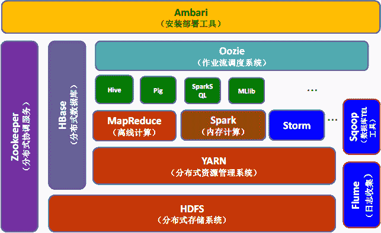

# Hadoop 与 HBase 的关系

> 原文：[`c.biancheng.net/view/6501.html`](http://c.biancheng.net/view/6501.html)

HBase 参考了 Google 公司的 Bigtable 建模，而 Bigtable 是基于 GFS 来完成数据的分布式存储的，因此，HBase 与 HDFS 有非常紧密的关系，它使用 HDFS 作为底层存储系统。虽然 HBase 可以单独运行在本地文件系统上，但这不是 HBase 设计的初衷。

HBase 是在 Hadoop 这种分布式框架中提供持久化的数据存储与管理的工具。在使用 HBase 的分布式集群模式时，前提是必须有 Hadoop 系统。

Hadoop 系统为 HBase 提供给了分布式文件存储系统，同时也使得 MapReduce 组件能够直接访问 HBase 进行分布式计算。

HBase 最重要的访问方式是 Java API（Application Programming Interface，应用程序编程接口），MapReduce 的批量操作方式并不常用。

下图展示了 HBase 在 Hadoop 生态系统中的位置。

图 1：Hadoop 生态系统
本节的知识点都基于 HBase 1.2.6 稳定版本，因为 HBase 底层依赖 Hadoop，所以对 Hadoop 的版本也有要求。

HBase 的官方网站上也发布了每个 Hadoop 版本对 HBase 的支持，如表所示。

Hadoop 版本支持矩阵

| Hadoop 版本 | HBase 1.2.x | HBase 1.3.x | HBase 2.0.x |
| Hadoop 2.4.x | S | S | X |
| Hadoop 2.5.x | S | S | X |
| Hadoop 2.6.0 | X | X | X |
| Hadoop 2.6.1+ | S | S | S |
| Hadoop 2.7.0 | X | X | X |
| Hadoop 2.7.1+ | S | S | S |
| Hadoop 2.8（0~1） | X | X | X |
| Hadoop 2.8.2 | NT | NT | NT |
| Hadoop 2.8.3+ | NT | NT | S |
| Hadoop 2.9.0 | X | X | X |
| Hadoop 3.0.0 | NT | NT | NT |

对符号的说明：

*   S 表示经过测试的，可支持的。
*   X 表示不支持。
*   NT 表示没有经过测试的。

从上表中可以看到 HBase 1.2.6 版本可以运行在 Hadoop 2.4.x、2.5.x、2.6.1+、2.7.1+，再根据 Hadoop 官网上提供的 Hadoop 版本，因此本节选择使用 Hadoop 2.7.6 版本。