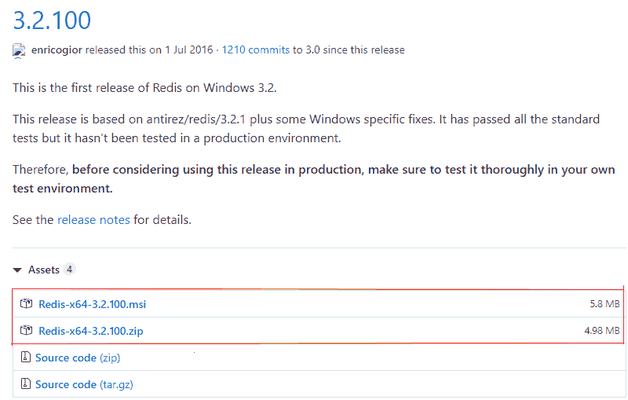
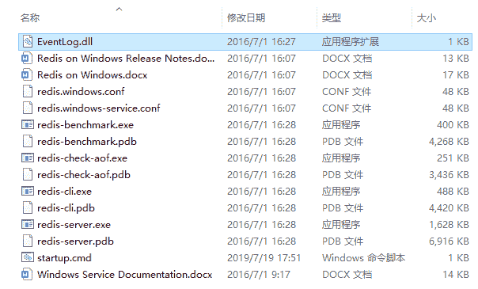
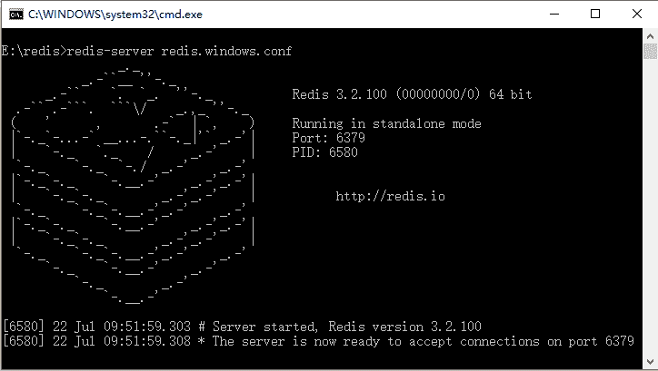
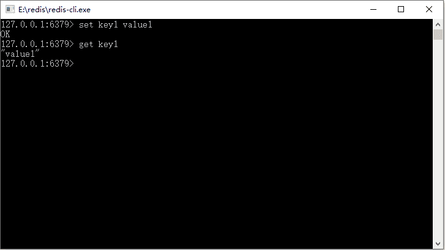

# Redis 基本安装和使用

> 原文：[`c.biancheng.net/view/4506.html`](http://c.biancheng.net/view/4506.html)

安装 Redis 十分简单，为了方便学习可以在 Windows 环境下安装 Redis，当然实际的工作中主要使用 Linux/Unix 系统安装，教程后面会给出安装方法。打开网址 [`github.com/MSOpenTech/redis/releases`](https://github.com/MSOpenTech/redis/releases) 就可以看到图 1 所示界面。

图 1  下载 Redis
把 Redis 的文件下载下来，进行解压缩，于是得到如图 2 所示的目录。

图 2  Redis 目录
为了方便，我们在这个目录新建一个文件 startup.cmd，用记事本或者其他文本编辑工具打开（要是打不开，可以先写入内容在重命名），然后写入以下内容。

redis-server redis.windows.conf

这个命令调用 redis-server.exe 的命令读取 redis.window.conf 的内容，用来启动 redis，保存好了 startup.cmd 文件，双击它就可以看到 Redis 启动的信息了，如图 3 所示。

图 3  启动 Redis 看到图 3 说明 Redis 已经成功启动，这个时候可以双击放在同一个文件夹下的文件 redis-cli.exe，它是一个 Redis 自带的客户端工具，这样就可以连接到 Redis 服务器了，如图 4 所示。

图 4  Redis 命令提示符客户端
这样就安装好了 Redis，并且用它提供的命令提示符客户端可以执行一些我们需要的命令。在学习的环境中使用 Windows 版本会比较方便，本教程也是这样做的。