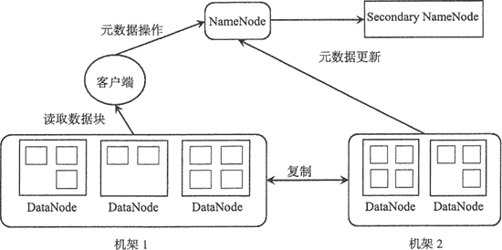
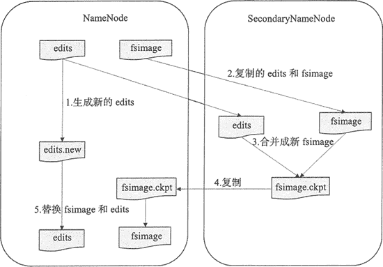
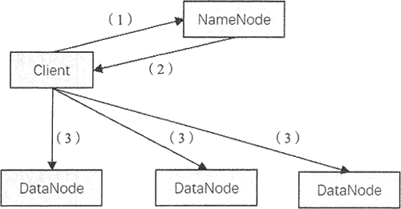
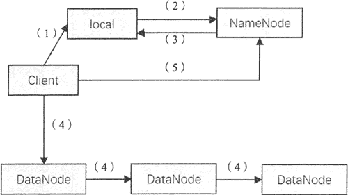

# HDFS 简明入门教程

> 原文：[`c.biancheng.net/view/6502.html`](http://c.biancheng.net/view/6502.html)

本节详细讲解作为 HBase 底层存储的分布式文件系统 HDFS 的原理。

HDFS ( Hadoop Distributed File System）即 Hadoop 分布式文件系统，它的设计目标是把超大数据集存储到集群中的多台普通商用计算机上，并提供高可靠性和高吞吐量的服务。

HDFS 是参考 Google 公司的 GFS 实现的，不管是 Google 公司的计算平台还是 Hadoop 计算平台，都是运行在大量普通商用计算机上的，这些计算机节点很容易出现硬件故障，而这两种计算平台都将硬件故障作为常态，通过软件设计来保证系统的可靠性。

例如，HDFS 的数据是分块地存储在每个节点上，当某个节点出现 故障时，HDFS 相关组件能快速检测节点故障并提供容错机制完成数据的自动恢复。

## HDFS 的基本架构

HDFS 主要由 3 个组件构成，分别是 NameNode、SecondaryNameNode 和 DataNode。

HDFS 是以 Master/Slave 模式运行的，其中，NameNode 和 SecondaryNameNode 运行在 Master 节点 上，而 DataNode 运行在 Slave 节点上，所以 HDFS 集群一般由一个 NameNode、一个 SecondaryNameNode 和许多 DataNode 组成，其架构如下图所示。

在 HDFS 中，文件是被分成块来进行存储的，一个文件可以包含许多个块，每个块存储在不同的 DataNode 中。从上图中可知，当一个客户端请求读取一个文件时，它需要先从 NameNode 中获取文件的元数据信息，然后从对应的数据节点上并行地读取数据块。

下面介绍 HDFS 架构中 NameNode、SecondaryNameNode 和 DataNode 的功能。

#### NameNode

NameNode 是主服务器，负责管理文件系统的命名空间以及客户端对文件的访问。当客户端请求数据时，仅仅从 NameNode 中获取文件的元数据信息，具体的数据传输不经过 NameNode，而是直接与具体的 DataNode 进行交互。

这里文件的元数据信息记录了文件系统中的文件名和目录名，以及它们之间的层级关系，同时也记录了每个文件目录的所有者及其权限，甚至还记录每个文件由哪些块组成，这些元数据信息记录在文件 fsimage 中，当系统初次启动时，NameNode 将读取 fsimage 中的信息并保存到内存中。

这些块的位置信息是由 NameNode 启动后从每个 DataNode 获取并保存在内存当中的，这样既减少了  NameNode 的启动时间，又减少了读取数据的查询时间，提高了整个系统的效率。

#### SecondaryNameNode

从字面上来看，SecondaryNameNode 很容易被当作是 NameNode 的备份节点，其实不然。可以通过下图看 HDFS 中 SecondaryNameNode 的作用。

NameNode 管理着元数据信息，元数据信息会定期保存到 edits 和 fsimage 文件中。其中的 edits 保存操作日志信息，在 HDFS 运行期间，新的操作日志不会立即与 fsimage 进行合并，也不会存到 NameNode 的内存中，而是会先写到 edits 中。

当 edits 文件达到一定域值或间隔一段时间后触发 SecondaryNameNode 进行工作，这个时间点称为 checkpoint。

SecondaryNameNode 的角色就是定期地合并 edits 和 fsimage 文件，其合并步骤如下。

1.  在进行合并之前，SecondaryNameNode 会通知 NameNode 停用当前的 editlog 文件， NameNode 会将新记录写入新的 editlog.new 文件中。
2.  SecondaryNameNode 从 NameNode 请求并复制 fsimage 和 edits 文件。
3.  SecondaryNameNode 把 fsimage 和 edits 文件合并成新的 fsimage 文件，并命名为 fsimage.ckpto
4.  NameNode 从 SecondaryNameNode 获取 fsimage.ckpt，并替换掉 fsimage，同时用 edits.new 文件替换旧的 edits 文件。
5.  更新 checkpoint 的时间。

最终 fsimage 保存的是上一个 checkpoint 的元数据信息，而 edits 保存的是从上个 checkpoint 开始发生的 HDFS 元数据改变的信息。

#### DataNode

DataNode 是 HDFS 中的工作节点，也是从服务器，它负责存储数据块，也负责为客户端提供数据块的读写服务，同时也响应 NameNode 的相关指令，如完成数据块的复制、删除等。

另外， DataNode 会定期发送心跳信息给 NameNode，告知 NameNode 当前节点存储的文件块信息。当客户端给 NameNode 发送读写请求时，NameNode 告知客户端每个数据块所在的 DataNode 信息，然后客户端直接与 DataNode 进行通信，减少 NameNode 的系统开销。

当 DataNode 在执行块存储操作时，DataNode 还会与其他 DataNode 通信，复制这些块到其他 DataNode 上实现冗余。

## HDFS 的分块机制和副本机制

在 HDFS 中，文件最终是以数据块的形式存储的，而副本机制极大程度上避免了宕机所造成的数据丢失，可以在数据读取时进行数据校验。

#### 分块机制

HDFS 中数据块大小默认为 64MB，而一般磁盘块的大小为 512B，HDFS 块之所以这么大，是为了最小化寻址开销。

如果块足够大，从磁盘传输数据的时间会明显大于寻找块的地址的时间，因此，传输一个由多个块组成的大文件的时间取决于磁盘传输速率。

随着新一代磁盘驱动器传输速率的提升，寻址开销会更少，在更多情况下 HDFS 使用更大的块。当然块的大小不是越大越好，因为 Hadoop 中一个 map 任务一次通常只处理一个块中的数据，如果块过大，会导致整体任务数量过小，降低作业处理的速度。

HDFS 按块存储还有如下好处。

1) 文件可以任意大，不会受到单个节点的磁盘容量的限制。理论上讲，HDFS 的存储容量是无限的。

2) 简化文件子系统的设计。将系统的处理对象设置为块，可以简化存储管理，因为块大小固定，所以每个文件分成多少个块，每个 DataNode 能存多少个块，都很容易计算。同时系统中 NameNode 只负责管理文件的元数据，DataNode 只负责数据存储，分工明确，提高了系统的效率。

3) 有利于提高系统的可用性。HDFS 通过数据备份来提供数据的容错能力和高可用性，而按照块的存储方式非常适合数据备份。同时块以副本方式存在多个 DataNode 中，有利于负载均衡，当某个节点处于繁忙状态时，客户端还可以从其他节点获取这个块的副本。

#### 副本机制

HDFS 中数据块的副本数默认为 3，当然可以设置更多的副本数，这些副本分散存储在集群中，副本的分布位置直接影响 HDFS 的可靠性和性能。

一个大型的分布式文件系统都是需要跨多个机架的，如下图中，HDFS 涉及两个机架。

如果把所有副本都存放在不同的机架上，可以防止机架故障从而导致数据块不可用，同时在多个客户端访问文件系统时很容易实现负载均衡。如果是写数据，各个数据块需要同步到不同机架上，会影响写数据的效率。

在 HDFS 默认 3 个副本情况下，会把第一个副本放到机架的一个节点上，第二副本放在同一 个机架的另一个节点上，第三个副本放在不同的机架上。

这种策略减少了跨机架副本的个数，提高了数据块的写性能，也可以保证在一个机架出现故障时，仍然能正常运转。

## HDFS 的读写机制

前面讲到，客户端读、写文件是与 NameNode 和 DataNode 通信的，下面详细介绍 HDFS 中读写文件的过程。

#### 读文件

HDFS 通过 RPC 调用 NameNode 获取文件块的位置信息，并且对每个块返回所在的 DataNode 的地址信息，然后再从 DataNode 获取数据块的副本。

HDFS 读文件的过程如图所示。

操作步骤如下：

1.  客户端发起文件读取的请求。
2.  NameNode 将文件对应的数据块信息及每个块的位置信息，包括每个块的所有副本的位置信息（即每个副本所在的 DataNode 的地址信息）都传送给客户端。
3.  客户端收到数据块信息后，直接和数据块所在的 DataNode 通信，并行地读取数据块。

在客户端获得 NameNode 关于每个数据块的信息后，客户端会根据网络拓扑选择与它最近的 DataNode 来读取每个数据块。当与 DataNode 通信失败时，它会选取另一个较近的 DataNode，同时会对出故障的 DataNode 做标记，避免与它重复通信，并发送 NameNode 故障节点的信息。

#### 写文件

当客户端发送写文件请求时，NameNode 负责通知 DataNode 创建文件，在创建之前会检查客户端是否有允许写入数据的权限。通过检测后，NameNode 会向 edits 文件写入一条创建文件的操作记录。

HDFS 中写文件的过程如图所示。

操作步骤如下：
1) 客户端在向 NameNode 发送写请求之前，先将数据写入本地的临时文件中。

2) 待临时文件块达到系统设置的块大小时，开始向 NameNode 请求写文件。

3) NameNode 在此步骤中会检查集群中每个 DataNode 状态信息，获取空闲的节点，并在检查客户端权限后创建文件，返回客户端一个数据块及其对应 DataNode 的地址列表。列表中包含副本存放的地址。

4) 客户端在获取 DataNode 相关信息后，将临时文件中的数据块写入列表中的第一个 DataNode，同时第一个 DataNode 会将数据以副本的形式传送至第二个 DataNode，第二个节点也会将数据传送至第三个 DataNode。

DataNode 以数据包的形式从客户端接收数据，并以流水线的形式写入和备份到所有的 DataNode 中，每个 DataNode 收到数据后会向前一个节点发送确认信息。 最终数据传输完毕，第一个 DataNode 会向客户端发送确认信息。

5) 当客户端收到每个 DataNode 的确认信息时，表示数据块已经持久化地存储在所有 DataNode 当中，接着客户端会向 NameNode 发送确认信息。如果在第（4 ）步中任何一个 DataNode 失败，客户端会告知 NameNode，将数据备份到新的 DataNode 中。