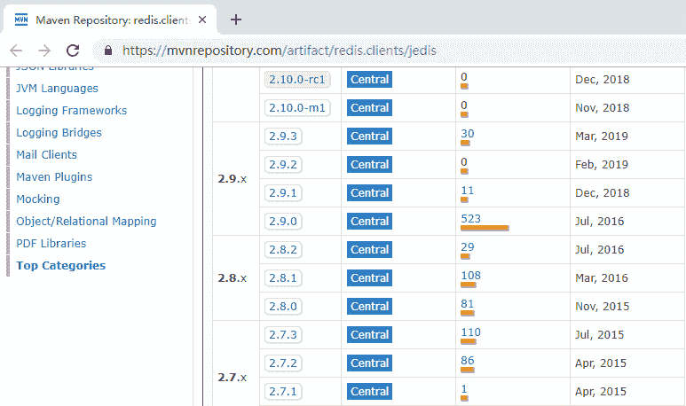
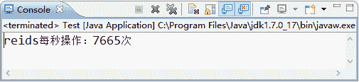

# 在 Java 程序中使用 Redis

> 原文：[`c.biancheng.net/view/4516.html`](http://c.biancheng.net/view/4516.html)

本教程是讨论 Java 互联网技术为主，因此主要论述如何在 Java 中使用 Redis。在 Java 中，可以简易地使用 Redis，或者通过 Spring 的 RedisTemplate 使用 Redis。

为了实际的工作和学习的需要，本教程会以 Spring 的视角为主向读者介绍在 Java 中如何使用 Redis，不过在基础章节会以 XML 方式的配置为主，而在实践章节则会以 Java 的配置为主介绍 Redis，你可以根据需要使用 XML 或者注解来实现你想要的功能。

在 Java 中使用 Redis 工具，要先下载 jedis.Jar 包，把它加载到工程的路径中，所以首先打开网站 [`mvnrepository.com/artifact/redis.clients/jedis`](http://mvnrepository.com/artifact/redis.clients/jedis)，如图 1 所示。


图 1  下载 jedis.jar 把它导入工程路径就可以使用了，可以使用如下代码进行测试：

```

import redis.clients.jedis.Jedis;

public class Test {
    public static void main(String[] args) {
        Jedis jedis = new Jedis("localhost", 6379); // 连接 Redis
        // jedis.auth("password"); //如果需密码
        int i = 0;
        try {
            long start = System.currentTimeMillis(); // 开始毫秒数
            while (true) {
                long end = System.currentTimeMillis();
                if (end - start >= 1000) {
                    // 当大于等于 1000 毫秒（相当于 1 秒）时，结束操作
                    break;
                }
                i++;
                jedis.set("test" + i, i + "");
            }
        } finally {
            // 关闭连接
            jedis.close();
        }
        // 打印 1 秒内对 Redis 的操作次数
        System.out.println("reids 每秒操作：" + i + "次");
    }
}
```

这段代码主要在于测试 Redis 的写入性能，这是笔者使用自己电脑（使用 Windows 操作系统）测试的结果，如图 2 所示。


图 2  运行结果
这里每秒只操作了 7 千多次，而事实上 Redis 的速度比这个操作速度快得多，这里慢是因为我们只是一条条地将命令发送给 Redis 去执行。

如果使用流水线技术它会快得多，将可以达到 10 万次每秒的操作，十分有利于系统性能的提高。注意，这只是一个简单的连接，更多的时候我们会使用连接池去管理它。

Java Redis 的连接池提供了类 redis.clients.jedis.JedisPool 用来创建 Redis 连接池对象。使用这个对象，需要使用类 redis.clients.jedis.JedisPoolConfig 对连接池进行配置，代码如下所示。

```

JedisPoolConfig poolCfg = new JedisPoolConfig();
//最大空闲数
poolCfg.setMaxIdle(50);
//最大连接数
poolCfg.setMaxTotal(100);
//最大等待毫秒数
poolCfg.setMaxWaitMillis(20000);
//使用配置创建连接池
JedisPool pool = new JedisPool (poolCfg, "localhost");
//从连接池中获取单个连接
Jedis jedis = pool.getResource();
//如果需密码
//jedis.auth("password");
```

读者可以从代码中的注释了解每一步骤的含义。使用连接池可以有效管理连接资源的分配。

由于 Redis 只能提供基于字符串型的操作，而在 Java 中使用的却以类对象为主，所以需要 Redis 存储的字符串和 Java 对象相互转换。

如果自己编写这些规则，工作量还是比较大的，比如一个角色对象，我们没有办法直接把对象存入 Redis 中，需要进一步进行转换，所以对操作对象而言，使用 Redis 还是比较难的。

好在 Spring 对这些进行了封装和支持，它提供了序列化的设计框架和一些序列化的类，使用后它可以通过序列化把 Java 对象转换，使得 Redis 能把它存储起来。

并且在读取的时候，再把由序列化过的字符串转化为 Java 对象，这样在 Java 环境中使用 Redis 就更加简单了，所以更多的时候可以使用 Spring 提供的 RedisTemplate 的机制来使用 Redis。