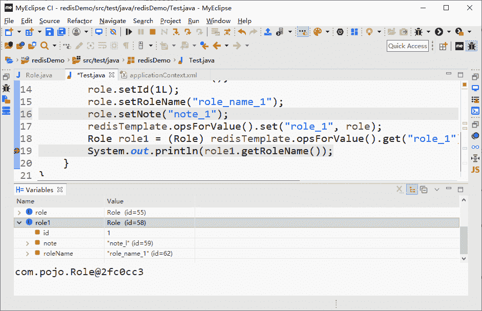

# 在 Spring 中使用 Redis

> 原文：[`c.biancheng.net/view/4507.html`](http://c.biancheng.net/view/4507.html)

在教程《在 Java 程序中使用 Redis》中介绍了在没有封装情况下使用 Java API 的缺点，需要自己编写规则把 Java 对象和 Redis 的字符串进行相互转换，而在 Spring 中这些问题都可以轻松处理。

在 Spring 中使用 Redis，除了需要 jedis.jar 外，还需要下载 spring-data-redis.jar，这里值得注意的是 jar 包和 Spring 版本兼容的问题，笔者使用的 jar 包版本是 1.8.1，而 Spring 的版本是 5.0.4，如果使用其他的版本可能存在不兼容的问题，从而产生异常，这是笔者从实际操作得来的经验。

把下载的 jar 包导入到工程环境中，这样就可以在使用 Spring 提供的 RedisTemplate 操作 Redis 了，只是在使用前，需要对 Spring 提供的方案进行探讨，以便更好地使用它们。

在大部分情况下我们都会用到连接池，于是先用 Spring 配置一个 JedisPoolConfig 对象，这个配置相对而言比较简单，使用 Spring 配置 JedisPoolConfig 对象代码如下所示。

```

<bean id="poolConfig" class="redis.clients.jedis.JedisPoolConfig">
    <!-- 最大空闲数 -->
    <property name="maxIdle" value="50" />
    <!-- 最大连接数 -->
    <property name="maxTotal" value="100" />
    <!-- 最大等待时间 -->
    <property name="maxWaitMillis" value="20000" />
</bean>
```

这样就设置了一个连接池的配置，继续往下配置。

在使用 Spring 提供的 RedisTemplate 之前需要配置 Spring 所提供的连接工厂，在 Spring Data Redis 方案中它提供了 4 种工厂模型。

*   JredisConnectionFactory。
*   JedisConnectionFactory。
*   LettuceConnectionFactory。
*   SrpConnectionFactory。

虽然使用哪种实现工厂都是可以的，但是要根据环境进行测试，以验证使用哪个方案的性能是最佳的。无论如何它们都是接口 RedisConnectionFactory 的实现类，更多的时候我们都是通过接口定义去理解它们，所以它们是具有接口适用性特性的。本教程将以使用最为广泛的 JedisConnectionFactory 为例进行讲解。

例如，在 Spring 中配置一个 JedisConnectionFactory 对象，配置 JedisConnectionFactory 代码如下所示。

```

<bean id="connectionFactory"
    class="org.springframework.data.redis.connection.jedis.JedisConnectionFactory">
    <property name="hostName" value="localhost" />
    <property name="port" value="6379" />
    <!--<property name="password" value="password"/> -->
    <property name="poolConfig" ref="poolConfig" />
</bean>
```

解释一下它的属性配置。

*   hostName，代表的是服务器，默认值是 localhost，所以如果是本机可以不配置它。
*   port，代表的是接口端口，默认值是 6379，所以可以使用默认的 Redis 端口，也可以不配置它。
*   password，代表的是密码，在需要密码连接 Redis 的场合需要配置它。
*   poolConfig，是连接池配置对象，可以设置连接池的属性。

这样就完成了一个 Redis 连接工厂的配置。这里配置的是 JedisConnectionFactory，如果需要的是 LettuceConnectionFactory，可以把使用 Spring 配置 JedisPoolConfig 对象代码中的 Bean 元素的 class 属性修改为 org.springframework.data.redis.connection.lettuce.LettuceConnectionFactor 即可，这取决于项目的需要和特殊性。有了 RedisConnectionFactory 工厂，就可以使用 RedisTemplate 了。

普通的连接使用没有办法把 Java 对象直接存入 Redis，而需要我们自己提供方案，这时往往就是将对象序列化，然后使用 Redis 进行存储，而取回序列化的内容后，在通过转换转变为 Java 对象，Spring 模板中提供了封装的方案，在它内部提供了 RedisSerializer 接口（org.springframework.data.redis.serializer.RedisSerializer）和一些实现类，其原理如图 1 所示。
图 1  Spring 序列化器
可以选择 Spring 提供的方案去处理序列化，当然也可以去实现在 spring data redis 中定义的 RedisSerializer 接口，在 Spring 中提供了以下几种实现 RedisSerializer 接口的序列化器。

*   GenericJackson2JsonRedisSerializer，通用的使用 Json2.jar 的包，将 Redis 对象的序列化器。
*   Jackson2JsonRedisSerializer<T>，通过 Jackson2.jar 包提供的序列化进行转换（由于版本太旧，Spring 不推荐使用）。
*   JdkSerializationRedisSerializer<T>，使用 JDK 的序列化器进行转化。
*   OxmSerializer，使用 Spring O/X 对象 Object 和 XML 相互转换。
*   StringRedisSerializer，使用字符串进行序列化。
*   GenericToStringSerializer，通过通用的字符串序列化进行相互转换。

使用它们就能够帮助我们把对象通过序列化存储到 Redis 中，也可以把 Redis 存储的内容转换为 Java 对象，为此 Spring 提供的 RedisTemplate 还有两个属性。

*   keySerializer——键序列器。
*   valueSerializer——值序列器。

有了上面的了解，就可以配置 RedisTemplate 了。假设选用 StringRedisSerializer 作为 Redis 的 key 的序列化器，而使用 JdkSerializationRedisSerializer 作为其 value 的序列化器，则可以以下代码的方法来配置 RedisTemplate。

```

<bean id="jdkSerializationRedisSerializer"
    class="org.springframework.data.redis.serializer.JdkSerializationRedisSerializer" />
<bean id="stringRedisSerializer"
    class="org.springframework.data.redis.serializer.StringRedisSerializer" />
<bean id="redisTemplate" class="org.springframework.data.redis.core.RedisTemplate">
    <property name="connectionFactory" ref="connectionFactory" />
    <property name="keySerializer" ref="stringRedisSerializer" />
    <property name="valueSerializer" ref="jdkSerializationRedisSerializer" />
</bean>
```

这样就配置了一个 RedisTemplate 的对象，并且 spring data redis 知道会用对应的序列化器去转换 Redis 的键值。

举个例子，新建一个角色对象，使用 Redis 保存它的对象，使用 Redis 保存角色类对象如下所示。

```

package com.pojo;
import java.io.Serializable;
public class Role implements Serializable {
    /**
     * 注意，对象要可序列化，需要实现 Serializable 接口，往往要重写 serialVersionUID
     */
    private static final long serialVersionUID = 3447499459461375642L;

    private long id;
    private String roleName;
    private String note;
    //省略 setter 和 getter 方法
}
```

因为要序列化对象，所以需要实现 Serializable 接口，表明它能够序列化，而 serialVersionUID 代表的是序列化的版本编号。

接下来就可以测试保存这个 Role 对象了，测试代码如下所示。

```

ApplicationContext applicationContext = new ClassPathXmlApplicationContext("applicationContext.xml");
RedisTemplate redisTemplate = applicationContext.getBean(RedisTemplate.class);
Role role = new Role();
role.setId(1L);
role.setRoleName("role_name_1");
role.setNote ("note_l");
redisTemplate.opsForValue().set("role_1", role);
Role role1 = (Role) redisTemplate.opsForValue().get ("role_1");
System.out.println(role1.getRoleName());
```

在 System.out.println(role1.getRoleName()) ；这行打下断点，可以看到如图 2 所示的测试结果。


图 2  写入和读取序列化对象数据
显然这里已经成功保存和获取了一个 Java 对象，这段代码演示的是如何使用 StringRedisSerializer 序列化 Redis 的 key，而使用 JdkSerializationRedisSerializer 序列化 Redis 的 value，当然也可以根据需要去选择，甚至是自定义序列化器。

注意，以上的使用都是基于 RedisTemplate、基于连接池的操作，换句话说，并不能保证每次使用 RedisTemplate 是操作同一个对 Redis 的连接，比如上面代码中的下面两行代码。set 和 get 方法看起来很简单，它可能就来自于同一个 Redis 连接池的不同 Redis 的连接。

为了使得所有的操作都来自于同一个连接，可以使用 SessionCallback 或者 RedisCallback 这两个接口，而 RedisCallback 是比较底层的封装，其使用不是很友好，所以更多的时候会使用 SessionCallback 这个接口，通过这个接口就可以把多个命令放入到同一个 Redis 连接中去执行，代码如下所示，它主要是实现了上面代码中的功能。

```

package redisDemo;

import org.springframework.context.ApplicationContext;
import org.springframework.context.support.ClassPathXmlApplicationContext;
import org.springframework.dao.DataAccessException;
import org.springframework.data.redis.core.RedisOperations;
import org.springframework.data.redis.core.RedisTemplate;
import org.springframework.data.redis.core.SessionCallback;

import com.pojo.Role;

public class Test {
    public static void main(String[] args) {
        ApplicationContext applicationContext = new ClassPathXmlApplicationContext("applicationContext.xml");
        RedisTemplate<String, Role> redisTemplate = applicationContext.getBean(RedisTemplate.class);
        Role role = new Role();
        role.setId(1L);
        role.setRoleName("role_name_1");
        role.setNote("role_note_1");
        SessionCallback callBack = new SessionCallback<Role>() {
            @Override
            public Role execute(RedisOperations ops) throws DataAccessException {
                ops.boundValueOps("role_1").set(role);
                return (Role) ops.boundValueOps("role_1").get();
            }
        };
        Role savedRole = (Role) redisTemplate.execute(callBack);
        System.out.println(savedRole.getId());
    }
}
```

这样 set 和 get 命令就能够保证在同一个连接池的同一个 Redis 连接进行操作，这里向读者展示的是使用匿名类的形式，而事实上如果采用 Java 8 的 JDK 版本，也可以使用 Lambda 表达式进行编写 SessionCallback 的业务逻辑，这样逻辑会更为清晰明了。由于前后使用的都是同一个连接，因此对于资源损耗就比较小，在使用 Redis 操作多个命令或者使用事务时也会常常用到它。