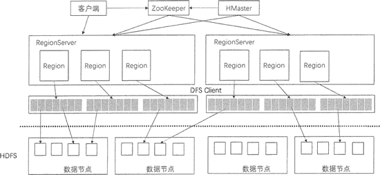

# HBase 的组件和功能

> 原文：[`c.biancheng.net/view/6509.html`](http://c.biancheng.net/view/6509.html)

HBase 是一个高可靠、高性能、面向列、可伸缩的分布式数据库，底层基于 Hadoop 的 HDFS 来存储数据。本节将介绍 HBase 的系统架构以及每个组件的功能。

上图展示了 HBase 的系统架构，包括客户端、ZooKeeper 服务器、HMaster 主服务器和 RegionServer。Region 是 HBase 中数据的物理切片，每个 Region 中记录了全局数据的一小部分，并且不同的 Region 之间的数据是互不重复的。

## 客户端

客户端包含访问 HBase 的接口，是整个 HBase 系统的入口，使用者直接通过客户端操作 HBase。客户端使用 HBase 的 RPC 机制与 HMaster 和 RegionServer 进行通信。

在一般情况下，客户端与 HMaster 进行管理类操作的通信，在获取 RegionServer 的信息后，直接与 RegionServer 进行数据读写类操作。而且客户端获取 Region 的位置信息后会缓存下来，用来加速后续数据的访问过程。

客户端可以用 Java 语言来实现，也可以使用 Thtift、Rest 等客户端模式，甚至 MapReduce 也可以算作一种客户端。

由于篇幅限制，本节只介绍 HBase 系统架构的客户端，ZooKeeper 服务器、HMaster 主服务器和 RegionServer 会在下面章节中讲解。