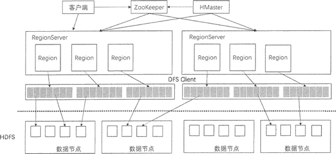

# Zookeeper 是什么？

> 原文：[`c.biancheng.net/view/6510.html`](http://c.biancheng.net/view/6510.html)

ZooKeeper 是一个高性能、集中化、分布式应用程序协调服务，主要是用来解决分布式应用中用户经常遇到的一些数据管理问题，例如，数据发布/订阅、命名服务、分布式协调通知、集群管理、Master 选举、分布式锁和分布式队列等功能。其中，Master 选举是 ZooKeeper 最典型的应用场景。

在 Hadoop 中，ZooKeeper 主要用于实现高可靠性（High Availability, HA），包括 HDFS 的 NameNode 和 YARN 的 ResourceManager 的 HA。 以 HDFS 为例，NameNode 作为 HDFS 的主节点，负责管理文件系统的命名空间以及客户端对文件的访问，同时需要监控整个 HDFS 中每个 DataNode 的状态，实现负载均衡和容错。

为了实现 HA，必须有多个 NameNode 并存，并且只有一个 NameNode 处于活跃状态，其他的则处于备用状态。当活跃的 NameNode 无法正常工作时， 处于备用状态的 NameNode 会通过竞争选举产生新的活跃节点来保证 HDFS 集群的高可靠性。

从上图中可以看到，在 HBase 的系统架构中，ZooKeeper 是串联 HBase 集群和 Client 的关键。

ZooKeeper 在 HBase 中的负责协调的任务如下。

## Master 选举

同 HDFS 的 HA 机制一样，HBase 集群中有多个 HMaster 并存，通过竞争选举机制保证同一时刻只有一个 HMaster 处于活跃状态，一旦这个 HMaster 无法使用，则从备用节点中选出一个顶上，保证集群的高可靠性。

## 系统容错

在 HBase 启动时，每个 RegionServer 在加入集群时都需要到 ZooKeeper 中进行注册，创建一个状态节点，ZooKeeper 会实时监控每个 RegionServer 的状态，同时 HMaster 会监听这些注册的  RegionServer。

当某个 RegionServer 挂断的时候，ZooKeeper 会因为一段时间内接收不到它的心跳信息而删除该 RegionServer 对应的状态节点，并且给 HMaster 发送节点删除的通知。这时，HMaster 获知集群中某节点断开，会立即调度其他节点开启容错机制。

## Region 元数据管理

在 HBase 集群中，Region 元数据被存储在 Meta 表中。每次客户端发起新的请求时，需要查询 Meta 表来获取 Region 的位置，而 Meta 表是存在 ZooKeeper 中的。

当 Region 发生变化时，例如，Region 的手工移动、进行负载均衡的移动或 Region 所在的 RegionServer 出现故障等，就能够通过 ZooKeeper 来感知到这一变化，保证客户端能够获得正确的 Region 元数据信息。

## Region 状态管理

HBase 集群中 Region 会经常发生变更，其原因可能是系统故障，配置修改，或者是 Region 的分裂和合并。只要 Region 发生变化，就需要让集群的所有节点知晓，否则就会出现某些事务性的异常。

而对于 HBase 集群，Region 的数量会达到 10 万，甚至更多。如此规模的 Region 状态管理如果直接由 HMaster 来实现，则 HMaster 的负担会很重，因此只有依靠 ZooKeeper 系统来完成。

## 提供 Meta 表存储位置

在 HBase 集群中，数据库表信息、列族信息及列族存储位置信息都属于元数据。这些元数据存储在 Meta 表中，而 Meta 表的位置入口由 ZooKeeper 来提供。