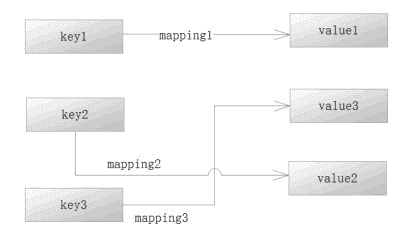
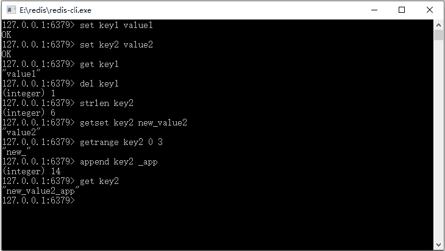
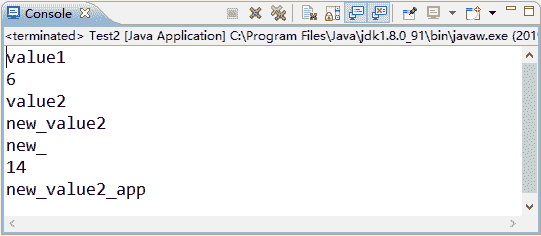
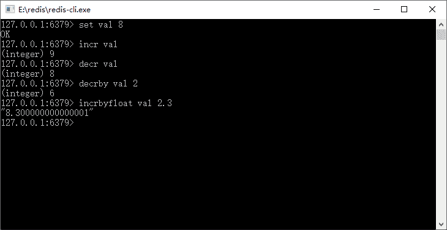

# Redis 字符串数据结构和常用命令

> 原文：[`c.biancheng.net/view/4527.html`](http://c.biancheng.net/view/4527.html)

字符串是 Redis 最基本的数据结构，它将以一个键和一个值存储于 Redis 内部，它犹如 Java 的 Map 结构，让 Redis 通过键去找到值。Redis 字符串的数据结构如图 1 所示。
图 1  Redis 字符串数据结构
Redis 会通过 key 去找到对应的字符串，比如通过 key1 找到 value1，又如在 Java 互联网中，假设产品的编号为 0001，只要设置 key 为 product_0001，就可以通过 product_0001 去保存该产品到 Redis 中，也可以通过 product_0001 从 redis 中找到产品信息。

字符串的一些基本命令，如表 1 所示。

表 1 字符串的一些基本命令

| 命  令 | 说  明 | 备  注 |
| set key value | 设置键值对 | 最常用的写入命令 |
| get key | 通过键获取值 | 最常用的读取命令 |
| del key | 通过 key，删除键值对 | 删除命令，返冋删除数，注意，它是个通用的命令，换句话说在其他数据结构中，也可以使用它 |
| strlen key  | 求 key 指向字符串的长度 | 返回长度 |
| getset key value | 修改原来 key 的对应值，并将旧值返回 | 如果原来值为空，则返回为空，并设置新值 |
| getrange key start end | 获取子串 | 记字符串的长度为 len，把字符串看作一个数组，而 Redis 是以 0 开始计数的，所以 start 和 end 的取值范围 为 0 到 len-1 |
| append key value | 将新的字符串 value，加入到原来 key 指向的字符串末 | 返回 key 指向新字符串的长度 |

为了让大家更为明确，笔者在 Redis 提供的客户端进行测试如图 2 所示。


图 2  Redis 操作字符串重用命令
这里我们看到了字符串的常用操作，为了在 Spring 中测试这些命令，首先配置 Spring 关于 Redis 字符串的运行环境，配置 Spring 关于 Redis 字符串的运行环境代码如下所示。

```

<bean id="poolConfig" class="redis.clients.jedis.JedisPoolConfig">
    <property name="maxIdle" value="50" />
    <property name="maxTotal" value="100" />
    <property name="maxWaitMillis" value="20000" />
</bean>

<bean id="connectionFactory"
    class="org.springframework.data.redis.connection.jedis.JedisConnectionFactory">
    <property name="hostName" value="localhost" />
    <property name="port" value="6379" />
    <property name="poolConfig" ref="poolConfig" />
</bean>
<bean id="jdkSerializationRedisSerializer"
    class="org.springframework.data.redis.serializer.JdkSerializationRedisSerializer" />
<bean id="stringRedisSerializer"
    class="org.springframework.data.redis.serializer.StringRedisSerializer" />
<bean id="redisTemplate" class="org.springframework.data.redis.core.RedisTemplate">
    <property name="connectionFactory" ref="connectionFactory" />
    <property name="keySerializer" ref="stringRedisSerializer" />
    <property name="valueSerializer" ref="jdkSerializationRedisSerializer" />
</bean>
```

注意，这里给 Spring 的 RedisTemplate 的键值序列化器设置为了 String 类型，所以它就是一种字符串的操作。假设把这段 Spring 的配置代码保存为一个独立为文件 applicationContext.xml，使用 Spring 测试 Redis 字符串操作代码如下所示。

```

package com.test;

import org.springframework.context.ApplicationContext;
import org.springframework.context.support.ClassPathXmlApplicationContext;
import org.springframework.data.redis.core.RedisTemplate;

import com.pojo.Role;

public class Test {
    public static void main(String[] args) {
        ApplicationContext applicationContext = new ClassPathXmlApplicationContext(
                "applicationContext.xml");
        RedisTemplate redisTemplate = applicationContext
                .getBean(RedisTemplate.class);
        // 设值
        redisTemplate.opsForValue().set("key1", "value1");
        redisTemplate.opsForValue().set("key2", "value2");
        // 通过 key 获取值
        String value1 = (String) redisTemplate.opsForValue().get("key1");
        System.out.println(value1);
        // 通过 key 删除值
        redisTemplate.delete("key1");
        // 求长度
        Long length = redisTemplate.opsForValue().size("key2");
        System.out.println(length);
        // 设值新值并返回旧值
        String oldValue2 = (String) redisTemplate.opsForValue().getAndSet(
                "key2", "new_value2");
        System.out.println(oldValue2);
        // 通过 key 获取值.
        String value2 = (String) redisTemplate.opsForValue().get("key2");
        System.out.println(value2);
        // 求子串
        String rangeValue2 = redisTemplate.opsForValue().get("key2", 0, 3);
        System.out.println(rangeValue2);
        // 追加字符串到末尾，返回新串长度
        int newLen = redisTemplate.opsForValue().append("key2", "_app");
        System.out.println(newLen);
        String appendValue2 = (String) redisTemplate.opsForValue().get("key2");
        System.out.println(appendValue2);
    }
}
```

这是主要的目的只是在 Spring 操作 Redis 键值对，其操作就等同于图 2 所示的命令一样。

在 Spring 中，redisTemplate.opsForValue() 所返回的对象可以操作简单的键值对，可以是字符串，也可以是对象，具体依据你所配置的序列化方案。

由于配置 Spring 关于 Redis 字符串的运行环境代码所配置的是字符串，所以以字符串来操作 Redis，其测试结果如下：


图 3 运行结果
结果和我们看到的命令行的结果一样的，作为开发者要熟悉这些方法。

上面介绍了字符串最常用的命令，但是 Redis 除了这些之外还提供了对整数和浮点型数字的功能。如果字符串是数字（整数或者浮点数），那么 Redis 还能支持简单的运算。不过它的运算能力比较弱，目前版本只能支持简单的加减法运算，如表 2 所示。

表 2 Redis 支持的简单运算

| 命   令 | 说   明 | 备   注 |
| incr key | 在原字段上加 1 | 只能对整数操作 |
| incrby key increment | 在原字段上加上整数（increment） | 只能对整数操作 |
| decr key | 在原字段上减 1 | 只能对整数操作 |
| decrby key decrement | 在原字段上减去整数（decrement） | 只能对整数操作 |
| incrbyfloat keyincrement | 在原字段上加上浮点数（increment） | 可以操作浮点数或者整数 |

对操作浮点数和整数进行了测试，如图 4 所示。


图 4  操作浮点数和整数
在测试过程中，如果开始把 val 设置为浮点数，那么 incr、decr、incrby、decrby 的命令都会失败。Redis 并不支持减法、乘法、除法操作，功能十分有限，这点需要我们注意。

由于 Redis 的功能比较弱，所以经常会在 Java 程序中读取它们，然后通过 Java 进行计算并设置它们的值。

这里使用 Spring 提供的 RedisTemplate 测试一下它们，不过依旧是用之前的配置，值得注意的是，这里使用的是字符串序列化器，所以 Redis 保存的还是字符串，如果采用其他的序列化器。

比如 JDK 序列化器，那么 Redis 保存的将不会是数字而是产生异常，字符是 Redis 最基本的类型，它可以使用最多的命令。测试代码如下所示。

```

/**
*测试 Redis 运算.
*/
public static void testCal() {
    ApplicationContext applicationContext =new ClassPathXmlApplicationContext("applicationContext.xml");
    RedisTemplate redisTemplate = applicationContext.getBean(RedisTemplate.class);
    redisTemplate.opsForValue().set ("i", "9");
    printCurrValue(redisTemplate, "i");
    redisTemplate.opsForValue().increment("i", 1);
    printCurrValue(redisTemplate,"i");
    redisTemplate.getConnectionFactory().getConnection().decrBy(
    redisTemplate.getKeySerializer().serialize("i"));
    printCurrValue(redisTemplate, "i");
    redisTemplate.getConnectionFactory().getConnection().decrBy(
            redisTemplate.getKeySerializer() .serialize("i"), 6);
    printCurrValue(redisTemplate, "i");
    redisTemplate.opsForValue().increment("i", 2.3);
    printCurrValue (redisTemplate, "i");
}

/**
*打印当前 key 的值
*@param redisTemplate spring RedisTemplate
*@param key 键
*/
public static void printCurrValue(RedisTemplate redisTemplate, String key) {
    String i = (String) redisTemplate.opsForValue().get(key);
    System.err.println(i);
}
```

注意，Spring 已经优化了代码，所以加粗的 increment 方法可以支持长整形（long）和双精度（double）的加法，而对于减法而言，RedisTemplate 并没有进行支持，所以用下面的代码去代替它：

redisTemplate.getConnectionFactory().getConnection().decrBy(
    redisTemplate.getKeySerializer().serialize("i"),6);

通过获得连接工厂再获得连接从而得到底层的 Redis 连接对象。为了和 RedisTemplate 的配置保持一致，所以先获取了其 keySerializer 属性，对键进行了序列化，如果获取结果也可以进行同样的转换。

当然 getConnection() 只是获取一个 spring data redis 项目中封装的底层对象 RedisConnection，甚至可以获取原始的链接对象—— Jedis 对象，比如下面这段代码：

Jedis jedis = (Jedis)redisTemplate.getConnectionFactory().getConnection().getNativeConnection();

首先，估计是因为 Redis 的版本在更替，支持的命令会有所不一，而 Spring 提供的 RedisTemplate 方法不足以支撑 Redis 的所有命令，所以这里才会有这样的变化。

而使用纯粹的 Java Redis 的最新 API 则可以看到这些命令对应的方法，这点是读者需要注意的。其次，所有关于减法的方法，原有值都必须是整数，否则就会引发异常，如下面这段代码，通过操作浮点数减法产生异常。

redisTemplate.opsForValue().set ("i", "8.9");
redisTemplate.getConnectionFactory().getConnection().decr(
redisTemplate.getKeySerializer().serialize("i"));

这些在 Java 中完全可以编译通过，但是运行之后产生了异常，这是因为对浮点数使用了 Redis 的命令，使用 Redis 的时候需要注意这些问题。