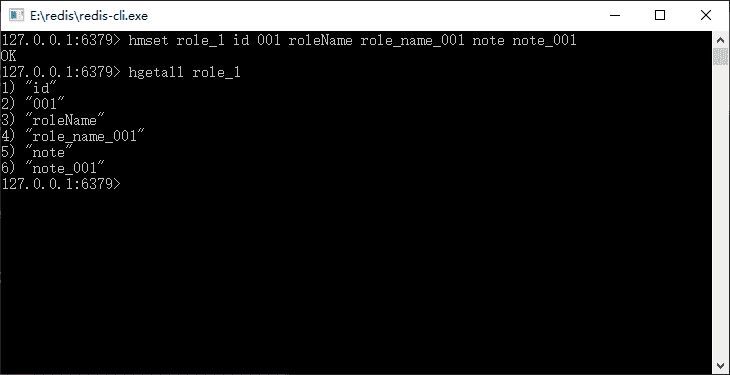
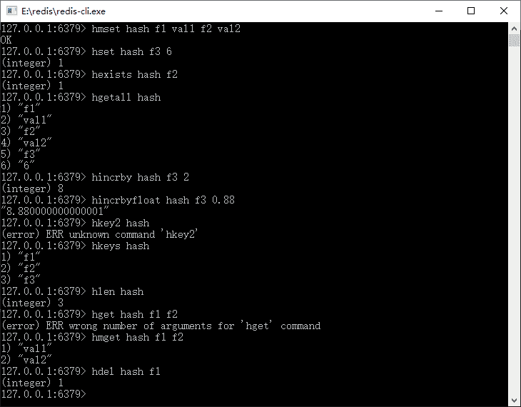
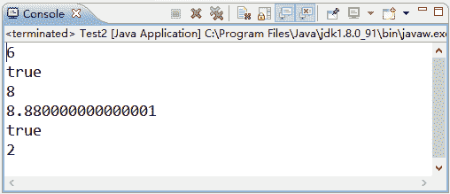

# Redis 哈希数据结构和常用命令

> 原文：[`c.biancheng.net/view/4529.html`](http://c.biancheng.net/view/4529.html)

Redis 中哈希结构就如同 Java 的 map 一样，一个对象里面有许多键值对，它是特别适合存储对象的，如果内存足够大，那么一个 Redis 的 hash 结构可以存储 2 的 32 次方减 1 个键值对（40 多亿）。

一般而言，不会使用到那么大的一个键值对，所以我们认为 Redis 可以存储很多的键值对。在 Redis 中，hash 是一个 String 类型的 field 和 value 的映射表，因此我们存储的数据实际在 Redis 内存中都是一个个字符串而已。

假设角色有 3 个字段：编号（id）、角色名称（roleName）和备注（note），这样就可以使用一个 hash 结构保存它，它的内存结果如表 1 所示。

表 1 角色 hash 结构

| role_1 |
| field | value |
| id | 001 |
| roleName | role_name_001 |
| note | note_001 |

在 Redis 中它就是一个这样的结构，其中 role_1 代表的是这个 hash 结构在 Redis 内存的 key，通过它就可以找到这个 hash 结构，而 hash 结构由一系列的 field 和 value 组成，下面用 Redis 的命令来保存角色对象，如图 1 所示。


图 1  使用 Redis 命令保存角色对象
上面的命令保存了一个角色对象。在 Redis 中，角色对象是通过键 role_1 来索引的，而角色本身是一个如表 1 所示的 hash 结构。hash 的键值对在内存中是一种无序的状态，我们可以通过键找到对应的值。

Redis hash 结构命令，如表 2 所示。

表 2 Redis hash 结构命令

| 命   令 | 说   明 | 备   注 |
| hdel key field1[field2......] | 删除 hash 结构中的某个（些）字段 | 可以进行多个字段的删除 |
| hexists key field | 判断 hash 结构中是否存在 field 字段 | 存在返回 1，否则返回 0 |
| hgetall key | 获取所有 hash 结构中的键值  | 返回键和值 |
| hincrby key field increment | 指定给 hash 结构中的某一字段加上一个整数 | 要求该字段也是整数字符串 |
| hincrbyfloat key field increment | 指定给 hash 结构中的某一字段加上一个浮点数 | 要求该字段是数字型字符串 |
| hkeys key | 返回 hash 中所有的键 | —— |
| hlen key | 返回 hash 中键值对的数量 | —— |
| hmget key field1[field2......] | 返回 hash 中指定的键的值，可以是多个 | 依次返回值 |
| hmset key field1 value1 [field2 field2......] | hash 结构设置多个键值对 | —— |
| hset key filed value | 在 hash 结构中设置键值对 | 单个设值 |
| hsetnx key field value | 当 hash 结构中不存在对应的键，才设置值 | —— |
| hvals key | 获取 hash 结构中所有的值 | —— |

从表 2 中可以看出，在 Redis 中的哈希结构和字符串有着比较明显的不同。

首先，命令都是以 h 开头，代表操作的是 hash 结构。其次，大多数命令多了一个层级 field，这是 hash 结构的一个内部键，也就是说 Redis 需要通过 key 索引到对应的 hash 结构，再通过 field 来确定使用 hash 结构的哪个键值对。

下面通过 Redis 的这些操作命令来展示如何使用它们，如图 2 所示。


图 2  Redis 的 hash 结构命令展示
从图 2 中可以看到，Redis 关于哈希结构的相关命令。这里需要注意的是：

哈希结构的大小，如果哈希结构是个很大的键值对，那么使用它要十分注意，尤其是关于 hkeys、hgetall、hvals 等返回所有哈希结构数据的命令，会造成大量数据的读取。这需要考虑性能和读取数据大小对 JVM 内存的影响。

对于数字的操作命令 hincrby 而言，要求存储的也是整数型的字符串，对于 hincrbyfloat 而言，则要求使用浮点数或者整数，否则命令会失败。

有了上面的描述，读者应该对 hash 结构有了一定的认识，也知道如何使用命令去操作它，现在讨论如何使用 Spring 去操作 Redis 的 hash 结构，由于 Spring 对 Redis 进行了封装，所以有必要对 RedisTemplate 的配置项进行修改。下面先修改 RedisTemplate 的配置，代码如下所示。

```

<bean id="jdkSerializationRedisSerializer"
        class="org.springframework.data.redis.serializer.JdkSerializationRedisSerializer" />
......
<bean id="stringRedisSerializer"
        class="org.springframework.data.redis.serializer.StringRedisSerializer" />
<bean id="redisTemplate" class="org.springframework.data.redis.core.RedisTemplate">
    <property name="connectionFactory" ref="connectionFactory" />
    <property name="defaultSerializer" ref="stringRedisSerializer"/>
    <property name="keySerializer" ref="stringRedisSerializer" />
    <property name="valueSerializer" ref="jdkSerializationRedisSerializer" />
</bean>
```

这段代码是参考前面代码编写的，所以做了一定的省略。这里把 Spring 提供的 RedisTemplate 的默认序列化器（defaultSerializer）修改为了字符串序列化器。因为在 Spring 对 hash 结构的操作中会涉及 map 等其他类的操作，所以需要明确它的规则。

这里只是指定默认的序列化器，如果想为 hash 结构指定序列化器，可以使用 RedisTemplate 提供的两个属性 hashKeySerializer 和 hashValueSerializer，来为 hash 结构的 field 和 value 指定序列化器。做了这样的修改我们用 Spring 来完成图 2 的功能，代码如下所示。

```

public static void testRedisHash()  {
    ApplicationContext applicationContext = new ClassPathXmlApplicationContext("applicationContext.xml");
    RedisTemplate redisTemplate =  applicationcontext.getBean(RedisTemplate.class);
    String key = "hash";
    Map<String, String> map = new HashMap<String,String>();
    map.put("f1", "val1");
    map.put("f2", "val2");
    // 相当于 hmset 命令
    redisTemplate.opsForHash().putAll(key, map);
    // 相当于 hset 命令
    redisTemplate.opsForHash().put(key, "f3", "6");
    printValueForhash (redisTemplate, key, "f3");
    // 相当于 hexists key filed 命令
    boolean exists = redisTemplate.opsForHash().hasKey(key, "f3");
    System.out.println(exists);
    // 相当于 hgetall 命令
    Map keyValMap = redisTemplate.opsForHash().entries(key);
    //相当于 hincrby 命令
    redisTemplate.opsForHash().increment(key, "f3",2);
    printValueForhash (redisTemplate, key, "f3");
    //相当于 hincrbyfloat 命令
    redisTemplate.opsForHash().increment (key, "f3", 0.88);
    printValueForhash(redisTemplate, key, "f3");
    //相当于 hvals 命令
    List valueList = redisTemplate.opsForHash().values(key);
    //相当于 hkeys 命令
    Set keyList = redisTemplate.opsForHash().keys(key);
    List<String> fieldList = new ArrayList<String>();
    fieldList.add("f1");
    fieldList.add("f2");
    //相当于 hmget 命令
    List valueList2 = redisTemplate.opsForHash().multiGet(key, keyList);
    //相当于 hsetnx 命令
    boolean success = redisTemplate.opsForHash () .putlfAbsent(key, "f4", "val4");
    System.out.println(success);
    //相当于 hdel 命令
    Long result = redisTemplate.opsForHash().delete(key, "fl", "f2");
    System.out.println(result);   
}
private static void printValueForhash(RedisTemplate redisTemplate,String key,String field) {
    //相当于 hget 命令
    Object value = redisTemplate.opsForHash().get(key,field);
    System.out.println(value);
}

```

以上代码笔者做了比较详细的注解，相信读者也不难理解，不过需要注意以下几点内容：

1）hmset 命令，在 Java 的 API 中，是使用 map 保存多个键值对在先的。

2）hgetall 命令会返回所有的键值对，并保存到一个 map 对象中，如果 hash 结构很大，那么要考虑它对 JVM 的内存影响。

3）hincrby 和 hincrbyFloat 命令都采用 increment 方法，Spring 会识别它具体使用何种方法。

4）redisTemplate.opsForHash().values(key) 方法相当于 hvals 命令，它会返回所有的值，并保存到一个 List 对象中；而 redisTemplate.opsForHash().keys(key) 方法相当于 hkeys 命令，它会获取所有的键，保存到一个 Set 对象中。

5）在 Spring 中使用 redisTemplate.opsForHash().putAll(key,map) 方法相当于执行了 hmset 命令，使用了 map，由于配置了默认的序列化器为字符串，所以它也只会用字符串进行转化，这样才能执行对应的数值加法，如果使用其他序列化器，则后面的命令可能会抛出异常。

6）在使用大的 hash 结构时，需要考虑返回数据的大小，以避免返回太多的数据，引发 JVM 内存溢出或者 Redis 的性能问题。

运行以上代码，可以得到这样的输出结果：


图 3  运行结果
操作成功了，按照类似的代码就可以在 Spring 中顺利操作 Redis 的 hash 结构了。