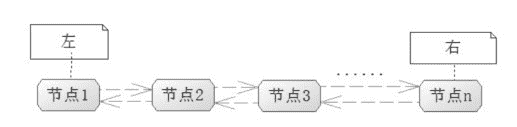

# Redis 链表（linked-list）数据结构和常用命令

> 原文：[`c.biancheng.net/view/4531.html`](http://c.biancheng.net/view/4531.html)

链表结构是 Redis 中一个常用的结构，它可以存储多个字符串，而且它是有序的，能够存储 2 的 32 次方减 1 个节点（超过 40 亿个节点）。

Redis 链表是双向的，因此即可以从左到右，也可以从右到左遍历它存储的节点，链表结构如图 1 所示。

图 1  链表结构
由于是双向链表，所以只能够从左到右，或者从右到左地访问和操作链表里面的数据节点。但是使用链表结构就意味着读性能的丧失，所以要在大量数据中找到一个节点的操作性能是不佳的，因为链表只能从一个方向中去遍历所要节点。

比如从查找节点 10 000 开始查询，它需要按照节点 1、节点 2、节点 3……直至节点 10 000，这样的顺序查找，然后把一个个节点和你给出的值比对，才能确定节点所在。如果这个链表很大，如有上百万个节点，可能需要遍历几十万次才能找到所需要的节点，显然查找性能是不佳的。

而链表结构的优势在于插入和删除的便利，因为链表的数据节点是分配在不同的内存区域的，并不连续，只是根据上一个节点保存下一个节点的顺序来索引而已，无需移动元素。其新增和删除的操作如图 2 所示。

图 2  链表的新增和删除操作
图 2 的阿拉伯数字代表新增的步骤，而汉字数字代表删除步骤。

#### 1）新增节点

对插入图中的节点 4 而言，先看从左到右的指向，先让节点 4 指向节点 1 原来的下一个节点，也就是节点 2，然后让节点 1 指向节点 4，这样就完成了从右到左的指向修改。再看从右到左，先让节点 4 指向节点 1，然后节点 2 指向节点 4，这个时候就完成了从右到左的指向，那么节点 1 和节点 2 之间的原有关联关系都已经失效，这样就完成了在链表中新增节点 4 的功能。

#### 2）删除节点

对删除图中的节点 3 而言，首先让节点 2 从左到右指向后续节点，然后让后续节点指向节点 2，这样节点 3 就脱离了链表，也就是断绝了与节点 2 和后继节点的关联关系，然后对节点 3 进行内存回收，无须移动任何节点，就完成了删除。

由此可见，链表结构的使用是需要注意场景的，对于那些经常需要对数据进行插入和删除的列表数据使用它是十分方便的，因为它可以在不移动其他节点的情况下完成插入和删除。而对于需要经常查找的，使用它性能并不佳，它只能从左到右或者从右到左的查找和比对。

因为是双向链表结构，所以 Redis 链表命令分为左操作和右操作两种命令，左操作就意味着是从左到右，右操作就意味着是从右到左。Redis 关于链表的命令如表 1 所示。

表 1 Redis 关于链表的命令

| 命   令 | 说   明 | 备   注 |
| lpush key node1 [node2.].....  | 把节点 node1 加入到链表最左边 | 如果是 node1、node2 ...noden 这样加入， 那么链表开头从左到右的顺序是 noden...node2、node1 |
| rpush key node1[node2]...... | 把节点 node1 加入到链表的最右边 | 如果是 node1、node2....noden 这样加  入，那么链表结尾从左到右的顺序是 node1、node2,node3...noden |
| lindex key index | 读取下标为 index 的节点 | 返回节点字符串，从 0 开始算 |
| llen key | 求链表的长度 | 返回链表节点数 |
| lpop key | 删除左边第一个节点，并将其返回 | —— |
| rpop key | 删除右边第一个节点，并将其返回 |  —— |
| linsert key before&#124;after pivot node | 插入一个节点 node，并且可以指定在值为 pivot 的节点的前面（before）或者后面（after)） | 如果 list 不存在，则报错；如果没有值为对应 pivot 的，也会插入失败返回 -1 |
| lpushx list node  | 如果存在 key 为 list 的链表，则插入节点 node, 并且作为从左到右的第一个节点  | 如果 list 不存在，则失败 |
| rpushx list node  | 如果存在 key 为 list 的链表，则插入节点 node，并且作为从左到右的最后个节点 | 如果 list 不存在，则失败 |
| lrange list start end | 获取链表 list 从 start 下标到 end 下标的节点值 | 包含 start 和 end 下标的值 |
| lrem list count value | 如果 count 为 0，则删除所有值等于 value 的节 点：如果 count 不是 0，则先对 count 取绝对值，假设记为 abs，然后从左到右删除不大于 abs 个等于 value 的节点 | 注意，count 为整数，如果是负数，则 Redis 会先求取其绝对值，然后传递到后台操作 |
| lset key index node | 设置列表下标为 index 的节点的值为 node | —— |
| ltrim key start stop | 修剪链表，只保留从 start 到 stop 的区间的节点，其余的都删除掉 | 包含 start 和 end 的下标的节点会保留 |

表 1 所列举的就是常用的链表命令，其中以“l”开头的代表左操作，以“r”开头的代表右操作。对于很多个节点同时操作的，需要考虑其花费的时间，链表数据结构对于查找而言并不适合于大数据，而 Redis 也给了比较灵活的命令对其进行操作。Redis 关于链表的操作命令，如图 3 所示。


图 3  Redis 关于链表的操作命令
这里展示了关于 Redis 链表的常用命令，只是对于大量数据操作的时候，我们需要考虑插入和删除内容的大小，因为这将是十分消耗性能的命令，会导致 Redis 服务器的卡顿。对于不允许卡顿的一些服务器，可以进行分批次操作，以避免出现卡顿。

需要指出的是，之前这些操作链表的命令都是进程不安全的，因为当我们操作这些命令的时候，其他 Redis 的客户端也可能操作同一个链表，这样就会造成并发数据安全和一致性的问题，尤其是当你操作一个数据量不小的链表结构时，常常会遇到这样的问题。

为了克服这些问题，Redis 提供了链表的阻塞命令，它们在运行的时候，会给链表加锁，以保证操作链表的命令安全性，如表 2 所示。

表 2 链表的阻塞命令

| 命   令 | 说   明 | 备   注 |
| blpop key timeout | 移出并获取列表的第一个元索，如果列表没有元素会阻塞列表直到等待超时或发现可弹出元索为止  | 相对于 lpop 命令，它的操作是进程安全的 |
| brpop key timeout | 移出并获取列表的最后一个元素，如果列表没有元素会阻塞列表直到等待超时或发现可弹出元素为止 | 相对于 rpop 命令，它的操作是进程安全的 |
| rpoplpush key sre dest | 按从左到右的顺序，将一个链表的最后一个元素移除，并插入到目标链表最左边 | 不能设置超时时间 |
| brpoplpush key src dest timeout | 按从左到右的顺序，将一个链表的最后一个元素移除，并插入到目标链表最左边，并可以设置超时时间 | 可设置超时时间 |

当使用这些命令时，Redis 就会对对应的链表加锁，加锁的结果就是其他的进程不能再读取或者写入该链表，只能等待命令结束。加锁的好处可以保证在多线程并发环境中数据的一致性，保证一些重要数据的一致性，比如账户的金额、商品的数量。

不过在保证这些的同时也要付出其他线程等待、线程环境切换等代价，这将使得系统的并发能力下降，关于多线程并发锁，未来还会提及，这里先看 Redis 链表阻塞操作命令，如图 4 所示。


图 4  Redis 链表阻塞操作命令
在实际的项目中，虽然阻塞可以有效保证了数据的一致性，但是阻塞就意味着其他进程的等待，CPU 需要给其他线程挂起、恢复等操作，更多的时候我们希望的并不是阻塞的处理请求，所以这些命令在实际中使用得并不多，后面还会深入探讨关于高并发锁的问题。

使用 Spring 去操作 Redis 链表的命令，这里继续保持代码清单 18-5 关于 RedisTemplate 的配置，在此基础上获取 RedisTemplate 对象，然后输入以下代码，它实现的是图 3 所示的命令功能，请读者仔细体会。

```

public static void testList() {
    ApplicationContext applicationcontext = new ClassPathXmlApplicationContext("applicationContext.xml");
    RedisTemplate redisTemplate = applicationcontext.getBean(RedisTemplate.class);
    try {
        //删除链表，以便我们可以反复测试
        redisTemplate.delete("list");
        //把 node3 插入链表 list
        redisTemplate. opsForList ().leftPush ("list", "node3");
        List<String> nodeList = new ArrayList<String>();
        for (int i = 2; i >= 1; i--){
            nodeList.add("nnode" + i);
        }
        //相当于 lpush 把多个价值从左插入链表
        redisTemplate.opsForList().leftPushAll("list", nodeList);
        //从右边插入一个节点
        redisTemplate.opsForList().rightPush("list", "node4");
        //获取下标为 0 的节点
        String nodel = (String) redisTemplate.opsForList() .index("list", 0);
        //获取链表长度
        long size = redisTemplate.opsForList ().size ("listn");
        //从左边弹出一个节点
        String lpop = (String) redisTemplate.opsForList().leftPop("list");
        //从右边弹出一个节点
        String rpop = (String) redisTemplate.opsForList().rightPop("list");
        //注意，需要使用更为底层的命令才能操作 linsert 命令
        //使用 linsert 命令在 node2 前插入一个节点
        redisTemplate.getConnectionFactory().getConnection().lInsert("list".getBytes("utf-8"),RedisListCommands.Position.BEFORE,"node2".getBytes("utf-8"),"before_node".getBytes("utf-8"));
        //使用 linsert 命令在 node2 后插入一个节点
        redisTemplate.getConnectionFactory().getConnection().linsert("list".getBytes("utf-8"),RedisListCommands.Position.AFTER,"node2".getBytes("utf-8"), "after_node".getBytes("utf-8"));
        //判断 list 是否存在，如果存在则从左边插入 head 节点
        redisTemplate.opsForList().leftPushlfPresent("list", "head");
        //判断 list 是否存在，如果存在则从右边插入 end 节点
        redisTemplate.opsForList().rightPushlfPresent("list", "end");
        //从左到右，或者下标从 0 到 10 的节点元素
        List valueList = redisTemplate.opsForList().range("list", 0, 10);
        nodeList.clear();
        for (int i = 1; i <= 3; i++) {
            nodeList.add("node");
        }
        //在链表左边插入三个值为 node 的节点
        redisTemplate.opsForList().leftPushAll.("list", nodeList);
        //从左到右删除至多三个 node 节点
        redisTemplate.opsForList().remove("list", 3,"node");
        //给链表下标为 0 的节点设置新值
        redisTemplate.opsForList().set("list",0, "new_head_value");
    } catch (UnsupportedEncodingException ex) {
        ex.printStackTrace();
    }
    //打印链表数据
    printList(redisTemplate, "list");
}
public static void printList(RedisTemplate redisTemplate, String key) { 
//链表长度
    Long size = redisTemplate.opsForList().size(key);
}
```

这里所展示的是 RedisTemplate 对于 Redis 链表的操作，其中 left 代表左操作，right 代表右操作。有些命令 Spring 所提供的 RedisTemplate 并不能支持，比如 linsert 命令，这个时候可以使用更为底层的方法去操作，正如代码中的这段：

```

// 使用 linsert 命令在 node2 前插入一个节点
redisTemplate.getConnectionFactory().getConnection().lInsert("list".getBytes("utf-8"),
RedisListCommands.Position.BEFORE,"node2".getBytes("utf-8"),
"before_node".getBytes("utf-8"));
```

在多值操作的时候，往往会使用 list 进行封装，比如 leftPushAll 方法，对于很大的 list 的操作需要注意性能，比如 remove 这样的操作，在大的链表中会消耗 Redis 系统很多的性能。

正如之前的探讨一样，Redis 还有对链表进行阻塞操作的命令，这里 Spring 也给出了支持，代码如下所示。

```

public static void testBList()    {
    ApplicationContext applicationContext = new ClassPathXmlApplicationContext("applicationContext.xml");
    RedisTemplate redisTemplate    = applicationContext.getBean(RedisTemplate.class);
    // 清空数据，可以重复测试
    redisTemplate.delete ("list1");
    redisTemplate.delete ("list2");
    //初始化链表 list1
    List<String> nodeList = new ArrayList<String>();
    for (int i=1; i<=5; i++)    {
        nodeList.add("node" + i);
    }
    redisTemplate.opsForList().leftPushAll("list1", nodeList);
    // Spring 使用参数超时时间作为阻塞命令区分，等价于 blpop 命令，并且可以设置时间参数 redisTemplate.opsForList().leftPop ("list1", 1, TimeUnit.SECONDS);
    // Spring 使用参数超时时间作为阻塞命令区分，等价于 brpop 命令，并且可以设置时间参数
    redisTemplate.opsForList().rightPop("list1", 1, TimeUnit.SECONDS);
    nodeList.clear();
    // 初始化链表 list2
    for (int i=1; i<=3; i++)    {
        nodeList.add("dato" + i);
    }
    redisTemplate.opsForList().leftPushAll("list2", nodeList);
    // 相当于 rpoplpush 命令，弹出 list1 最右边的节点，插入到 list2 最左边
    redisTemplate.opsForList().rightPopAndLeftPush("list1","list2");
    // 相当于 brpoplpush 命令，注意在 Spring 中使用超时参数区分 redisTemplate.opsForList().rightPopAndLeftPush("list1", "list2",1,TimeUnit.SECONDS);
    // 打印链表数据
    printList(redisTemplate, "list1");
    printList(redisTemplate, "list2");
}

```

这里展示了 Redis 关于链表的阻塞命令，在 Spring 中它和非阻塞命令的方法是一致的，只是它会通过超时参数进行区分，而且我们还可以通过方法设置时间的单位，使用还是相当简单的。注意，它是阻塞的命令，在多线程的环境中，它能在一定程度上保证数据的一致而性能却不佳。