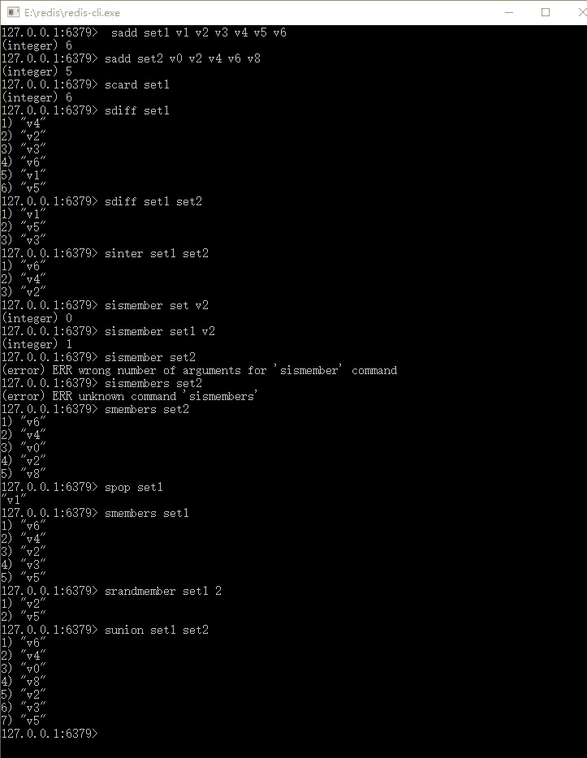
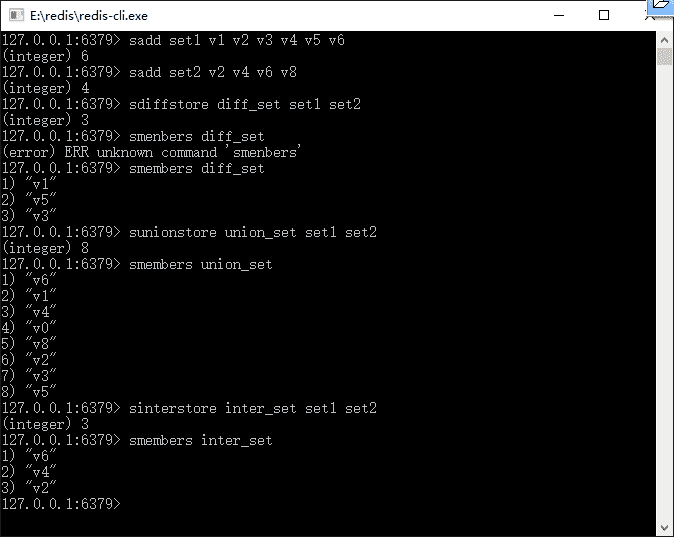

# Redis 集合数据结构和常用命令

> 原文：[`c.biancheng.net/view/4535.html`](http://c.biancheng.net/view/4535.html)

Redis 的集合不是一个线性结构，而是一个哈希表结构，它的内部会根据 hash 分子来存储和查找数据，理论上一个集合可以存储 2 的 32 次方减 1 个节点（大约 42 亿）个元素，因为采用哈希表结构，所以对于 Redis 集合的插入、删除和查找的复杂度都是 0（1），只是我们需要注意 3 点。

*   对于集合而言，它的每一个元素都是不能重复的，当插入相同记录的时候都会失败。
*   集合是无序的。
*   集合的每一个元素都是 String 数据结构类型。

Redis 的集合可以对于不同的集合进行操作，比如求出两个或者以上集合的交集、差集和并集等。集合命令，如表 1 所示。

表 1 集合命令

| 命   令 | 说   明 | 备   注 |
| sadd key member1 [member2 member3......] | 给键为 key 的集合増加成员 | 可以同时増加多个 |
| scard key | 统计键为 key 的集合成员数  | — |
| sdiffkey1 [key2] | 找出两个集合的差集 | 参数如果是单 key，那么 Redis 就返回这个 key 的所有元素 |
| sdiftstore des key1 [key2] | 先按 sdiff 命令的规则，找出 key1 和 key2 两 个集合的差集，然后将其保存到 des 集合中。 | — |
| sinter key1 [key2] | 求 key1 和 key2 两个集合的交集。 | 参数如果是单 key，那么 Redis 就返冋这个 key 的所有元素 |
| sinterstore des key1 key2  | 先按 sinter 命令的规则，找出 key1 和 key2 两个集合的交集，然后保存到 des 中 | — |
| sismember key member | 判断 member 是否键为 key 的集合的成员 | 如果是返回 1，否则返回 0 |
| smembers key | 返回集合所有成员 | 如果数据量大，需要考虑迭代遍历的问题 |
| smove src des member  | 将成员 member 从集合 src 迁移到集合 des 中 | — |
| spop key | 随机弹出集合的一个元素 | 注意其随机性，因为集合是无序的 |
| srandmember key [count] | 随机返回集合中一个或者多个元素，count 为限制返回总数，如果 count 为负数，则先求其绝对值  | count 为整数，如果不填默认为 1，如果 count 大于等于集合总数，则返回整个集合 |
| srem key member1[member2......] | 移除集合中的元素，可以是多个元素 | 对于很大的集合可以通过它删除部分元素，避免删除大量数据引发 Redis 停顿 |
| sunion key1 [key2] | 求两个集合的并集 | 参数如果是单 key，那么 Redis 就返回这个 key 的所有元素 |
| sunionstore des key1 key2 | 先执行 sunion 命令求出并集，然后保存到键为 des 的集合中 | — |

表 1 中命令的前缀都包含了一个 s，用来表达这是集合的命令，集合是无序的，并且支持并集、交集和差集的运算，下面通过命令行客户端来演示这些命令，如图 1 所示。


图 1  通过命令行客户端演示这些命令交集、并集和差集保存命令的用法，如下图 2 所示。


图 2  交集、并集和差集保存命令的用法
这里的命令主要是求差集、并集和交集，并保存到新的集合中。至此就展示了表 1 中的所有命令，下面将在 Spring 中操作它们，代码如下所示。

```

// 请把 RedisTemplate 值序列化器设置为 StringRedisSerializer 测试该代码片段
ApplicationContext applicationContext = new ClassPathXmlApplicationContext("applicationContext.xml"); RedisTemplate redisTemplate = applicationContext.getBean(RedisTemplate.class);
Set set = null;
// 将元素加入列表
redisTemplate.boundSetOps ("set1").add ("vl","v2","v3","v4","v5", "v6");
redisTemplate.boundSetOps ("set2").add( "v0","v2","v4","v6","v8");
//求集合长度
redisTemplate.opsForSet().size ("set1");
//求差集
set = redisTemplate.opsForSet().difference ("set1","set2");
//求并集
set = redisTemplate.opsForSet().intersect ("set1","set2");
//判断是否集合中的元素
boolean exists = redisTemplate.opsForSet().isMember("set1", "vl");
//获取集合所有元素
set = redisTemplate.opsForSet().members ("set1");
//从集合中随机弹出一个元素
String val = (String)redisTemplate.opsForSet().pop("set1");
//随机获取一个集合的元素
val = (String) redisTemplate.opsForSet().randomMember("set1");
//随机获取 2 个集合的元素
List list = redisTemplate.opsForSet ().randomMembers ("set1", 2L);
//删除一个集合的元素，参数可以是多个
redisTemplate.opsForSet().remove ("setl","v1");
//求两个集合的并集
redisTemplate.opsForSet().union ("set1","set2");
//求两个集合的差集，并保存到集合 diff_set 中
redisTemplate.opsForSet().differenceAndStore("set1", "set2", "diff_set");
//求两个集合的交集，并保存到集合 inter_set 中
redisTemplate.opsForSet().intersectAndStore("set1","set2" "inter_set");
//求两个集合的并集，并保存到集合 union_set 中
redisTemplate.opsForSet().unionAndStore ("set1", "set2", "union_set");
```

上面的注释已经较为详细地描述了代码的含义，这样我们就可以在实践中使用 Spring 操作 Redis 的集合了。