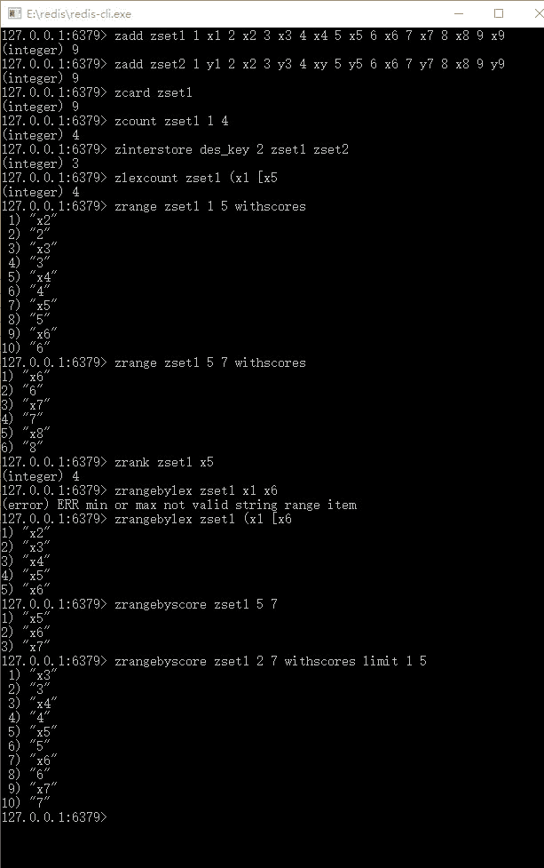

# Redis 有序集合（sorted set）串数据结构和常用命令

> 原文：[`c.biancheng.net/view/4537.html`](http://c.biancheng.net/view/4537.html)

有序集合和集合类似，只是说它是有序的，和无序集合的主要区别在于每一个元素除了值之外，它还会多一个分数。分数是一个浮点数，在 Java 中是使用双精度表示的，根据分数，Redis 就可以支持对分数从小到大或者从大到小的排序。

这里和无序集合一样，对于每一个元素都是唯一的，但是对于不同元素而言，它的分数可以一样。元素也是 String 数据类型，也是一种基于 hash 的存储结构。

集合是通过哈希表实现的，所以添加、删除、查找的复杂度都是 0（1）。集合中最大的成员数为 2 的 32 次方减 1（40 多亿个成员），有序集合的数据结构如图 1 所示。
图 1  有序集合的数据结构
有序集合是依赖 key 标示它是属于哪个集合，依赖分数进行排序，所以值和分数是必须的，而实际上不仅可以对分数进行排序，在满足一定的条件下，也可以对值进行排序。

## Redis 基础命令

有序集合和无序集合的命令是接近的，只是在这些命令的基础上，会增加对于排序的操作，这些是我们在使用的时候需要注意的细节。

下面讲解这些常用的有序集合的部分命令。有些时候 Redis 借助数据区间的表示方法来表示包含或者不包含，比如在数学的区间表示中，[2,5] 表示包含 2，但是不包含 5 的区间。具体如表 1 所示。

表 1 Redis 有序集合的部分命令

| 命   令 | 说   明  | 备   注 |
| zadd key score1 value1 [score2 value2......] | 向有序集合的 key，增加一个或者多个成员 | 如果不存在对应的 key，则创建键为 key 的有序集合 |
| zcard key  | 获取有序集合的成员数 | — |
| zcount key min max   | 根据分数返回对应的成员列表  | min 为最小值，max 为最大值，默认为包含 min 和 max 值，采用数学区间表示的方法，如果需要不包含，则在分数前面加入“(”，注意不支持“[”表示 |
| zincrby key increment member | 给有序集合成员值为 member 的分数增加 increment |  — |
| zinterstore desKey numkeys key1 [key2 key3......] | 求多个有序集合的交集，并且将结果保存到 desKey 中 | numkeys 是一个整数，表示多少个有序集合 |
| zlexcount key min max   | 求有序集合 key 成员值在 min 和 max 的范围 | 这里范围为 key 的成员值，Redis 借助数据区间的表示方法，“[”表示包含该值，“(”表示不包含该值 |
| zrange key start stop [withscores] | 按照分值的大小（从小到大）返回成员，加入 start 和 stop 参数可以截取某一段返回。如果输入可选项 withscores，则连同分数一起返回 | 这里记集合最人长度为 len，则 Redis 会将集合排序后，形成一个从 0 到 len-1 的下标，然后根据 start 和 stop 控制的下标（包含 start 和 stop）返回 |
| zrank key member | 按从小到大求有序集合的排行 | 排名第一的为 0，第二的为 1…… |
| zrangebylex key min max [limit offset count] | 根据值的大小，从小到大排序，min 为最小值，max 为最大值；limit 选项可选，当 Redis 求出范围集合后，会生产下标 0 到 n，然后根据偏移量 offset 和限定返回数 count，返回对应的成员 | 这里范围为 key 的成员值，Redis 借助数学区间的表示方法，“[”表示包含该值，“(”表示不包含该值 |
| zrangebyscore key min max [withscores] [limit offset count] | 根据分数大小，从小到大求取范围，选项 withscores 和 limit 请参考 zrange 命令和 zrangebylex 说明 | 根据分析求取集合的范围。这里默认包含 min 和 max，如果不想包含，则在参数前加入“(”， 注意不支持“[”表示 |
| zremrangebyscore key start stop | 根据分数区间进行删除 | 按照 socre 进行排序，然后排除 0 到 len-1 的下标，然后根据 start 和 stop 进行删除，Redis 借助数学区间的表示方法，“[”表示包含该值，“(” 表示不包含该值 |
| zremrangebyrank key start stop | 按照分数排行从小到大的排序删除，从 0 开始计算 | — |
| zremrangebylex key min max | 按照值的分布进行删除 | — |
| zrevrange key start stop [withscores] | 从大到小的按分数排序，参数请参见 zrange | 与 zrange 相同，只是排序是从大到小 |
| zrevrangebyscore key max min [withscores] | 从大到小的按分数排序，参数请参见 zrangebyscore | 与 zrangebyscore 相同，只是排序是从大到小 |
| zrevrank key member | 按从大到小的顺序，求元素的排行 |  排名第一位 0，第二位 1...... |
| zscore key member | 返回成员的分数值 | 返回成员的分数 |
| zunionstore desKey numKeys key1 [key2 key3 key4......] | 求多个有序集合的并集，其中 numKeys 是有序集合的个数 | —— |

在对有序集合、下标、区间的表示方法进行操作的时候，需要十分小心命令，注意它是操作分数还是值，稍有不慎就会出现问题。

这里命令比较多，也有些命令比较难使用，在使用的时候，务必要小心，不过好在我们使用 zset 的频率并不是太高，下面是测试结果——有序集合命令展示，如图 2 所示。


图 2 有序集合命令展示

## spring-data-redis 对有序集合的封装

在 Spring 中使用 Redis 的有序集合，需要注意的是 Spring 对 Redis 有序集合的元素的值和分数的范围（Range）和限制（Limit）进行了封装，在演示如何使用 Spring 操作有序集合前要进一步了解它的封装。

先介绍一个主要的接口——TypedTuple，它不是一个普通的接口，而一个内部接口，它是 org.springframework.data.redis.core.ZSetOperations 接口的内部接口，它定义了两个方法，代码如下所示。

```

public interface ZSetOperations<K,V>{
    ......
public interface TypedTuple<V> extends Comparable<TypedTuple<V>< {
    V getValue();

    Double getScore();
}
......
}
```

这里的 getValue() 是获取值，而 getScore() 是获取分数，但是它只是一个接口，而不是一个实现类。spring-data-redis 提供了一个默认的实现类—— DefaultTypedTuple，同样它会实现 TypedTuple 接口，在默认的情况下 Spring 就会把带有分数的有序集合的值和分数封装到这个类中，这样就可以通过这个类对象读取对应的值和分数了。

Spring 不仅对有序集合元素封装，而且对范围也进行了封装，方便使用。它是使用接口 org.springframework.data.redis.connection.RedisZSetCommands 下的内部类 Range 进行封装的，它有一个静态的 range() 方法，使用它就可以生成一个 Range 对象了，只是要清楚 Range 对象的几个方法才行，为此我们来看看下面的伪代码。

```

//设置大于等于 min
public Range gte(Object min)
//设置大于 min
public Range gt(Object min)
//设置小于等于 max
public Range lte(Object max)
//设置小于 max
public Range lt(Object max)
```

这 4 个方法就是最常用的范围方法。下面讨论一下限制，它是接口 org.springframework.data.redis.connection.RedisZSetCommands 下的内部类，它是一个简单的 POJO，它存在两个属性，它们的 getter 和 setter 方法，如下面的代码所示。

```

// ......
public interface RedisZSetCommands {
    // ......
public class Limit {
    int offset;
    int count;
//setter 和 getter 方法
}
//......
}
```

通过属性的名称很容易知道：offset 代表从第几个开始截取，而 count 代表限制返回的总数量。

## 通过 Spring 操作有序集合

我们讨论了 spring-data-redis 项目对有序集合的封装，在此基础上，这节给出演示的例子。只是在测试代码前，要把 RedisTemplate 的 keySerializer 和 valueSerializer 属性都修改为字符串序列化器 StringRedisSerializer，测试代码如下所示。

```

public static void testZset() {
    ApplicationContext applicationContext = new ClassPathXmlApplicationContext(
                "applicationContext.xml");
    RedisTemplate redisTemplate = applicationContext.getBean(RedisTemplate.class);
    // Spring 提供接口 TypedTuple 操作有序集合
    Set<TypedTuple> set1 = new HashSet<TypedTuple>();
    Set<TypedTuple> set2 = new HashSet<TypedTuple>();
    int j = 9;
    for (int i = 1; i <= 9; i++) {
        j--;
        // 计算分数和值
        Double score1 = Double.valueOf(i);
        String value1 = "x" + i;
        Double score2 = Double.valueOf(j);
        String value2 = j % 2 == 1 ? "y" + j : "x" + j;
        // 使用 Spring 提供的默认 TypedTuple--DefaultTypedTuple
        TypedTuple typedTuple1 = new DefaultTypedTuple(value1, score1);
        set1.add(typedTuple1);
        TypedTuple typedTuple2 = new DefaultTypedTuple(value2, score2);
        set2.add(typedTuple2);
    }
    // 将元素插入有序集合 zset1
    redisTemplate.opsForZSet().add("zset1", set1);
    redisTemplate.opsForZSet().add("zset2", set2);
    // 统计总数
    Long size = null;
    size = redisTemplate.opsForZSet().zCard("set1");
    // 计分数为 score，那么下面的方法就是求 3<=score<=6 的元素
    size = redisTemplate.opsForZSet().count("zset1", 3, 6);
    Set set = null;
    // 从下标一开始截取 5 个元素，但是不返回分数，每一个元索是 String
    set = redisTemplate.opsForZSet().range("zset1", 1, 5);
    printSet(set);
    // 截取集合所有元素，并且对集合按分数排序，并返回分数，每一个元素是 TypedTuple
    set = redisTemplate.opsForZSet().rangeWithScores("zset1", 0, -1);
    printTypedTuple(set);
    // 将 zset1 和 zset2 两个集合的交集放入集合 inter_zset
    size = redisTemplate.opsForZSet().intersectAndStore("zset1", "zset2","inter_zset");
    // 区间
    Range range = Range.range();
    range.lt("x8");// 小于
    range.gt("x1"); // 大于
    set = redisTemplate.opsForZSet().rangeByLex("zset1", range);
    printSet(set);
    range.lte("x8"); // 小于等于
    range.gte("xl"); // 大于等于
    set = redisTemplate.opsForZSet().rangeByLex("zset1", range);
    printSet(set);
    // 限制返回个数
    Limit limit = Limit.limit();
    // 限制返回个数
    limit.count(4);
    // 限制从第五个开始截取
    limit.offset(5);
    // 求区间内的元素，并限制返回 4 条
    set = redisTemplate.opsForZSet().rangeByLex("zset1", range, limit);
    printSet(set);
    // 求排行，排名第 1 返回 0，第 2 返回 1
    Long rank = redisTemplate.opsForZSet().rank("zset1", "x4");
    System.err.println("rank = " + rank);
    // 删除元素，返回删除个数
    size = redisTemplate.opsForZSet().remove("zset1", "x5", "x6");
    System.err.println("delete = " + size);
    // 按照排行删除从 0 开始算起，这里将删除第排名第 2 和第 3 的元素
    size = redisTemplate.opsForZSet().removeRange("zset2", 1, 2);
    // 获取所有集合的元素和分数，以-1 代表全部元素
    set = redisTemplate.opsForZSet().rangeWithScores("zset2", 0, -1);
    printTypedTuple(set);
    // 删除指定的元素
    size = redisTemplate.opsForZSet().remove("zset2", "y5", "y3");
    System.err.println(size);
    // 给集合中的一个元素的分数加上 11
    Double dbl = redisTemplate.opsForZSet().incrementScore("zset1", "x1",11);
    redisTemplate.opsForZSet().removeRangeByScore("zset1", 1, 2);
    set = redisTemplate.opsForZSet().reverseRangeWithScores("zset2", 1, 10);
    printTypedTuple(set);
}

/**
* 打印 TypedTuple 集合
* @param set
* -- Set<TypedTuple>
*/
public static void printTypedTuple(Set<TypedTuple> set) {
    if (set != null && set.isEmpty()) {
        return;
    }
    Iterator iterator = set.iterator();
    while (iterator.hasNext()) {
        TypedTuple val = (TypedTuple) iterator.next();
        System.err.print("{value = " + val.getValue() + ", score = "
                + val.getScore() + "}\n");
    }
}

/**
* 打印普通集合
* @param set 普通集合
*/
public static void printSet(Set set) {
    if (set != null && set.isEmpty()) {
        return;
    }
    Iterator iterator = set.iterator();
    while (iterator .hasNext()) {
    Object val = iterator.next();
    System. out.print (val +"\t");
    }
    System.out.println();
}
```

上面的代码演示了大部分 Spring 对有序集合的操作，笔者也给了比较清晰的注释，读者参考后一步步验证，就能熟悉如何通过 Spring 操作有序集合了。