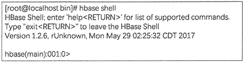

# HBase Shell 及其常用命令

> 原文：[`c.biancheng.net/view/6518.html`](http://c.biancheng.net/view/6518.html)

HBase 数据库默认的客户端程序是 HBase Shell，它是一个命令行工具。用户可以使用 HBase Shell，通过命令行的方式与 HBase 进行交互。

HBase Shell 是一个封装了 Java 客户端 API 的 JRuby 应用软件，在 HBase 的 HMaster 主机上通过命令行输入 hbase shell，即可进入 HBase 命令行环境，如图 1 所示。

图 1：HBase Shell 命令行环境在 Shell 中输入`help`可以获取可用命令列表，输入`help commandname`可获取特定命令的帮助，还可以输入各种命令查看集群、数据库和数据的各项详情。

例如，使用`status`命令查看当前集群各节点的状态，使用`version`命令查看当前 HBase 的版本号，输入命令`exit`或`quit`即可退出 HBase Shell。

下面对常用命令做一下汇总。

HBase Shell 数据表命令

| 命令 | 描述 |
| create | 创建指定模式的新表 |
| alter | 修改表的结构，如添加新的列族 |
| describe | 展示表结构的信息，包括列族的数量与属性 |
| list | 列出 HBase 中已有的表 |
| disable/enable | 为了删除或更改表而禁用一个表，更改完后需要解禁表 |
| disable_all | 禁用所有的表，可以用正则表达式匹配表 |
| is_disable | 判断一个表是否被禁用 |
| drop | 删除表 |
| truncate | 如果只是想删除数据而不是表结构，则可用 truncate 来禁用表、删除表并自动重建表结构 |

HBase Shell 增删改查命令

| 命令 | 描述 |
| put | 添加一个值到指定单元格中 |
| get | 通过表名、行键等参数获取行或单元格数据 |
| scan | 遍历表并输出满足指定条件的行记录 |
| count | 计算表中的逻辑行数 |
| delete | 删除表中列族或列的数据 |