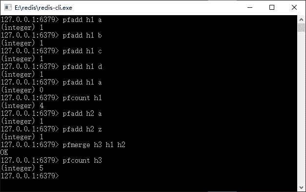

# Redis HyperLogLog 常用命令

> 原文：[`c.biancheng.net/view/4538.html`](http://c.biancheng.net/view/4538.html)

基数是一种算法。举个例子，一本英文著作由数百万个单词组成，你的内存却不足以存储它们，那么我们先分析一下业务。

英文单词本身是有限的，在这本书的几百万个单词中有许许多多重复单词，扣去重复的单词，这本书中也就是几千到一万多个单词而已，那么内存就足够存储它们了。

比如数字集合 {1,2,5,7,9,1,5,9} 的基数集合为 {1,2,5,7,9} 那么基数（不重复元素）就是 5，基数的作用是评估大约需要准备多少个存储单元去存储数据，但是基数的算法一般会存在一定的误差（一般是可控的）。Redis 对基数数据结构的支持是从版本 2.8.9 开始的。

基数并不是存储元素，存储元素消耗内存空间比较大，而是给某一个有重复元素的数据集合（一般是很大的数据集合）评估需要的空间单元数，所以它没有办法进行存储，加上在工作中用得不多，所以简要介绍一下 Redis 的 HyperLogLog 命令就可以了，如表 1 所示。

表 1 Redis 的 HyperLogLog 命令

| 命   令 | 说   明 | 备   注 |
| pfadd key element | 添加指定元素到 HyperLogLog 中 | 如果已经存储元索，则返回为 0，添加失败 |
| pfcount key | 返回 HyperLogLog 的基数值 | — |
| pfmerge desKey key1 [key2 key3...]  | 合并多个 HyperLogLog，并将其保存在 desKey 中 | — |

在命令行中演示一下它们，如图 1 所示。


图 1  Redis 的 HyperLogLog 命令演示
分析一下逻辑，首先往一个键为 h1 的 HyperLogLog 插入元素，让其计算基数，到了第 5 个命令“pfadd h1 a”的时候，由于在此以前已经添加过，所以返回了 0。它的基数集合是 {a,b,c,d}，故而求集合长度为 4；之后再添加了第二个基数，它的基数集合是{a,z}，所以在 h1 和 h2 合并为 h3 的时候，它的基数集合为 {a,b,c,d,z}，所以求取它的基数就是 5。

在 Spring 中操作基数，代码如下所示。

```

ApplicationContext applicationContext = new ClassPathXmlApplicationcontext("applicationContext.xml");
RedisTemplate redisTemplate = applicationContext.getBean(RedisTemplate.class);
redisTemplate.opsForHyperLogLog().add("HyperLogLog", "a", "b" , "c", "d", "a");
redisTemplate.opsForHyperLogLog().add("HyperLogLog2", "a"); redisTemplate.opsForHyperLogLog().add("HyperLogLog2", "z");
Long size = redisTemplate.opsForHyperLogLog().size("HyperLogLog");
System.err.println(size);
size = redisTemplate.opsForHyperLogLog().size("HyperLogLog2");
System.err.println(size);
redisTemplate.opsForHyperLogLog().union ("des_key","HyperLogLog","HyperLogLog2");
size = redisTemplate.opsForHyperLogLog().size("des_key");
System.err.println(size);
```

从上面的代码可以看到，增加一个元素到基数中采用 add 方法，它可以是一个或者多个元素，而求基数大小则是采用了 size 方法，合并基数则采用了 union 方法，其第一个是目标基数的 key，然后可以是一到多个 key。