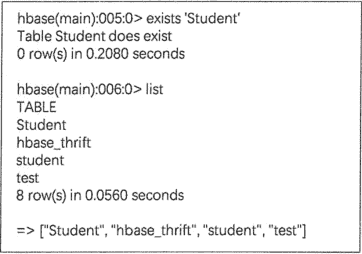
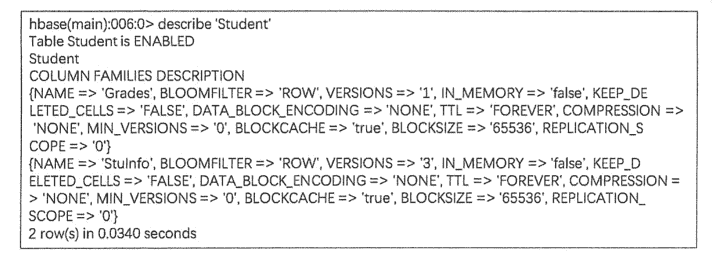

# HBase 创建表（create 命令）

> 原文：[`c.biancheng.net/view/6530.html`](http://c.biancheng.net/view/6530.html)

与关系型数据库不同，在 HBase 中，基本组成为表，不存在多个数据库。因此，在 HBase 中存储数据先要创建表，创建表的同时需要设置列族的数量和属性。

示例：Student 数据表

| 行键 | 列族 StuInfo | 列族 Grades | 时间戳 |
| Name | Age | Sex | Class | BigData | Computer | Math |
| 0001 | Tom Green | 18 | Male |   | 80 | 90 | 85 | T2 |
| 0002 | Amy | 19 |   | 01 | 95 |   | 89 | T1 |
| 0003 | Allen | 19 | Male | 02 | 90 |   | 88 | T1 |

HBase 使用 creat 命令来创建表，创建表时需要指明表名和列族名，如创建上表中的学生信息表 Student 的命令如下:

create 'Student','StuInfo','Grades'

这条命令仓建了名为 Student 的表，表中包含两个列族，分别为 Stulnfo 和 Grades。

注意在 HBase Shell 语法中，所有字符串参数都必须包含在单引号中，且区分大小写，如 Student 和 student 代表两个不同的表。

另外，在上条命令中没有对列族参数进行定义，因此使用的都是默认参数，如果建表时要设置列族的参数，参考以下方式：

create 'Student', {NAME => 'Stulnfo', VERSIONS => 3}, {NAME =>'Grades', BLOCKCACHE => true}

大括号内是对列族的定义，NAME、VERSION 和 BLOCKCACHE 是参数名，无须使用单引号，符号`=>`表示将后面的值赋给指定参数。例如，`VERSIONS => 3`是指此单元格内的数据可以保留最近的 3 个版本，`BLOCKCACHE => true`指允许读取数据时进行缓存。

创建表结构以后，可以使用 exsits 命令查看此表是否存在，或使用 list 命令查看数据库中所有表，如下图所示。

图 2：exsits 和 list 命令
还可以使用 describe 命令查看指定表的列族信息，如下图所示。

图 3：describe 命令 describe 命令描述了表的详细结构，包括有多少个列族、每个列族的参数信息，这些显示的参数都可以使用 alter 命令进行修改。