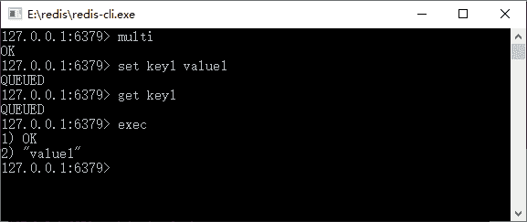
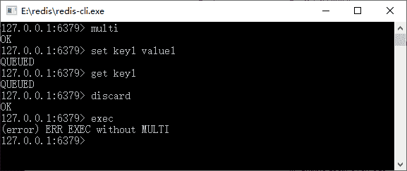
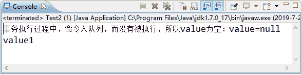

# Redis 的基础事务和常用操作

> 原文：[`c.biancheng.net/view/4540.html`](http://c.biancheng.net/view/4540.html)

和其他大部分的 NoSQL 不同，Redis 是存在事务的，尽管它没有数据库那么强大，但是它还是很有用的，尤其是在那些需要高并发的网站当中。

使用 Redis 读/写数据要比数据库快得多，如果使用 Redis 事务在某种场合下去替代数据库事务，则可以在保证数据一致性的同时，大幅度提高数据读/写的响应速度。

细心的读者也许可以发现笔者一直都很强调性能，因为互联网和传统企业管理系统不一样，互联网系统面向的是公众，很多用户同时访问服务器的可能性很大，尤其在一些商品抢购、抢红包等场合，对性能和数据的一致性有着很高的要求，而存储系统的读/写响应速度对于这类场景的性能的提高是十分重要的。

在 Redis 中，也存在多个客户端同时向 Redis 系统发送命令的并发可能性，因此同一个数据，可能在不同的时刻被不同的线程所操纵，这样就出现了并发下的数据一致的问题。为了保证异性数据的安全性，Redis 为提供了事务方案。而 Redis 的事务是使用 MULTI-EXEC 的命令组合，使用它可以提供两个重要的保证：

*   事务是一个被隔离的操作，事务中的方法都会被 Redis 进行序列化并按顺序执行，事务在执行的过程中不会被其他客户端发生的命令所打断。
*   事务是一个原子性的操作，它要么全部执行，要么就什么都不执行。

在一个 Redis 的连接中，请注意要求是一个连接，所以更多的时候在使用 Spring 中会使用 SessionCallback 接口进行处理，在 Redis 中使用事务会经过 3 个过程：

*   开启事务。
*   命令进入队列。
*   执行事务。

先来学习 Redis 事务命令，如表 1 所示。

表 1 Redis 事务命令

| 命 令 | 说 明 | 备 注 |
| multi | 开启事务命令，之后的命令就进入队列，而不会马上被执行 | 在事务生存期间，所有的 Redis 关于数据结构的命令都会入队 |
| watch key1 [key2......] | 监听某些键，当被监听的键在事务执行前被修改，则事务会被回滚 | 使用乐观锁 |
| unwatch key1 [key2......]  | 取消监听某些键 | —— |
| exec | 执行事务，如果被监听的键没有被修改，则采用执行命令，否则就回滚命令 | 在执行事务队列存储的命令前，Redis 会检测被监听的键值对有没有发生变化，如果没有则执行命令, 否则就回滚事务 |
| discard | 回滚事务 | 回滚进入队列的事务命令，之后就不能再用 exec 命令提交了 |

在 Redis 中开启事务是 multi 命令，而执行事务是 exec 命令。multi 到 exec 命令之间的 Redis 命令将采取进入队列的形式，直至 exec 命令的出现，才会一次性发送队列里的命令去执行，而在执行这些命令的时候其他客户端就不能再插入任何命令了，这就是 Redis 的事务机制。

Redis 命令执行事务的过程，如图 1 所示。


图 1 Redis 命令执行事务的过程
从图 1 中可以看到，先使用 multi 启动了 Redis 的事务，因此进入了 set 和 get 命令，我们可以发现它并未马上执行，而是返回了一个“QUEUED”的结果。

这说明 Redis 将其放入队列中，并不会马上执行，当命令执行到 exec 的时候它就会把队列中的命令发送给 Redis 服务器，这样存储在队列中的命令就会被执行了，所以才会有“OK”和“value1”的输出返回。

如果回滚事务，则可以使用 discard 命令，它就会进入在事务队列中的命令，这样事务中的方法就不会被执行了，使用 discard 命令取消事务如图 2 所示。


图 2  使用 discard 命令取消事务
当我们使用了 discard 命令后，再使用 exec 命令时就会报错，因为 discard 命令已经取消了事务中的命令，而到了 exec 命令时，队列里面已经没有命令可以执行了，所以就出现了报错的情况。

教程前面我们讨论过，在 Spring 中要使用同一个连接操作 Redis 命令的场景，这个时候我们借助的是 Spring 提供的 SessionCallback 接口，采用 Spring 去实现本节的命令，代码如下所示。

```

ApplicationContext applicationContext= new ClassPathXmlApplicationContext("applicationContext.xml");
RedisTemplate redisTemplate = applicationContext.getBean(RedisTemplate.class);
SessionCallback callBack = (SessionCallback) (RedisOperations ops)-> {
    ops.multi();
    ops.boundValueOps("key1").set("value1");
    //注意由于命令只是进入队列，而没有被执行，所以此处采用 get 命令，而 value 却返回为 null
    String value = (String) ops.boundValueOps("key1").get();
    System.out.println ("事务执行过程中，命令入队列，而没有被执行，所以 value 为空： value="+value);
    //此时 list 会保存之前进入队列的所有命令的结果
    List list = ops.exec(); //执行事务
    //事务结束后，获取 value1
    value = (String) redisTemplate.opsForValue().get("key1");
    return value;
};
//执行 Redis 的命令
String value = (String)redisTemplate.execute(callBack);
System.out.println(value);
```

这里采用了 Lambda 表达式（注意，Java 8 以后才引入 Lambda 表达式）来为 SessionCallBack 接口实现了业务逻辑。从代码看，使用了 SessionCallBack 接口，从而保证所有的命令都是通过同一个 Redis 的连接进行操作的。

在使用 multi 命令后，要特别注意的是，使用 get 等返回值的方法一律返回为空，因为在 Redis 中它只是把命令缓存到队列中，而没有去执行。使用 exec 后就会执行事务，执行完了事务后，执行 get 命令就能正常返回结果了。

最后使用 redisTemplate.execute(callBack); 就能执行我们在 SessionCallBack 接口定义的 Lambda 表达式的业务逻辑，并将获得其返回值。执行代码后可以看到这样的结果，如图 3 所示：


图 3  运行结果
需要再强调的是：这里打印出来的 value=null，是因为在事务中，所有的方法都只会被缓存到 Redis 事务队列中，而没有立即执行，所以返回为 null，这是在 Java 对 Redis 事务编程中开发者极其容易犯错的地方，一定要十分注意才行。如果我们希望得到 Redis 执行事务各个命令的结果，可以用这行代码：

List list = ops.exec(); //执行事务

这段代码将返回之前在事务队列中所有命令的执行结果，并保存在一个 List 中，我们只要在 SessionCallback 接口的 execute 方法中将 list 返回，就可以在程序中获得各个命令执行的结果了。