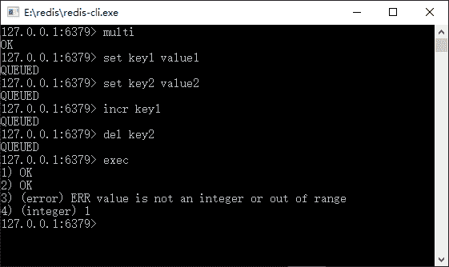
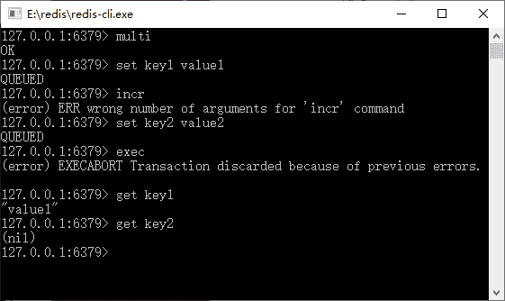

# 探索 Redis 事务回滚

> 原文：[`c.biancheng.net/view/4541.html`](http://c.biancheng.net/view/4541.html)

对于 Redis 而言，不单单需要注意其事务处理的过程，其回滚的能力也和数据库不太一样，这也是需要特别注意的一个问题——Redis 事务遇到的命令格式正确而数据类型不符合，如图 1 所示。

图 1  Redis 事务遇到命令格式正确而数据类型不符合
从图 1 中可知，我们将 key1 设置为字符串，而使用命令 incr 对其自增，但是命令只会进入事务队列，而没有被执行，所以它不会有任何的错误发生，而是等待 exec 命令的执行。

当 exec 命令执行后，之前进入队列的命令就依次执行，当遇到 incr 时发生命令操作的数据类型错误，所以显示出了错误，而其之前和之后的命令都会被正常执行。注意，这里命令格式是正确的，问题在于数据类型，对于命令格式是错误的却是另外一种情形，如图 2 所示。

图 2  Redis 事务遇到命令格式错误的
从图 2 中可以看到我们使用的 incr 命令格式是错误的，这个时候 Redis 会立即检测出来并产生错误，而在此之前我们设置了 key1，在此之后我们设置了 key2。当事务执行的时候，我们发现 key2 的值为空，说明被 Redis 事务回滚了。

通过上面两个例子，可以看出在执行事务命令的时候，在命令入队的时候，Redis 就会检测事务的命令是否正确，如果不正确则会产生错误。无论之前和之后的命令都会被事务所回滚，就变为什么都没有执行。

当命令格式正确，而因为操作数据结构引起的错误，则该命令执行出现错误，而其之前和之后的命令都会被正常执行。这点和数据库很不一样，这是需要读者注意的地方。

对于一些重要的操作，我们必须通过程序去检测数据的正确性，以保证 Redis 事务的正确执行，避免出现数据不一致的情况。Redis 之所以保持这样简易的事务，完全是为了保证移动互联网的核心问题——性能。