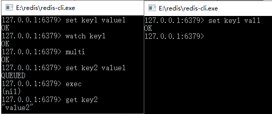

# Redis watch 命令——监控事务

> 原文：[`c.biancheng.net/view/4544.html`](http://c.biancheng.net/view/4544.html)

在 Redis 中使用 watch 命令可以决定事务是执行还是回滚。一般而言，可以在 multi 命令之前使用 watch 命令监控某些键值对，然后使用 multi 命令开启事务，执行各类对数据结构进行操作的命令，这个时候这些命令就会进入队列。

当 Redis 使用 exec 命令执行事务的时候，它首先会去比对被 watch 命令所监控的键值对，如果没有发生变化，那么它会执行事务队列中的命令，提交事务；如果发生变化，那么它不会执行任何事务中的命令，而去事务回滚。无论事务是否回滚，Redis 都会去取消执行事务前的 watch 命令，这个过程如图 1 所示。

图 1  Redis 执行事务过程
Redis 参考了多线程中使用的 CAS（比较与交换，Compare And Swap）去执行的。在数据高并发环境的操作中，我们把这样的一个机制称为乐观锁。这句话还是比较抽象，也不好理解。

所以先简要论述其操作的过程，当一条线程去执行某些业务逻辑，但是这些业务逻辑操作的数据可能被其他线程共享了，这样会引发多线程中数据不一致的情况。

为了克服这个问题，首先，在线程开始时读取这些多线程共享的数据，并将其保存到当前进程的副本中，我们称为旧值（old value），watch 命令就是这样的一个功能。

然后，开启线程业务逻辑，由 multi 命令提供这一功能。在执行更新前，比较当前线程副本保存的旧值和当前线程共享的值是否一致，如果不一致，那么该数据已经被其他线程操作过，此次更新失败。

为了保持一致，线程就不去更新任何值，而将事务回滚；否则就认为它没有被其他线程操作过，执行对应的业务逻辑，exec 命令就是执行“类似”这样的一个功能。

注意，“类似”这个字眼，因为不完全是，原因是 CAS 原理会产生 ABA 问题。所谓 ABA 问题来自于 CAS 原理的一个设计缺陷，它可能引发 ABA 问题，如表 1 所示。

表 1 ABA 问题

| 时间顺序 | 线程 1 | 线程 2 | 说明 |
| T1 | X=A | — | 线程 1 加入监控 X |
| T2 | 复杂运算开始 | 修改 X=B | 线程 2 修改 X，此刻为 B |
| T3 | 处理简单业务 | — |
| T4 | 修改 X=A | 线程 2 修改 X，此刻又变回 A |
| T5 | 结束线程 2 | 线程 2 结束 |
| T6 | 检测 X=A，验证通过，提交事务 | — | CAS 原理检测通过，因为和旧值保持一致 |

在处理复杂运算的时候，被线程 2 修改的 X 的值有可能导致线程 1 的运算出错，而最后线程 2 将 X 的值修改为原来的旧值 A，那么到了线程 1 运算结束的时间顺序 T6，它将检测 X 的值是否发生变化，就会拿旧值 A 和当前的 X 的值 A 比对，结果是一致的，于是提交事务。

然后在复杂计算的过程中 X 被线程 2 修改过了，这会导致线程 1 的运算出错。在这个过程中，对于线程 2 而言，X 的值的变化为 A->B->A，所以 CAS 原理的这个设计缺陷被形象地称为“ABA 问题”。

仅仅记录一个旧值去比较是不足够的，还要通过其他方法避免 ABA 问题。常见的方法如 Hibernate 对缓存的持久对象（PO）加入字段 version 值，当每次操作一次该 PO，则 version=version+1，这样采用 CAS 原理探测 version 字段，就能在多线程的环境中，排除 ABA 问题，从而保证数据的一致性。

关于 CAS 和乐观锁的概念，本教程还会从更深层次讨论它们，暂时讨论到这里，当讨论完了 CAS 和乐观锁，读者再回头来看这个过程，就会有更深的理解了。

从上面的分析可以看出，Redis 在执行事务的过程中，并不会阻塞其他连接的并发，而只是通过比较 watch 监控的键值对去保证数据的一致性，所以 Redis 多个事务完全可以在非阻塞的多线程环境中并发执行，而且 Redis 的机制是不会产生 ABA 问题的，这样就有利于在保证数据一致的基础上，提高高并发系统的数据读/写性能。

下面演示一个成功提交的事务，如表 2 所示。

表 2 事务检测

| 时刻 | 客户端 | 说   明 |
| T1 | set key1 value1 | 初始化 key1 |
| T2 | watch key1 | 监控 key1 的键值对 |
| T3 | multi | 开启事务 |
| T4 | set key2 value2 | 设置 key2 的值 |
| T5 | exec | 提交事务，Redis 会在这个时间点检测 key1 的值在 T2 时刻后，有没有被其他命令修改过，如果没有，则提交事务去执行 |

这里我们使用了 watch 命令设置了一个 key1 的监控，然后开启事务设置 key2，直至 exec 命令去执行事务，这个过程和图 2 所演示的一样。

图 2  运行结果
这里我们看到了一个事务的过程，而 key2 也在事务中被成功设置。下面将演示一个提交事务的案例，如表 3 所示。

表 3 提交事务

| 时刻 | 客户端 1 | 客户端 2 | 说   明 |
| T1 | set key1 value1 |   | 客户端 1：返回 OK |
| T2 | watch key1 |   | 客户端 1：监控 key1 |
| T3 | multi |   | 客户端 1：开启事务 |
| T4 | set key2 value2 |   | 客户端 1：事务命令入列 |
| T5 | —— | set key1 vall | 客户端 2：修改 key1 的值 |
| T6 | exec | —— | 客户端 1：执行事务，但是事务会先检査在 T2 时刻被监控的 key1 是否被 其他命令修改过。 因为客户端 2 修改过，所以它会回滚事务，事实上如果客户端执行的是 set key1 value1 命令，它也会认为 key1 被修改过，然后返回（nil），所以是不会产生 ABA 问题的 |

图 3  测试 Redis 事务回滚
在表 3 中有比较详尽的说明，注意 T2 和 T6 时刻命令的说明，使用 Redis 事务要掌握这些内容。