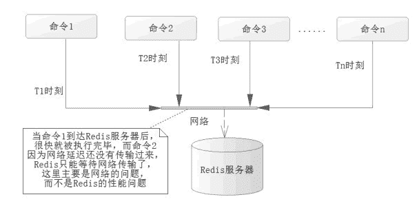

# 使用流水线（pipelined）提高 Redis 的命令性能

> 原文：[`c.biancheng.net/view/4546.html`](http://c.biancheng.net/view/4546.html)

教程前几节讨论了 Redis 的事务的各类问题，在事务中 Redis 提供了队列，这是一个可以批量执行任务的队列，这样性能就比较高，但是使用 multi...exec 事务命令是有系统开销的，因为它会检测对应的锁和序列化命令。

有时候我们希望在没有任何附加条件的场景下去使用队列批量执行一系列的命令，从而提高系统性能，这就是 Redis 的流水线（pipelined）技术。而现实中 Redis 执行读/写速度十分快，而系统的瓶颈往往是在网络通信中的延时，如图 1 所示。
图 1  系统的瓶颈
在实际的操作中，往往会发生这样的场景，当命令 1 在时刻 T1 发送到 Redis 服务器后，服务器就很快执行完了命令 1，而命令 2 在 T2 时刻却没有通过网络送达 Redis 服务器，这样就变成了 Redis 服务器在等待命令 2 的到来，当命令 2 送达，被执行后，而命令 3 又没有送达 Redis，Redis 又要继续等待，依此类推，这样 Redis 的等待时间就会很长，很多时候在空闲的状态，而问题出在网络的延迟中，造成了系统瓶颈。

为了解决这个问题，可以使用 Redis 的流水线，但是 Redis 的流水线是一种通信协议，没有办法通过客户端演示给大家，不过我们可以通过 Java API 或者使用 Spring 操作它，先使用 Java API 去测试一下它的性能，代码如下所示。

```

Jedis jedis = pool.getResource();
long start = System.currentTimeMillis();
// 开启流水线
Pipeline pipeline = jedis.pipelined();
// 这里测试 10 万条的读/写 2 个操作
for (int i = 0; i < 100000; i++) {
    int j = i + 1;
    pipeline.set("pipeline_key_" + j, "pipeline_value_" + j);
    pipeline.get("pipeline_key_" + j);
}
// pipeline.sync(); //这里只执行同步，但是不返回结果
// pipeline.syncAndReturnAll ();将返回执行过的命令返回的 List 列表结果
List result = pipeline.syncAndRetrunAll();
long end = System.currentTimeMillis();
// 计算耗时
System.err.println("耗时：" + (end - start) + "毫秒");
```

笔者在电脑上测试这段代码，它的耗时在 550 毫秒到 700 毫秒之间，也就是不到 1 秒的时间就完成多达 10 万次读/写，可见其性能远超数据库。笔者的测试是 1 秒 2 万多次，可见使用流水线后其性能提高了数倍之多，效果十分明显。执行过的命令的返回值都会放入到一个 List 中。

注意，这里只是为了测试性能而已，当你要执行很多的命令并返回结果的时候，需要考虑 List 对象的大小，因为它会“吃掉”服务器上许多的内存空间，严重时会导致内存不足，引发 JVM 溢出异常，所以在工作环境中，是需要读者自己去评估的，可以考虑使用迭代的方式去处理。

在 Spring 中，执行流水线和执行事务的方法如出一辙都比较简单，使用 RedisTemplate 提供的 executePipelined 方法即可。下面将上面代码的功能修改为 Spring 的形式供大家参考，代码如下所示。

```

public static void testPipeline() {
    Applicationcontext applicationcontext = new ClassPathXmlApplicationContext("applicationcontext.xml");
    RedisTemplate redisTemplate = applicationcontext.getBean(RedisTemplate.class);
    // 使用 Java8 的 Lambda 表达式
    SessionCallback callBack = (SessionCallback) (RedisOperations ops)-> {
        for (int i = 0; i<100000; i++)    {
            int j = i + 1;
            ops . boundValueOps ("pipeline_key_" + j ).set("piepeline_value_"+j);
            ops.boundValueOps("pipeline_key_" + j).get();
        }
        return null;
    };
    long start = System.currentTimeMillis();
    //执行 Redis 的流水线命令
    List resultList= redisTemplate.executePipelined(callBack);
    long end = System.currentTimeMillis();
    System.err.println(end-start);
}
```

笔者对这段代码进行了测试，其性能慢于不用 RedisTemplate 的，测试消耗的时间大约在 1 100 毫秒到 1 300 毫秒之间，也就是消耗的时间大约是其两倍，但也属于完全可以接受的性能范围，同样的在执行很多命令的时候，也需要考虑其对运行环境内存空间的开销。