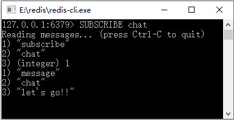

# Redis 发布订阅模式

> 原文：[`c.biancheng.net/view/4547.html`](http://c.biancheng.net/view/4547.html)

当使用银行卡消费的时候，银行往往会通过微信、短信或邮件通知用户这笔交易的信息，这便是一种发布订阅模式，这里的发布是交易信息的发布，订阅则是各个渠道。这在实际工作中十分常用，Redis 支持这样的一个模式。

发布订阅模式首先需要消息源，也就是要有消息发布出来，比如例子中的银行通知。首先是银行的记账系统，收到了交易的命令，成功记账后，它就会把消息发送出来，这个时候，订阅者就可以收到这个消息进行处理了，观察者模式就是这个模式的典型应用了。下面用图 1 描述这样的一个过程。
图 1  交易信息发布订阅机制
这里建立了一个消息渠道，短信系统、邮件系统和微信系统都在监听这个渠道，一旦记账系统把交易消息发送到消息渠道，则监听这个渠道的各个系统就可以拿到这个消息，这样就能处理各自的任务了。它也有利于系统的拓展，比如现在新增一个彩信平台，只要让彩信平台去监听这个消息渠道便能得到对应的消息了。

从上面的分析可以知道以下两点：

*   要有发送的消息渠道，让记账系统能够发送消息。
*   要有订阅者（短信、邮件、微信等系统）订阅这个渠道的消息。

同样的，Redis 也是如此。首先来注册一个订阅的客户端，这个时候使用 SUBSCRIBE 命令。

比如监听一个叫作 chat 的渠道，这个时候我们需要先打开一个客户端，这里记为客户端 1，然后输入命令：

SUBSCRIBE chat

这个时候客户端 1 就会订阅了一个叫作 chat 渠道的消息了。之后打开另外一个客户端，记为客户端 2，输入命令：

publish chat "let's go!!"

这个时候客户端 2 就向渠道 chat 发送消息：

"let's go!!"

我们观察客户端 1，就可以发现已经收到了消息，并有对应的信息打印出来。Redis 的发布订阅过程如图 2 和图 3 所示。


图 2  Redis 的发布订阅过程（1）

图 3  Redis 的发布订阅过程（2）
其出现的先后顺序为先出现图 2 的上半部分，执行图 3 命令之后运行结果为图 2 所示，当发布消息的时候，对应的客户端已经获取到了这个信息。

下面在 Spring 的工作环境中展示如何配置发布订阅模式。首先提供接收消息的类，它将实现 org.springframework.data.redis.connection.MessageListener 接口，并实现接口定义的方法 public void onMessage（Message message,byte[]pattern），Redis 发布订阅监听类代码如下所示。

```

/*** imports ***/
public class RedisMessageListener implements MessageListener {
    private RedisTemplate redisTemplate;

    /*** 此处省略 redisTemplate 的 setter 和 getter 方法 ***/
    @Override
    public void onMessage(Message message, byte[] bytes) {
        // 获取消息
        byte[] body = message.getBody();
        // 使用值序列化器转换
        String msgBody = (String) getRedisTemplate().getValueSerializer()
                .deserialize(body);
        System.err.println(msgBody);
        // 获取 channel
        byte[] channel = message.getChannel();
        // 使用字符串序列化器转换
        String channelStr = (String) getRedisTemplate().getStringSerializer()
                .deserialize(channel);
        System.err.println(channelStr);
        // 渠道名称转换
        String bytesStr = new String(bytes);
        System.err.println(bytesStr);
    }
}
```

为了在 Spring 中使用这个类，需要对其进行配置。

<bean id="redisMsgListener" class="com.redis.listener.RedisMessageListener">
    <property name="redisTemplate" ref="redisTemplate"/>
</bean>

这样就在 Spring 上下文中定义了监听类。

有了监听类还不能进行测试。为了进行测试，要给一个监听容器，在 Spring 中已有类 org.springframework.data.redis.listener.RedisMessageListenerContainer。它可以用于监听 Redis 的发布订阅消息，下面的配置就是为了实现这个功能，读者可以通过注释来了解它的配置要点。

```

<bean id="topicContainer"
    class="org.springframework.data.redis.listener.RedisMessageListenerContainer" destroy-method="destroy">
    <!--Redis 连接工厂 -->
    <property name="connectionFactory" ref="connectionFactory" />
    <!--连接池，这里只要线程池生存，才能继续监听 -->
    <property name="taskExecutor">
        <bean
            class="org.springframework.scheduling.concurrent.ThreadPoolTaskScheduler">
            <property name="poolSize" value="3" />
        </bean>
    </property>
    <!--消息监听 Map -->
    <property name="messageListeners">
        <map>
            <!-- 配置监听者，key-ref 和 bean id 定义一致 -->
            <entry key-ref="redisMsgListener">
                <!--监听类 -->
                <bean class="org.springframework.data.redis.listener.ChannelTopic">
                    <constructor-arg value="chat" />
                </bean>
            </entry>
        </map>
    </property>
</bean>
```

这里配置了线程池，这个线程池将会持续的生存以等待消息传入，而这里配置了容器用 id 为 redisMsgListener 的 Bean 进行对渠道 chat 的监听。当消息通过渠道 chat 发送的时候，就会使用 id 为 redisMsgListener 的 Bean 进行处理消息。

通过以下代码测试 Redis 发布订阅。

```

public static void main(String[] args)    {
    ApplicationContext applicationContext = new ClassPathXmlApplicationContext("applicationContext.xml");
    RedisTemplate redisTemplate = applicationContext.getBean(RedisTemplate.class);
    String channel = "chat";
    redisTemplate.convertAndSend(channel, "I am lazy!!");
}
```

convertAndSend 方法就是向渠道 chat 发送消息的，当发送后对应的监听者就能监听到消息了。运行它，后台就会打出对应的消息。