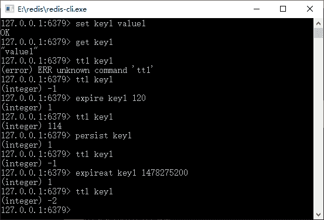

# Redis 的超时命令和垃圾回收策略

> 原文：[`c.biancheng.net/view/4548.html`](http://c.biancheng.net/view/4548.html)

正如 Java 虚拟机，它提供了自动 GC（垃圾回收）的功能，来保证 Java 程序使用过且不再使用的 Java 对象及时的从内存中释放掉，从而保证内存空间可用。

当程序编写不当或考虑欠缺的时候（比如读入大文件），内存就可能存储不下运行所需要的数据，那么 Java 虚拟机就会抛出内存溢出的异常而导致服务失败。同样，Redis 也是基于内存而运行的数据集合，也存在着对内存垃圾的回收和管理的问题。

Redis 基于内存，而内存对于一个系统是最为宝贵的资源，而且它远远没有磁盘那么大，所以对于 Redis 的键值对的内存回收也是一个十分重要的问题，如果操作不当会产生 Redis 宕机的问题，使得系统性能低下。

一般而言，和 Java 虚拟机一样，当内存不足时 Redis 会触发自动垃圾回收的机制，而程序员可以通过 System.gc() 去建议 Java 虚拟机回收内存垃圾，它将“可能”（注意，System.gc() 并不一定会触发 JVM 去执行回收，它仅仅是建议 JVM 做回收）触发一次 Java 虚拟机的回收机制，但是如果这样做可能导致 Java 虚拟机在回收大量的内存空间的同时，引发性能低下的情况。

对于 Redis 而言，del 命令可以删除一些键值对，所以 Redis 比 Java 虚拟机更灵活，允许删除一部分的键值对。与此同时，当内存运行空间满了之后，它还会按照回收机制去自动回收一些键值对，这和 Java 虚拟机又有相似之处，但是当垃圾进行回收的时候，又有可能执行回收而引发系统停顿，因此选择适当的回收机制和时间将有利于系统性能的提高，这是我们需要去学习的。

在谈论 Redis 内存回收之前，首先要讨论的是键值对的超时命令，因为大部分情况下，我们都想回收那些超时的键值对，而不是那些非超时的键值对。

对于 Redis 而言，可以给对应的键值设置超时，相关命令如表 1 所示。

表 1 Redis 的超时命令

| 命   令 | 说   明 | 备   注 |
| persist key | 持久化 key，取消超时时间 | 移除 key 的超时时间 |
| ttl key | 査看 key 的超时时间  | 以秒计算，-1 代表没有超时时间，如果不存在 key 或者 key 已经超时则为 -2 |
| expire key seconds  | 设置超时时间戳 | 以秒为单位 |
| expireat key timestamp | 设置超时时间点 | 用 uninx 时间戳确定 |
| pptl key milliseconds | 查看 key 的超时时间戳 | 用亳秒计算 |
| pexpire key | 设置键值超时的时间 | 以亳秒为单位 |
| Pexpireat key stamptimes | 设置超时时间点 | 以亳秒为单位的 uninx 时间戳 |

下面展示这些命令在 Redis 客户端的使用，如图 1 所示。


图 1  Redis 超时命令
使用 Spring 也可以执行这样的一个过程，下面用 Spring 演示这个过程，代码如下所示。

```

public static void testExpire()    {
    ApplicationContext applicationContext = new ClassPathXmlApplicationContext ("applicationContext.xml");
    RedisTemplate redisTemplate = applicationContext.getBean(RedisTemplate.class);
    redisTemplate.execute((RedisOperations ops) -> {
        ops.boundValueOps("key1").set("value1");
        String keyValue = (String)ops.boundValueOps("key1").get();
        Long expSecond = ops.getExpire("key1");
        System.err.println(expSecond);
        boolean b = false;
        b = ops.expire("key1", 120L, TimeUnit.SECONDS);
        b = ops.persist("key1")
        Long l = 0L;
        l = ops.getExpire("key1");
        Long now = System.currentTimeMillis();
        Date date = new Date();
        date.setTime(now + 120000);
        ops.expireAt("key", date);
        return null;
    });
}
```

上面这段代码采用的就是 Spring 操作 Redis 超时命令的一个过程，感兴趣的读者可以打断点一步步验证这个过程。

这里有一个问题需要讨论：如果 key 超时了，Redis 会回收 key 的存储空间吗？这也是面试时常常被问到的一个问题。

答案是不会。这里读者需要非常注意的是：Redis 的 key 超时不会被其自动回收，它只会标识哪些键值对超时了。

这样做的一个好处在于，如果一个很大的键值对超时，比如一个列表或者哈希结构，存在数以百万个元素，要对其回收需要很长的时间。如果采用超时回收，则可能产生停顿。坏处也很明显，这些超时的键值对会浪费比较多的空间。

Redis 提供两种方式回收这些超时键值对，它们是定时回收和惰性回收。

*   定时回收是指在确定的某个时间触发一段代码，回收超时的键值对。
*   惰性回收则是当一个超时的键，被再次用 get 命令访问时，将触发 Redis 将其从内存中清空。

定时回收可以完全回收那些超时的键值对，但是缺点也很明显，如果这些键值对比较多，则 Redis 需要运行较长的时间，从而导致停顿。所以系统设计者一般会选择在没有业务发生的时刻触发 Redis 的定时回收，以便清理超时的键值对。

对于惰性回收而言，它的优势是可以指定回收超时的键值对，它的缺点是要执行一个莫名其妙的 get 操作，或者在某些时候，我们也难以判断哪些键值对已经超时。

无论是定时回收还是惰性回收，都要依据自身的特点去定制策略，如果一个键值对，存储的是数以千万的数据，使用 expire 命令使其到达一个时间超时，然后用 get 命令访问触发其回收，显然会付出停顿代价，这是现实中需要考虑的。