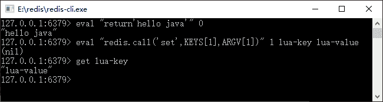
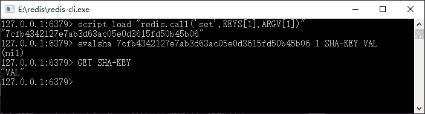
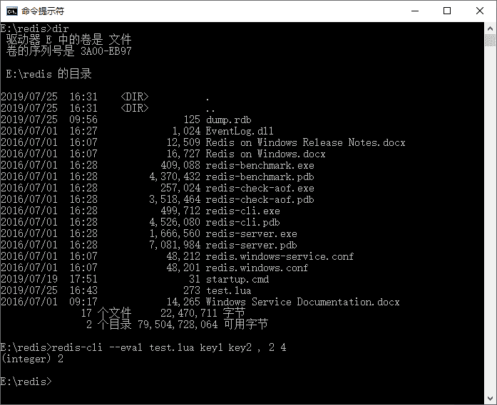

# Redis 中使用 Lua 语言

> 原文：[`c.biancheng.net/view/4554.html`](http://c.biancheng.net/view/4554.html)

在 Redis 的 2.6 以上版本中，除了可以使用命令外，还可以使用 Lua 语言操作 Redis。从前面的命令可以看出 Redis 命令的计算能力并不算很强大，而使用 Lua 语言则在很大程度上弥补了 Redis 的这个不足。

只是在 Redis 中，执行 Lua 语言是原子性的，也就说 Redis 执行 Lua 的时候是不会被中断的，具备原子性，这个特性有助于 Redis 对并发数据一致性的支持。

Redis 支持两种方法运行脚本，一种是直接输入一些 Lua 语言的程序代码；另外一种是将 Lua 语言编写成文件。

在实际应用中，一些简单的脚本可以采取第一种方式，对于有一定逻辑的一般采用第二种方式。而对于采用简单脚本的，Redis 支持缓存脚本，只是它会使用 SHA-1 算法对脚本进行签名，然后把 SHA-1 标识返回回来，只要通过这个标识运行就可以了。

## 执行输入 Lua 程序代码

它的命令格式为：

eval lua-script key-num [key1 key2 key3 ...] [value1 value2 value3 ...]

其中：

*   eval 代表执行 Lua 语言的命令。
*   Lua-script 代表 Lua 语言脚本。
*   key-num 整数代表参数中有多少个 key，需要注意的是 Redis 中 key 是从 1 开始的，如果没有 key 的参数，那么写 0。
*   [key1key2key3...] 是 key 作为参数传递给 Lua 语言，也可以不填它是 key 的参数，但是需要和 key-num 的个数对应起来。
*   [value1 value2 value3...] 这些参数传递给 Lua 语言，它们是可填可不填的。

这里难理解的是 key-num 的意义，举例说明就能很快掌握它了，如图 1 所示。


图 1  Redis 执行 Lua 语言脚本
这里可以看到执行了两个 Lua 脚本。

eval "return'hello java'" 0

这个脚本只是返回一个字符串，并不需要任何参数，所以 key-num 填写了 0，代表着没有任何 key 参数。按照脚本的结果就是返回了 hello java，所以执行后 Redis 也是这样返回的。这个例子很简单，只是返回一个字符串。

eval "redis.call('set',KEYS[1],ARGV[1])" 1 lua-key lua-value

设置一个键值对，可以在 Lua 语言中采用 redis.call(command,key[param1,param2...]) 进行操作，其中：

*   command 是命令，包括 set、get、del 等。
*   Key 是被操作的键。
*   param1,param2...代表给 key 的参数。

脚本中的 KEYS[1] 代表读取传递给 Lua 脚本的第一个 key 参数，而 ARGV[1] 代表第一个非 key 参数。

这里共有一个 key 参数，所以填写的 key-num 为 1，这样 Redis 就知道 key-value 是 key 参数，而 lua-value 是其他参数，它起到的是一种间隔的作用。

最后我们可以看到使用 get 命令获取数据是成功的，所以 Lua 脚本运行成功了。

有时可能需要多次执行同样一段脚本，这个时候可以使用 Redis 缓存脚本的功能，在 Redis 中脚本会通过 SHA-1 签名算法加密脚本，然后返回一个标识字符串，可以通过这个字符串执行加密后的脚本。

这样的一个好处在于，如果脚本很长，从客户端传输可能需要很长的时间，那么使用标识字符串，则只需要传递 32 位字符串即可，这样就能提高传输的效率，从而提高性能。

首先使用命令：

script load script

这个脚本的返回值是一个 SHA-1 签名过后的标识字符串，我们把它记为 shastring。通过 shastring 可以使用命令执行签名后的脚本，命令的格式是：

evalsha shastring keynum [key1 key2 key3 ...] [param1 param2 param3 ...]

下面演示这样的一个过程，如图 2 所示。


图 2  使用签名运行 Lua 脚本
对脚本签名后就可以使用 SHA-1 签名标识运行脚本了。在 Spring 中演示这样的一个过程，如果是简单存储，笔者认为原来的 API 中的 Jedis 对象就简单些，所以先获取了原来的 connection 对象，代码如下所示。

```

// 如果是简单的对象，使用原来的封装会简易些
ApplicationContext applicationContext = new ClassPathXmlApplicationContext(
        "applicationContext.xml");
RedisTemplate redisTemplate = applicationContext.getBean(RedisTemplate.class);
applicationContext.getBean(RedisTemplate.class);
// 如果是简单的操作，使用原来的 Jedis 会简易些
Jedis jedis = (Jedis) redisTemplate.getConnectionFactory().getConnection().getNativeConnection();
// 执行简单的脚本
String helloJava = (String) jedis.eval("return 'hello java'");
System.out.println(helloJava);
// 执行带参数的脚本
jedis.eval("redis.call ('set', KEYS [1],ARGV [1])", 1, "lua-key",
        "lua-value");
String luaKey = (String) jedis.get("lua-key");
System.out.println(luaKey);
// 缓存脚本，返回 shal 签名标识
String shal = jedis.scriptLoad("redis.call('set',KEYS[1], ARGV[1])");
// 通过标识执行脚本
jedis.evalsha(shal, 1, new String[] { "sha-key", "sha-val" });
// 获取执行脚本后的数据
String shaVal = jedis.get("sha-key");
System.out.println(shaVal);
// 关闭连接
jedis.close();
```

上面演示的是简单字符串的存储，但现实中可能要存储对象，这个时候可以考虑使用 Spring 提供的 RedisScript 接口，它还是提供了一个实现类—— DefaultRedisScript，让我们来了解它的使用方法。

这里先来定义一个可序列化的对象 Role，因为要序列化所以需要实现 Serializable 接口，代码如下所示。

```

public class Role implements Serializable {
    /**
     * 注意，对象要可序列化，需要实现 Serializable 接口，往往要重写 serialVersionUID
     */
    private static final long serialVersionUID = 3447499459461375642L;

    private long id;
    private String roleName;
    private String note;
    // 省略 setter 和 getter
}
```

这个时候，就可以通过 Spring 提供的 DefaultRedisScript 对象执行 Lua 脚本来操作对象了，代码如下所示。

```

ApplicationContext applicationContext = new ClassPathXmlApplicationContext(
        "applicationContext.xml");
RedisTemplate redisTemplate = applicationContext.getBean(RedisTemplate.class);
// 定义默认脚本封装类
DefaultRedisScript<Role> redisScript = new DefaultRedisScript<Role>();
// 设置脚本
redisScript.setScriptText("redis.call('set',KEYS[1], ARGV[1]) return redis.call('get', KEYS[1])");
// 定义操作的 key 列表
List<String> keyList = new ArrayList<String>();
keyList.add("role1");
// 需要序列化保存和读取的对象
Role role = new Role();
role.setId(1L);
role.setRoleName("role_name_1");
role.setNote("note_1");
// 获得标识字符串
String sha1 = redisScript.getSha1();
System.out.println(sha1);
// 设置返回结果类型，如果没有这句话，结果返回为空
redisScript.setResultType(Role.class);
// 定义序列化器
JdkSerializationRedisSerializer serializer = new JdkSerializationRedisSerializer();
// 执行脚本
// 第一个是 RedisScript 接口对象，第二个是参数序列化器
// 第三个是结果序列化器，第四个是 Reids 的 key 列表，最后是参数列表
Role obj = (Role) redisTemplate.execute(redisScript, serializer,
        serializer, keyList, role);
// 打印结果
System.out.println(obj);
```

注意加粗的代码，两个序列化器第一个是参数序列化器，第二个是结果序列化器。这里配置的是 Spring 提供的 JdkSerializationRedisSerializer，如果在 Spring 配置文件中将 RedisTemplate 的 valueSerializer 属性设置为 JdkSerializationRedisSerializer，那么使用默认的序列化器即可。

## 执行 Lua 文件

本节教程的上部分我们把 Lua 变为一个字符串传递给 Redis 执行，而有些时候要直接执行 Lua 文件，尤其是当 Lua 脚本存在较多逻辑的时候，就很有必要单独编写一个独立的 Lua 文件。比如编写了一段 Lua 脚本，代码如下所示。

```

redis.call('set',KEYS[1],ARGV[1])
redis.call('set',KEYS[2],ARGV[2])
local n1 = tonumber(redis.call('get',KEYS[1]))
local n2 = tonumber(redis.call('get',KEYS[2]))
if n1 > n2 then
    return 1
end
if n1 == n2 then
    return 0
end
if n1 < n2 then
    return 2
end
```

这是一个可以输入两个键和两个数字（记为 n1 和 n2）的脚本，其意义就是先按键保存两个数字，然后去比较这两个数字的大小。当 n1==n2 时，就返回 0；当 n1>n2 时，就返回 1；当 n1<n2 时，就返回 2，且把它以文件名 test.lua 保存起来。这个时候可以对其进行测试，在 Windows 或者在 Linux 操作系统上执行下面的命令：

redis-cli --eval test.lua key1 key2 , 2 4

注意，redis-cli 的命令需要注册环境，或者把文件放置在正确的目录下才能正确执行，这样就能看到效果，如图 3 所示。


图 3  redis-cli 的命令执行
看到结果就知道已经运行成功了。只是这里需要非常注意命令，执行的命令键和参数是使用逗号分隔的，而键之间用空格分开。在本例中 key2 和参数之间是用逗号分隔的，而这个逗号前后的空格是不能省略的，这是要非常注意的地方，一旦左边的空格被省略了，那么 Redis 就会认为“key2,”是一个键，一旦右边的空格被省略了，Redis 就会认为“,2”是一个键。

在 Java 中没有办法执行这样的文件脚本，可以考虑使用 evalsha 命令，这里更多的时候我们会考虑 evalsha 而不是 eval，因为 evalsha 可以缓存脚本，并返回 32 位 sha1 标识，我们只需要传递这个标识和参数给 Redis 就可以了，使得通过网络传递给 Redis 的信息较少，从而提高了性能。

如果使用 eval 命令去执行文件里的字符串，一旦文件很大，那么就需要通过网络反复传递文件，问题往往就出现在网络上，而不是 Redis 的执行效率上了。参考上面的例子去执行，下面我们模拟这样的一个过程，使用 Java 执行 Redis 脚本代码如下所示。

```

public static void testLuaFile() {
    ApplicationContext applicationContext = new ClassPathXmlApplicationContext("applicationContext.xml");
    RedisTemplate redisTemplate = applicationContext.getBean(RedisTemplate.class);
    //读入文件流
    File file = new File("G:\\dev\\redis\\test.lua");
    byte[] bytes = getFileToByte(file);
    Jedis jedis = (Jedis)redisTemplate.getConnectionFactory().getConnection().getNativeConnection();
    //发送文件二进制给 Redis,这样 REdis 就会返回 shal 标识
    byte[] shal = jedis.scriptLoad(bytes);
    //使用返回的标识执行，其中第二个参数 2,表示使用 2 个键
    //而后面的字符串都转化为了二进制字节进行传输
    Object obj = jedis.evalsha(shal,2,  "key1".getBytes(),"key2".getBytes(),"2".getBytes(), "4".getBytes());
    System.out.println(obj);
}
/**
* 把文件转化为二进制数组
* @param file 文件
* return 二进制数组
*/
public static byte[] getFileToByte(File file) {
    byte[] by = new byte[(int) file.length()];
    try {
        InputStream is = new FileinputStream(file);
        ByteArrayOutputStream bytestream = new ByteArrayOutputStream(); byte[] bb = new byte[2048];
        int ch;
        ch = is.read(bb);
        while (ch != -1) {
            bytestream.write(bb, 0, ch);
            ch = is.read(bb);
        }
        by = bytestream.toByteArray();
    } catch (Exception ex) {
        ex.printStackTrace();
    }
    return by;
}
```

如果我们将 sha1 这个二进制标识保存下来，那么可以通过这个标识反复执行脚本，只需要传递 32 位标识和参数即可，无需多次传递脚本。

从对 Redis 的流水线的分析可知，系统性能不佳的问题往往并非是 Redis 服务器的处理能力，更多的是网络传递，因此传递更少的内容，有利于系统性能的提高。

这里采用比较原始的 Java Redis 连接操作 Redis，还可以采用 Spring 提供的 RedisScript 操作文件，这样就可以通过序列化器直接操作对象了。