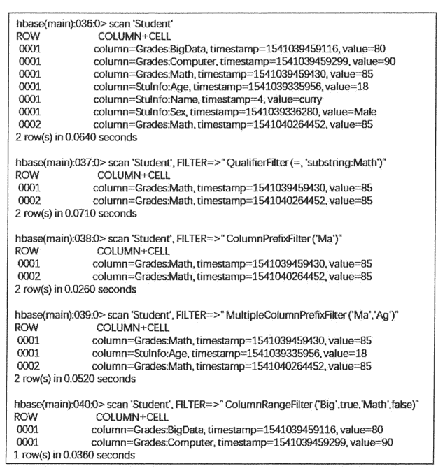

# HBase 过滤器入门教程

> 原文：[`c.biancheng.net/view/6522.html`](http://c.biancheng.net/view/6522.html)

在 HBase 中，get 和 scan 操作都可以使用过滤器来设置输出的范围，类似 SQL 里的 Where 查询条件。

使用 show_filter 命令可以查看当前 HBase 支持的过滤器类型，如下图所示。

使用上述过滤器时，一般需要配合比较运算符或比较器使用，如下面两个表所示。

比较运算符

| 比较运算符 | 描述 |
| = | 等于 |
| > | 大于 |
| >= | 大于等于 |
| < | 小于 |
| <= | 小于等于 |
| != | 不等于 |

比较器

| 比较器 | 描述 |
| BinaryComparator | 匹配完整字节数组 |
| BinaryPrefixComparator | 匹配字节数组前缀 |
| BitComparator | 匹配比特位 |
| NullComparator | 匹配空值 |
| RegexStringComparator | 匹配正则表达式 |
| SubstringComparator | 匹配子字符串 |

使用过滤器的语法格式如下所示：

scan '表名', { Filter => "过滤器(比较运算符, '比较器') }

在上述语法中，Filter=> 指明过滤的方法，整体可用大括号引用，也可以不用大括号。过滤的方法用双引号引用，而比较方式用小括号引用。

下面介绍常见的过滤器使用方法。

## 行键过滤器

RowFilter 可以配合比较器和运算符，实现行键字符串的比较和过滤。例如，匹配行键中大于 0001 的数据，可使用 binary 比较器；匹配以 0001 开头的行键，可使用 substring 比较器，注意 substring 不支持大于或小于运算符。

实现上述匹配条件的过滤命令以及显示结果如下图所示。

针对行键进行匹配的过滤器还有 PrefixFilter、KeyOnlyFilter、FirstKeyOnlyFilter 和 InclusiveStopFilter，其具体含义和使用示例如下表所示。

其中，FirstKeyOnlyFilter 过滤器可以用来实现对逻辑行进行计数的功能，并且比其他计数方式效率高。

其他行键过滤器描述

| 行键过滤器 | 描述 | 示例 |
| PrefixFilter | 行键前缀比较器，比较行键前缀 | scan 'Student', FILTER => "PrefixFilter('0001')" 同
scan 'Student', FILTER => "RowFilter(=,'substring:0001')" |
| KeyOnlyFilter | 只对单元格的键进行过滤和显示，不显示值 | scan 'Student', FILTER => "KeyOnlyFilter()" |
| FirstKeyOnlyFilter | 只扫描显示相同键的第一个单元格，其键值对会显示出来 | scan 'Student', FILTER => "FirstKeyOnlyFilter()" |
| InclusiveStopFilter | 替代 ENDROW 返回终止条件行 | scan 'Student', { STARTROW => '0001', FIILTER => "InclusiveStopFilter('binary:0002')" } 同
scan 'Student', { STARTROW => '0001', ENDROW => '0003' } |

上表中的命令示例操作结果如下图所示。

## 列族与列过滤器

针对列族进行过滤的过滤器为 FamilyFilter，其语法结构与 RowFilter 类似，不同之处在于 FamilyFilter 是对列族名称进行过滤的。

例如，以下命令扫描 Student 表显示列族为 Grades 的行。

scan 'Student', FILTER=>" FamilyFilter(= , 'substring:Grades')"

针对列的过滤器如下表所示，这些过滤器也需要结合比较运算符和比较器进行列族或列的扫描过滤。

列过滤器描述

| 列过滤器 | 描述 | 示例 |
| QualifierFilter | 列标识过滤器，只显示对应列名的数据 | scan 'Student', FILTER => "QualifierFilter(=,'substring:Math')" |
| ColumnPrefixFilter | 对列名称的前缀进行过滤 | scan 'Student', FILTER => "ColumnPrefixFilter('Ma')" |
| MultipleColumnPrefixFilter | 可以指定多个前缀对列名称过滤 | scan 'Student', FILTER => "MultipleColumnPrefixFilter('Ma','Ag')" |
| ColumnRangeFilter | 过滤列名称的范围 | scan 'Student', FILTER => "ColumnRangeFilter('Big',true,'Math',false')" |

上表中 QualifierFilter 和 ColumnPrefixFilter 过滤效果类似，只是 ColumnPrefixFilter 无须结合运算符和比较器即可完成字符串前缀的过滤。

MultipleColumnPrefixFilter 过滤器是对 ColumnPrefixFilter 的延伸，可以一次过滤多个列前缀。

ColumnRangeFilter 过滤器则可以扫描出符合过滤条件的列范围，起始和终止列名用单引号引用，true 和 false 参数可指明结果中包含的起始或终止列。

上表中的过滤器示例在 HBase Shell 中扫描结果如下图所示。

## 值过滤器

在 HBase 的过滤器中也有针对单元格进行扫描的过滤器，即值过滤器，如下表所示。

值过滤器描述

| 值过滤器 | 描述 | 示例 |
| ValueFilter | 值过滤器，找到符合值条件的键值对 | scan 'Student', FILTER => "ValueFilter(=,'substring:curry')" 同
get 'Student', '0001', FILTER => "ValueFilter(=,'substring:curry')" |
| SingleColumnValueFilter | 在指定的列族和列中进行比较的值过滤器 | scan 'Student', Filter => "SingleColumnValueFilter('StuInfo', 'Name', =, 'binary:curry')" |
| SingleColumnValueExcludeFilter | 排除匹配成功的值 | scan 'Student', Filter => "SingleColumnValueExcludeFilter('StuInfo', 'Name', =, 'binary:curry')" |

ValueFilter 过滤器可以利用 get 和 scan 方法对单元格进行过滤，但是使用 get 方法时，需要指定行键。

SingleColumnValueFilter 和 SingleColumnValueExcludeFilter 过滤器扫描的结果是相反的， 都需要在过滤条件中指定列族和列的名称。

上表中的值过滤器示例在 HBase Shell 中扫描结果如下图所示。

## 其他过滤器

还有一些其他的过滤器，其过滤方式和示例如下表所示。

其他过滤器描述

| 值过滤器 | 描述 | 示例 |
| ColumnCountGetFilter | 限制每个逻辑行返回键值对的个数，在 get 方法中使用 | get 'Student', '0001', FILTER => "ColumnCountGetFilter(3)" |
| TimestampsFilter | 时间戳过滤，支持等值，可以设置多个时间戳 | scan 'Student', Filter => "TimestampsFilter(1,4)" |
| InclusiveStopFilter | 设置停止行 | scan 'Student', { STARTROW => '0001', ENDROW => '0005', FILTER => "InclusiveStopFilter('0003')" } |
| PageFilter | 对显示结果按行进行分页显示 | scan 'Student', { STARTROW => '0001', ENDROW => '0005', FILTER => "PageFilter(3)" } |
| ColumnPaginationFilter | 对一行的所有列分页，只返回 [offset,offset+limit] 范围内的列 | scan 'Student', { STARTROW => '0001', ENDROW => '0005', FILTER => "ColumnPaginationFilter(2,1)" } |

ColumnCountGetFilter 过滤器限制每个逻辑行返回多少列，一般不用在 scan 方法中，Timestamps Filter 匹配相同时间戳的数据。

InclusiveStopFilter 过滤器设置停止行，且包含停止的行，上表中示例最终展示数据为行键 0001〜0003 范围内的数据。PageFilter 设置每页最多显示多少逻辑行, 示例中显示三个逻辑行。

ColumnPaginationFilter 过滤器对一个逻辑行的所有列进行分页显示。