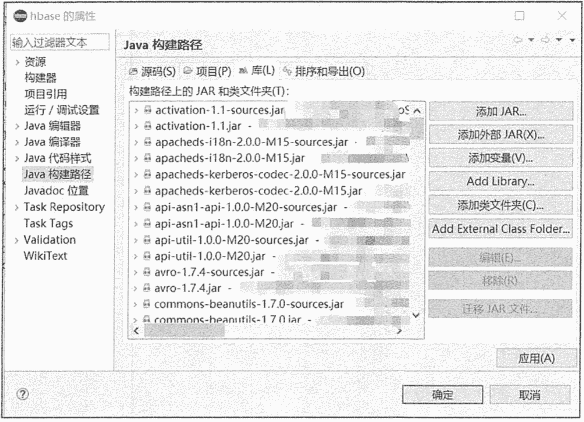

# HBase Java 编程入门教程

> 原文：[`c.biancheng.net/view/6523.html`](http://c.biancheng.net/view/6523.html)

一款优秀的数据库除了会提供客户端，还会提供编程语言接口，HBase 也不例外。HBase 除了支持使用 Shell 客户端来操作（请看《HBase Shell 及其常用命令》），还提供了多种编程语言的接口，其中 Java API 是原生支持的，其它编程语言接口需要通过 Thrift 协议支持。

本节只讲解 Java 接口编程，其它编程语言接口请转到《HBase Thrift 协议编程入门教程》。

HBase 官方代码包里含有原生访问客户端，由 Java 语言实现，相关的类在 org.apache.hadoop.hbase.client 包中，都是与 HBase 数据存储管理相关的 API。

例如，若要管理 HBase，则用 Admin 接口来创建、删除、更改表；若要向表格添加数据或查询数据，则使用 Table 接口等。

下面主要介绍 Admin 和 Table 接 口以及 HBaseConfiguration、HTableDescriptor、HClounmDescriptor、Put、Get、Result、Scan 这些类的功能和常用方法。

## 开发环境配置

使用 Java 开发 Hbase，只需要将用到的 HBase 库包加入引用路径即可。本节使用 Eclipse 集成开发环境进行编程，如果系统已经安装 Maven，可以创建 Maven 项目，在 pom.xml 配置 HBase 的依赖即可自动下载 jar 包。

下面讲解如何在 Eclipse 中手动导入 HBase 库包。

首先创建 Java 工程，然后鼠标右键单击工程名，选择属性，在“Java 构建路径”→“库”→ “添加外部 JAR”中找到 HBase 安装目录下的 lib 子目录，将需要的库包导入工程，即可进行基本的 HBase 操作，如下图所示。

然后在工程目录 src 下新建类文件，在 Java 文件中导入需要的 HBase 包，如 HBase 的环境配置包、HBase 客户端接口、工具包等：

import org.apache.hadoop.conf.Configuration;
import org.apache.hadoop.hbase.*;
import org.apache.hadoop.hbase.client.*;
import org.apache.hadoop.hbase.util.Bytes;

在使用过程中可以根据需要加入更多的包，如 HBase 的过滤器等。

## 构建 Java 客户端

在分布式环境下，客户端访问 HBase 需要通过 ZooKeeper 的地址和端口来获取当前活跃的 Master 和所需的 RegionServer 地址。因此需要先用 HBaseCongifiguration 类配置 ZooKeeper 的地址和端口，然后再使用 Connection 类建立连接。

示例代码如下：

```

public static Configuration conf;
public static Connection connection;
public void getconnect() throws IOException {
    conf=HBaseConfiguration.create();
    conf.set("hbase.zookeeper.quorum", "cm-cdh01");
    conf.set("hbase.zookeeper.property.clientPort","2181");
    try{
        connection=ConnectionFactory.createConnection(conf);
    } catch (IOException e) {
        e.printStackTrace();
    }
}
```

cm-cdh01 为 ZooKeeper 的地址，2181 为端口号。HBaseConfiguration.create() 方法用来创建相关配置，然后使用此配置信息进行数据库的连接。

## 表操作

连接数据库后，完成表的创建和删除。示例代码如下：

```

public void createtable() throws IOException{
    TableName tableName = TableName.valueOf("Student");
    Admin admin = connection.getAdmin();
    if{admin.tableExists(tableName)) {
        admin.disableTable(tableName);
        admin.deleteTable(tableName);
        System.out.printin(tableName.toString() + "is exist,delete it");
    }
    HTableDescriptor tdesc = new HTableDescriptor(tableName);
    HColumnDescriptor colDesc = new HColumnDescriptor("Stulnfo");
    tdesc.addFamily(colDesc);
    tdesc.addFamily(new HColumnDescriptor("Grades"));
    admin.createTable(tdesc);
    admin.close();
}
```

其中，Admin 是 Java 的接口类型，在使用 Admin 时，必须调用 Connection.getAdmin() 方法返回一个子对象，然后用这个 Admin 接口来操作返回的子对象方法。

这个接口用于管理 HBase 数据库的表信息，包括创建、删除表和列出所有表项等，主要的方法参见下表。

Admin 接口的主要方法

| 方法返回类型 | 方法描述 |
| void | abort(String why, Throwable e) 终止服务器或客户端 |
| void | closeRegion(byte[] regionname, String serverName) 关闭 Region |
| void | createTableb(TableDescriptor, desc) 创建表 |
| void | deleteTable(TableName tableName) 删除表 |
| void | disableTable(TableName tableName) 使表无效 |
| void | enableTable(TableName tableName) 使表有效 |
| HTableDescriptor[]  | listTables() 列出所有表项 |
| HTableDescriptor[] | getTableDescriptor(TableName tableName) 获取表的详细信息 |

使用 get 方法获取某一行数据，代码示例如下：

```

public void getData() throws IOException{
    Table table = connection.getTable(TableName.valueOf("Student"));
    Get get = new Get(Bytes.toBytes("row1"))；
    Result result= table.get(get);
    for (Cell cell:resuIt.rawCells()){
        System.out.println(new String(CellUtil.getCellKeyAsString(cell)));
        System.out.printin(new String(CellUtil.cloneFamily(cell)));
        System.out.printin(new String(CellUtil.cloneQualifier(cell)));
        System.out.printin(new String(CellUtil.cloneValue(cell)));
        System.out.printin(cell.getTimestamp());
    }
    table.close();
}
```

通过 table.get() 方法进行查询后，将结果存入 result 中，其中包含多个键值对，本例中使用循环的方法将键值对逐个打印出来。CellUtil 接口提供每个单元格的定位值，如行键、列族、列和时间戳。

对 HBase 表的增、删、改、查，org.apache.hadoop.hbase.client 包提供了相应的类，除了已经举例说明的插入数据使用的 put 类、根据行键获取数据的 get 类外，还有进行全表扫描的 scan 类、 删除某行信息的 delete 类，甚至提供了扫描数据时进行过滤的 FilterList 类，读者可以在 HBase 官网获取详细信息。