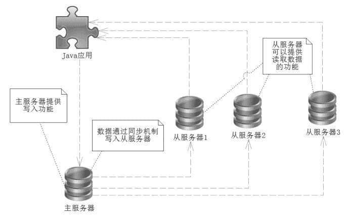
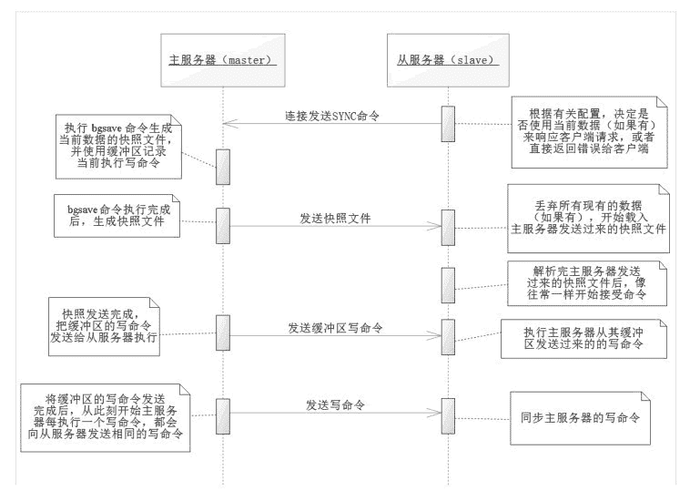
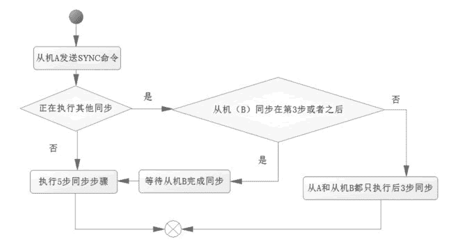

# Redis 主从复制的配置方法和执行过程

> 原文：[`c.biancheng.net/view/4565.html`](http://c.biancheng.net/view/4565.html)

尽管 Redis 的性能很好，但是有时候依旧满足不了应用的需要，比如过多的用户进入主页，导致 Redis 被频繁访问，此时就存在大量的读操作。

对于一些热门网站的某个时刻（比如促销商品的时候）每秒成千上万的请求是司空见惯的，这个时候大量的读操作就会到达 Redis 服务器，触发许许多多的操作，显然单靠一台 Redis 服务器是完全不够用的。

一些服务网站对安全性有较高的要求，当主服务器不能正常工作的时候，也需要从服务器代替原来的主服务器，作为灾备，以保证系统可以继续正常的工作。

因此更多的时候我们更希望可以读/写分离，读/写分离的前提是读操作远远比写操作频繁得多，如果把数据都存放在多台服务器上那么就可以从多台服务器中读取数据，从而消除了单台服务器的压力，读/写分离的技术已经广泛用于数据库中了。

## 主从同步基础概念

互联网系统一般是以主从架构为基础的，所谓主从架构设计的思路大概是：

*   在多台数据服务器中，只有一台主服务器，而主服务器只负责写入数据，不负责让外部程序读取数据。
*   存在多台从服务器，从服务器不写入数据，只负责同步主服务器的数据，并让外部程序读取数据。
*   主服务器在写入数据后，即刻将写入数据的命令发送给从服务器，从而使得主从数据同步。
*   应用程序可以随机读取某一台从服务器的数据，这样就分摊了读数据的压力。
*   当从服务器不能工作的时候，整个系统将不受影响；当主服务器不能工作的时候，可以方便地从从服务器中选举一台来当主服务器。

请注意上面的思路，笔者用了“大概”这两个字，因为这只是一种大概的思路，每一种数据存储的软件都会根据其自身的特点对上面的这几点思路加以改造，但是万变不离其宗，只要理解了这几点就很好理解 Redis 的复制机制了。主从同步机制如图 1 所示。
图 1  主从同步机制
这个时候读数据就可以随机从服务器上读取，当从服务器是多台的时候，那么单台服务器的压力就大大降低了，这十分有利于系统性能的提高，当主服务器出现不能工作的情况时，也可以切换为其中的一台从服务器继续让系统稳定运行，所以也有利于系统运行的安全性。当然由于 Redis 自身具备的特点，所以其也有实现主从同步的特殊方式。

## Redis 主从同步配置

对 Redis 进行主从同步的配置分为主机与从机，主机是一台，而从机可以是多台。

首先，明确主机。当你能确定哪台机子是主机的时候，关键的两个配置是 dir 和 dbfilename 选项，当然必须保证这两个文件是可写的。对于 Redis 的默认配置而言，dir 的默认值为“./”，而对于 dbfilename 的默认值为“dump.rbd”。换句话说，默认采用 Redis 当前目录的 dump.rbd 文件进行同步。对于主机而言，只要了解这多信息，很简单。

其次，在明确了从机之后，进行进一步配置所要关注的只有 slaveof 这个配置选项，它的配置格式是：

slaveof server port

其中，server 代表主机，port 代表端口。当从机 Redis 服务重启时，就会同步对应主机的数据了。当不想让从机继续复制主机的数据时，可以在从机的 Redis 命令客户端发送 slaveof no one 命令，这样从机就不会再接收主服务器的数据更新了。又或者原来主服务器已经无法工作了，而你可能需要去复制新的主机，这个时候执行 slaveof sever port 就能让从机复制另外一台主机的数据了。

在实际的 Linux 环境中，配置文件 redis.conf 中还有一个 bind 的配置，默认为 127.0.0.1，也就是只允许本机访问，把它修改为 bind 0.0.0.0，其他的服务器就能够访问了。

上面的文字描述了如何配置，但是有时候需要进一步了解 Redis 主从复制的过程，这些内容对于复制而言是很有必要的，同时也是很有趣的。

## Redis 主从同步的过程

Redis 主从同步的过程如图 2 所示。
图 2  Redis 主从同步
图 2 中左边的流程是主服务器，而右边的流程为从服务器，这里有必要进行更深层次的描述：

1）无论如何要先保证主服务器的开启，开启主服务器后，从服务器通过命令或者重启配置项可以同步到主服务器。

2）当从服务器启动时，读取同步的配置，根据配置决定是否使用当前数据响应客户端，然后发送 SYNC 命令。

当主服务器接收到同步命令的时候，就会执行 bgsave 命令备份数据，但是主服务器并不会拒绝客户端的读/写，而是将来自客户端的写命令写入缓冲区。从服务器未收到主服务器备份的快照文件的时候，会根据其配置决定使用现有数据响应客户端或者拒绝。

3）当 bgsave 命令被主服务器执行完后，开始向从服务器发送备份文件，这个时候从服务器就会丢弃所有现有的数据，开始载入发送的快照文件。

4）当主服务器发送完备份文件后，从服务器就会执行这些写入命令。此时就会把 bgsave 执行之后的缓存区内的写命令也发送给从服务器，从服务完成备份文件解析，就开始像往常一样，接收命令，等待命令写入。

5）缓冲区的命令发送完成后，当主服务器执行一条写命令后，就同时往从服务器发送同步写入命令，从服务器就和主服务器保持一致了。而此时当从服务器完成主服务器发送的缓冲区命令后，就开始等待主服务器的命令了。

以上 5 步就是 Redis 主从同步的过程。

只是在主服务器同步到从服务器的过程中，需要备份文件，所以在配置的时候一般需要预留一些内存空间给主服务器，用以腾出空间执行备份命令。一般来说主服务器使用 50%～65% 的内存空间，以为主从复制留下可用的内存空间。

多从机同步机制，如图 3 所示。
图 3  多从机同步机制
如果出现多台同步，可能会出现频繁等待和频繁操作 bgsave 命令的情况，导致主机在较长时间里性能不佳，这个时候我们会考虑主从链进行同步的机制，以减少这种可能。