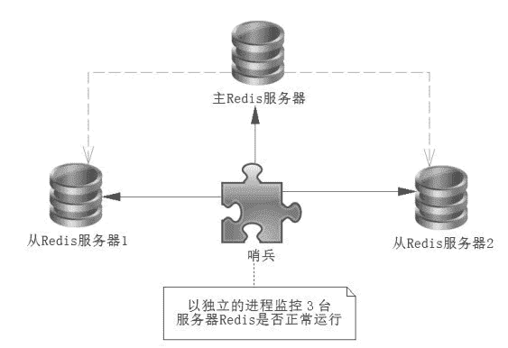
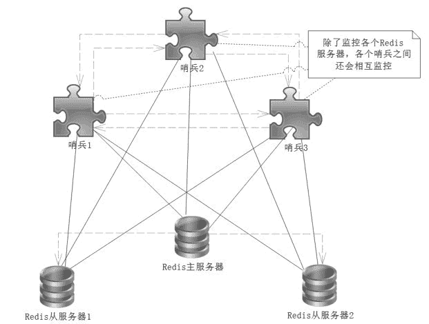
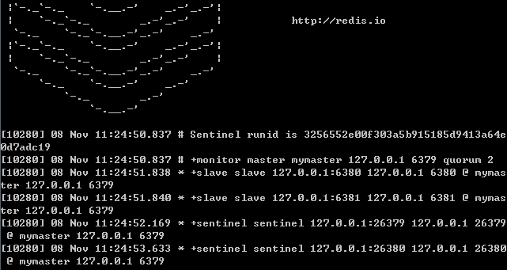

# Redis 哨兵（Sentinel）模式的配置方法及其在 Java 中的用法

> 原文：[`c.biancheng.net/view/4567.html`](http://c.biancheng.net/view/4567.html)

主从切换技术的方法是：当主服务器宕机后，需要手动把一台从服务器切换为主从服务器，这就需要人工干预，既费时费力，还会造成一段时间内服务不可用，这不是一种推荐的方式，因此笔者没有介绍主从切换技术。

更多的时候，我们优先考虑哨兵模式，它是当前企业应用的主流方式。

## 哨兵模式概述

Redis 可以存在多台服务器，并且实现了主从复制的功能。哨兵模式是一种特殊的模式，首先 Redis 提供了哨兵的命令，哨兵是一个独立的进程，作为进程，它会独立运行。

其原理是哨兵通过发送命令，等待 Redis 服务器响应，从而监控运行的多个 Redis 实例，如图 1 所示。
图 1  Redis 哨兵
这里的哨兵有两个作用：

*   通过发送命令，让 Redis 服务器返回监测其运行状态，包括主服务器和从服务器。
*   当哨兵监测到 master 宕机，会自动将 slave 切换成 master，然后通过发布订阅模式通知到其他的从服务器，修改配置文件，让它们切换主机。

只是现实中一个哨兵进程对 Redis 服务器进行监控，也可能出现问题，为了处理这个问题，还可以使用多个哨兵的监控，而各个哨兵之间还会相互监控，这样就变为了多个哨兵模式。多个哨兵不仅监控各个 Redis 服务器，而且哨兵之间互相监控，看看哨兵们是否还“活”着，其关系如图 2 所示。

论述一下故障切换（failover）的过程。假设主服务器宕机，哨兵 1 先监测到这个结果，当时系统并不会马上进行 failover 操作，而仅仅是哨兵 1 主观地认为主机已经不可用，这个现象被称为主观下线。

当后面的哨兵监测也监测到了主服务器不可用，并且有了一定数量的哨兵认为主服务器不可用，那么哨兵之间就会形成一次投票，投票的结果由一个哨兵发起，进行 failover 操作，在 failover 操作的过程中切换成功后，就会通过发布订阅方式，让各个哨兵把自己监控的服务器实现切换主机，这个过程被称为客观下线。这样对于客户端而言，一切都是透明的。
图 2  多哨兵监控 Redis

## 
搭建哨兵模式

配置 3 个哨兵和 1 主 2 从的 Redis 服务器来演示这个过程。机器的分配，如表 1 所示：

表 1 机器分配

| 服务类型 | 是否主服务器 | IP 地址 | 端口 |
| Redis | 是 | 192.168.11.128 | 6379 |
| Redis | 否 | 192.168.11.129 | 6379 |
| Redis | 否 | 192.168.11.130 | 6379 |
| Sentinel | —— | 192.168.11.128 | 26379 |
| Sentinel | —— | 192.168.11.129 | 26379 |
| Sentinel | —— | 192.168.11.130 | 26379 |

它的结构就如同图 2 所示，下面对它们进行配置。首先配置 Redis 的主从服务器，修改服务器的 redis.conf 文件，下面的配置内容，仅仅是笔者在原有文件的基础上修改的内容：

#使得 Redis 服务器可以跨网络访问
bind 0.0.0.0
#设置密码
requiredpass "abcdefg"
#指定主服务器，注意：有关 slaveof 的配置只是配置从服务器，而主服务器不需要配置
slaveof 192.168.11.128 6379
#主服务器密码，注意：有关 slaveof 的配置只是配置从服务器，而主服务器不需要配置
masterauth abcdefg

上述内容主要是配置 Redis 服务器，从服务器比主服务器多一个 slaveof 的配置和密码，这里配置的 bind 使得 Redis 服务器可以跨网段访问。而对于外部的访问还需要提供密码，因此还提供了 requirepass 的配置，用以配置密码，这样就配置完了 3 台服务器。

配置 3 个哨兵，每一个哨兵的配置都是一样的，在 Redis 安装目录下可以找到 sentinel.conf 文件，然后对其进行修改。

下面对 3 个哨兵的这个文件作出修改，同样也是在原有的基础上进行修改，如下所示。

#禁止保护模式
protected-mode no
#配置监听的主服务器，这里 sentinel monitor 代表监控
#mymaster 代表服务器名称，可以自定义
#192.168.11.128 代表监控的主服务器
#6379 代表端口
#2 代表只有两个或者两个以上的烧饼认为主服务器不可用的时候，才会做故障切换操作
sentinel monitor mymaster 192.168.11.128 6379 2
#sentinel auth-pass 定义服务的密码
#mymaster 服务名称
#abcdefg Redis 服务器密码
sentinel auth-pass mymaster abcdefg

上述关闭了保护模式，以便测试。sentinel monitor 是配置一个哨兵主要的内容，首先是自定义服务名称 mymaster，然后映射服务器和端口。最后的 2 是代表当存在两个或者两个以上的哨兵投票认可当前主服务器不可用后，才会进行故障切换，这样可以降低因出错而切换主服务器的概率。sentinel auth-pass 用于配置服务名称及其密码。

有了上述的修改，我们可以进入 Redis 的安装目录下的 src 目录，通过以下命令启动 Redis 服务器和哨兵，如下所示：

#启动哨兵进程
./redis-sentinel ../sentinel.conf
#启动 Redis 服务器进程
./redis-server ../redis.conf

只是这里要注意服务器启动的顺序，首先是主机（192.168.11.128）的 Redis 服务进程，然后启动从机的服务进程，最后启动 3 个哨兵的服务进程。这里可以从哨兵启动的输出窗口看一下哨兵监控信息，如图 3 所示。

从图 3 中，我们看到了一个哨兵对多台 Redis 服务器进行了监控。

## 在 Java 中使用哨兵模式

在 Java 中使用哨兵模式，加入关于哨兵的信息即可，非常简单，下面代码展示了这样的一个过程。

```

//连接池配置
JedisPoolConfig jedisPoolConfig = new JedisPoolConfig();
jedisPoolConfig.setMaxTotal(10);
jedisPoolConfig.setMaxIdle(5);
jedisPoolConfig.setMinIdle(5);
//哨兵信息
Set<String> sentinels = new HashSet<String>(Arrays.asList(
    "192.168.11.128:26379",
    "192.168.11.129:26379",
    "192.168.11.130:26379"
));
//创建连接池
//mymaster 是我们配置给哨兵的服务名称
//sentinels 是哨兵信息
//jedisPoolConfig 是连接池配置
//abcdefg 是连接 Redis 服务器的密码
JedisSentinelPool pool = new JedisSentinelPool("mymaster", sentinels, jedisPoolConfig, "abcdefg");
//获取客户端
Jedis jedis = pool.getResource();
//执行两个命令
jedis.set("mykey", "myvalue");
String myvalue = jedis.get("mykey");
//打印信息
System.out.println(myvalue);
```


图 3  哨兵监控信息
通过上述的代码就能够连接 Redis 服务器了，这个时候将启动主机（192.168.11.128）提供服务。为了验证哨兵的作用，我们可以把主机上的 Redis 服务器关闭，马上运行，你就可以发现报错，那倒不是因为哨兵失效导致的，而是因为 Redis 哨兵默认超时 3 分钟后才会进行投票切换主机，等超过 3 分钟后再进行测试。

同样的，通过配置也可以实现在 Spring 中使用哨兵的这些功能，代码如下所示。

```

<?xml version="1.0" encoding="UTF-8"?>
<beans xmlns="http://www.springframework.org/schema/beans"
    xmlns:xsi="http://www.w3.org/2001/XMLSchema-instance" 
    xmlns:p="http://www.springframework.org/schema/p"
    xsi:schemaLocation="http://www.springframework.org/schema/beans
    http://www.springframework.org/schema/beans/spring-beans-3.2.xsd">
    <bean id="poolConfig" class="redis.clients.jedis.JedisPoolConfig">
        <!-- 最大空闲数 -->
        <property name="maxIdle" value="50" />
        <!-- 最大连接数 -->
        <property name="maxTotal" value="100" />
        <!-- 最大等待时间 -->
        <property name="maxWaitMillis" value="30000" />
    </bean>
    <!-- jdk 序列化器，可保存对象 -->
    <bean id="jdkSerializationRedisSerializer"
        class="org.springframework.data.redis.serializer.JdkSerializationRedisSerializer" />
    <!-- String 序列化器 -->
    <bean id="stringRedisSerializer"
        class="org.springframework.data.redis.serializer.StringRedisSerializer" />

    <!-- 哨兵配置 -->
    <bean id="sentinelConfig"
        class="org.springframework.data.redis.connection.RedisSentinelConfiguration">
        <!-- 服务名称 -->
        <property name="master">
            <bean class="org.springframework.data.redis.connection.RedisNode">
                <property name="name" value="mymaster" />
            </bean>
        </property>
        <!-- 哨兵服务 IP 和端口 -->
        <property name="sentinels">
            <set>
                <bean class="org.springframework.data.redis.connection.RedisNode">
                    <constructor-arg name="host" value="192.168.11.128" />
                    <constructor-arg name="port" value="26379" />
                </bean>
                <bean class="org.springframework.data.redis.connection.RedisNode">
                    <constructor-arg name="host" value="192.168.11.129" />
                    <constructor-arg name="port" value="26379" />
                </bean>
                <bean class="org.springframework.data.redis.connection.RedisNode">
                    <constructor-arg name="host" value="192.168.11.130" />
                    <constructor-arg name="port" value="26379" />
                </bean>
            </set>
        </property>
    </bean>
    <!-- 连接池设置 -->
    <bean id="connectionFectory"
        class="org.springframework.data.redis.connection.jedis.JedisConnectionFactory">
        <constructor-arg name="sentinelConfig" ref="sentinelConfig" />
        <constructor-arg name="poolConfig" ref="poolConfig" />
        <property name="password" value="abcdefg" />
    </bean>
    <!-- 配置 RedisTemplate -->
    <bean id="redisTemplate" class="org.springframework.data.redis.core.RedisTemplate">
        <property name="connectionFactory" ref="connectionFactory" />
        <property name="keySerializer" ref="stringRedisSerializer" />
        <property name="defaultSerializer" ref="stringRedisSerializer" />
        <property name="valueSerializer" ref="jdkSerializationRedisSerializer" />
    </bean>
</beans>
```

这样就在 Spring 中配置好了哨兵和其他的内容，使用 Spring 测试哨兵，代码如下所示。

```

public static void testLuaFile() {
    ApplicationContext applicationContext = new ClassPathXmlApplicationContext("applicationContext.xml");
    RedisTemplate redisTemplate = applicationContext.getBean(RedisTemplate.class);
    String retVal = (String)redisTemplate.execute((RedisOperations ops)->{
        ops.boundValueOps("mykey").set("myvalue");
        String value = (String)ops.boundValuesOps("mykey").get();
        return value;
    });
    System.out.println(retVal);
}
```

这样在实际的项目中，就可以使用哨兵模式来提高系统的可用性和稳定了。

## 哨兵模式的其他配置项

上述以最简单的配置完成了哨兵模式。哨兵模式的配置项还是比较有用的，比如上述我们需要等待 3 分钟后，Redis 哨兵进程才会做故障切换，有时候我们希望这个时间短一些，下面再对它们进行一些介绍，如表 2 所示。

表 2 哨兵模式的其他配置项

| 配置项 | 参数类型 | 作用 |
| port | 整数 | 启动哨兵进程端口 |
| dir | 文件夹目录 | 哨兵进程服务临时文件夹，默认为 /tmp，要保证有可写入的权限 |
| sentinel down-after-milliseconds | <服务名称><亳秒数（整数）> | 指定哨兵在监测 Redis 服务时，当 Redis 服务在一个亳秒数内都无 法回答时，单个哨兵认为的主观下线时间，默认为 30000（30 秒） |
| sentinel parallel-syncs  | <服务名称><服务器数（整数）> | 指定可以有多少 Redis 服务同步新的主机，一般而言，这个数字越 小同步时间就越长，而越大，则对网络资源要求则越高 |
| sentinel failover-timeout   | <服务名称><亳秒数（整数）> | 指定在故障切换允许的亳秒数，当超过这个亳秒数的时候，就认为 切换故障失败，默认为 3 分钟 |
| sentinel notification-script | <服务名称><脚本路径> | 指定 sentinel 检测到该监控的 redis 实例指向的实例异常时，调用的 报警脚本。该配置项可选，比较常用 |

sentinel down-after-milliseconds 配置项只是一个哨兵在超过其指定的毫秒数依旧没有得到回答消息后，会自己认为主机不可用。对于其他哨兵而言，并不会认为主机不可用。

哨兵会记录这个消息，当拥有认为主观下线的哨兵到达 sentinel monitor 所配置的数量的时候，就会发起一次新的投票，然后切换主机，此时哨兵会重写 Redis 的哨兵配置文件，以适应新场景的需要。