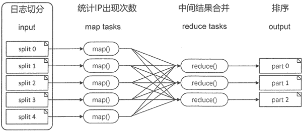
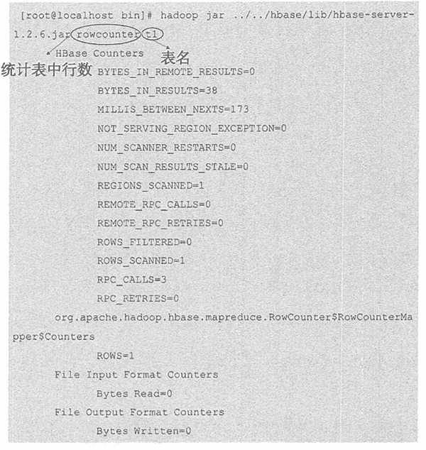

# HBase MapReduce 处理分布式数据

> 原文：[`c.biancheng.net/view/6526.html`](http://c.biancheng.net/view/6526.html)

MapReduce 是 Hadoop 框架的重要组成部分，是在可扩展的方式下处理超过 TB 级数据的分布式处理的组件。它遵循分而治之的原则，通过将数据拆分到分布式文件系统中的不同机器上， 让服务器能够尽快直接访问和处理数据，最终合并全局结果。

以下图所示网站点击率排行为例，简单介绍 MapReduce 处理数据的过程。

首先将网站的日志文件拆分成大小合理的块，每个服务器使用 map 任务处理一个块。一般来说，拆分过程要尽可能地利用可用的服务器和基础设施。

网站的日志文件是非常大的，处理时划分为大小相等的分片，每台服务器完成一个分片的处理后通过 shuffle，最终通过 reduce 任务将所有结果进行汇总。

## HBase 中 MapRecude 包

MapReduce 可用于完成批量数据的分布式处理，而 HBase 中表格的数据是非常庞大的，通常是 GB 或 TB 级，将 MapReduce 和 HBase 结合，能快速完成批量数据的处理。

在应用过程中，HBase 可以作为数据源，即将表中的数据作为 MapReduce 的输入；同时，HBase 可以在 MapReduce 作业结束时接收数据，甚至在 MapReduce 任务过程中使用 HBase 来共享资源。

HBase 支持使用 org.apache.hadoop.hbase.mapieduce 包中的方法来实现 MapReduce 作业，完成 HBase 表中数据的功能如下表所示。

hbase.mapreduce 包

| 类名 | 描述 |
| CellCounter | 利用 MapReduce 计算表中单元格的个数 |
| Export | 将 HBase 中的表导出序列化文件，存储在 HDFS 中 |
| GroupingTableMapper | 从输入记录中抽取列进行组合 |
| HFileOutputFormat2 | 写入 HFile 文件 |
| HRegionPartitioner<KEY,VALUE> | 将输出的 key 分到指定的 key 分组中。key 是根据已存在的 Region 进行分组的，所以每个 Reducer 拥有一个单独的 Region |
| Import | 导入 HDFS 中的序列化文件这些文件是由 Export 导出的 |
| ImportTsv | 导入 TSV 文件的数据 |
| KeyValueSortReducer | 产生排序的键值 |
| LoadIncrementalHFiles | 将 HFileOutputFormat2 的输出导入 HBase 表 |
| MultiTableInputFormat | 将表格数据转换为 MapReduce 格式 |
| MultiTableOutputFormat | 将 Hadoop 的输出写到一个或多个 HBase 表中 |
| TableInputFormat | 将 HBase 表的数据转化为 MapReduce 格式 |
| TableOutputFormat<KEY> | 转化 MapReduce 的输出，写入 HBase 中 |
| TableSplit | 对表进行拆分 |
| WALInputFormat | 作为输入格式用于 WAL |

HBase 还提供了 HBase MapReduce 作业中用到的输入/输出格式化等其他辅助工具，这些都是利用 MapReduce 框架完成的。

读者若要了解更多功能请参考 HBase MapReduce API 官网。

## 执行 HBase MapReduce 任务

HBase 可以通过执行 hbase/lib 中的 hbase-server-1.2.6.jar 来完成一些简单的 MapReduce 操作。

下面通过 hbase/bin/hbase mapredcp 命令来查看执行 MapReduce 会用到的 jar 文件。

[root@localhost bin]# ./hbase mapredcp/usr/local/hbase/lib/zookeeper-3.4.6.jar:/usr/local/hbase/lib/hbase-client-1.2.6.j ar:/usr/local/hbase/lib/netty-all-4.0.23.Final.jar:/usr/local/hbase/lib/metrics-core-2 .2.0.jar:/usr/local/hbase/lib/protobuf-java—2.5.0.jar:/usr/local/hbase/lib/guava-12.0\. 1.jar:/usr/local/hbase/lib/hbase-protocol-1.2.6.jar:/usr/local/hbase/lib/hbase-prefix-tree-1.2.6.jar:/usr/local/hbase/lib/htrace-core-3.1.0-incubating.jar:/usr/local/hbase/ lib/hbase-common-1.2.6.jar:/usr/local/hbase/lib/hbase-hadoop-compat-1.2.6.jar:/usr/loc al/hbase/lib/hbase-server-1.2.6.jar

在执行这些任务之前，需要将这些库绑定到 Hadoop 框架中，确保这些库在任务执行之前已 经可用，通过修改 hadoop/etc/hadoop-env.sh 文件来配置库文件。

在 hadoop-env.sh 中加入以下两行代码：

#hbase 的安装路径
export HBASE_HOME=/usr/local/hbase
#加载 hbase/lib 下的所有库
export HADOOP_CLASSPATH= $HBASE_HOME/lib/*:classpath

完成以上配置后，重新启动 Hadoop 服务，然后在 hadoop 的 bin 目录中执行以下命令:

[root@localhost bin]# hadoop jar ../../hbase/lib/hbase-server-1.2.6.jar
An example program must be given as the first argument.
Valid program names are:
    CellCounter: Count cells in HBase table.
    WALPlayer: Replay WAL files.
    completebulkload: Complete a bulk data load.
    copytable: Export a table from local cluster to peer cluster.
    export: Write table data to HDFS.
    exportsnapshot: Export the specific snapshot to a given FileSystem.
    import: Import data written by Export.
    importtsv: Import data in TSV format.
    rowcounter: Count rows in HBase table.
    verifyrep: Compare the data from tables in two different clusters. WARNING: It doesn ' t work for incrementColumnValues'd cells since the timestamp is changed after being appended to the log.

hbase-server-1.2.6.jar 包提供 CellCounter、export、 import、rowcounter 等类，用户可以直接使用，下图所示为使用 rowcounter 类来统计表中的行数。

