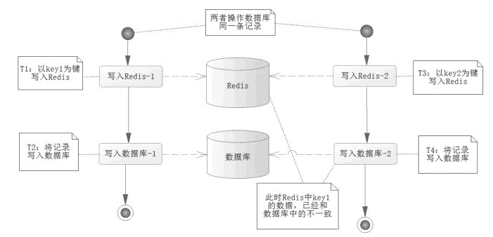
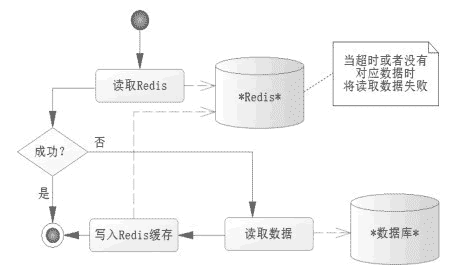
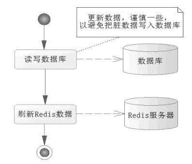

# Redis 和数据库的结合

> 原文：[`c.biancheng.net/view/4571.html`](http://c.biancheng.net/view/4571.html)

使用 Redis 可以优化性能，但是存在 Redis 的数据和数据库同步的问题，这是我们需要关注的问题。假设两个业务逻辑都是在操作数据库的同一条记录，而 Redis 和数据库不一致，如图 1 的场景。

图 1  Redis 和数据库不一致
在图 1 中，T1 时刻以键 key1 保存数据到 Redis，T2 时刻刷新进入数据库，但是 T3 时刻发生了其他业务需要改变数据库同一条记录的数据，但是采用了 key2 保存到 Redis 中，然后又写入了更新数据到数据库中，此时在 Redis 中 key1 的数据是脏数据，和数据库的数据并不一致。

而图 1 只是数据不一致的一个可能的原因，实际情况可能存在多种，比如数据库的事务是完善的，而对于 Redis 的事务，通过学习应该清楚它并不是那么严格的，如果发生异常回滚的事件，那么 Redis 的数据可能就和数据库不太一致了，所以要保存数据的一致性是相当困难的。

但是不用沮丧，因为互联网系统显示给用户的信息往往并不需要完全是“最新的”，有些数据允许延迟。举个例子，一个购物网站会有一个用户购买排名榜，如果做成实时的，每一笔投资都会引发重新计算，那么网站的性能就存在极大的压力，但是这个排名榜却没有太大的意义。

同样，商品的总数有时候只需要去实现一个非实时的数据。这些在互联网系统中也是十分常见的，一般而言，可以在某段时间进行刷新（比如以一个小时为刷新间隔），排出这段时间的最新排名，这就是延迟性的更新。但是对于一些内容则需要最新的，尤其是当前用户的交易记录、购买时商品的数量，这些需要实时处理，以避免数据的不一致，因为这些都是对于企业和用户重要的记录。

我们会考虑读/写以数据库的最新记录为主，并且同步写入 Redis，这样数据就能保持一致性了，而对于一些常用的只需要显示的，则以查询 Redis 为主。这样网站的性能就很高了，毕竟写入的次数远比查询的次数要少得多得多。下面先对数据库的读/写操作进行基本阐述。

## Redis 和数据库读操作

数据缓存往往会在 Redis 上设置超时时间，当设置 Redis 的数据超时后，Redis 就没法读出数据了，这个时候就会触发程序读取数据库，然后将读取的数据库数据写入 Redis（此时会给 Redis 重设超时时间），这样程序在读取的过程中就能按一定的时间间隔刷新数据了，读取数据的流程如图 2 所示。

图 2  读取数据的流程
下面写出这个流程的伪代码：

```

public DataObject readMethod(args) {
    // 尝试从 Redis 中读取数据
    DataObject data = getRedis(key);
    if(data != null) {
        // 读取数据返回为空，失败
        // 从数据库中读取数据
        data = getFromDataBase();
        // 重新写入 Redis，以便以后读出
        writeRedis(key,data);
        // 设置 Redis 的超时时间为 5 分钟
        setRedisExpire(key,5);
    }
    return data;
}
```

上面的伪代码完成了图 2 所描述的过程。这样每当读取 Redis 数据超过 5 分钟，Redis 就不能读到超时数据了，只能重新从 Redis 中读取，保证了一定的实时性，也避免了多次访问数据库造成的系统性能低下的情况。

## Redis 和数据库写操作

写操作要考虑数据一致的问题，尤其是那些重要的业务数据，所以首先应该考虑从数据库中读取最新的数据，然后对数据进行操作，最后把数据写入 Redis 缓存中，如图 3 所示。
图 3  写入数据的流程
写入业务数据，先从数据库中读取最新数据，然后进行业务操作，更新业务数据到数据库后，再将数据刷新到 Redis 缓存中，这样就完成了一次写操作。这样的操作就能避免将脏数据写入数据库中，这类问题在操作时要注意。

下面写出这个流程的伪代码：

```

public DataObject writeMethod(args) {
    //从数据库里读取最新数据
    DataObject dataObject = getFromDataBase(args);
    //执行业务逻辑
    ExecLogic(dataObject);
    //更新数据库数据
    updateDataBase(dataObject);
    //刷新 Redis 缓存
    updateRedisData(dataObject);
}
```

上面的伪代码完成了图 3 所描述的过程。首先，从数据库中读取最新的数据，以规避缓存中的脏数据问题，执行了逻辑，修改了部分业务数据。然后，把这些数据保存到数据库里，最后，刷新这些数据到 Redis 中。