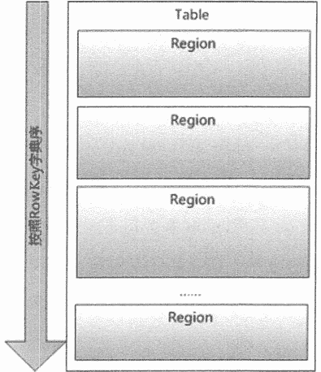
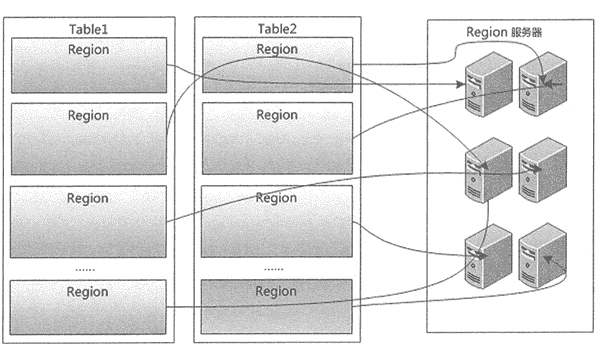
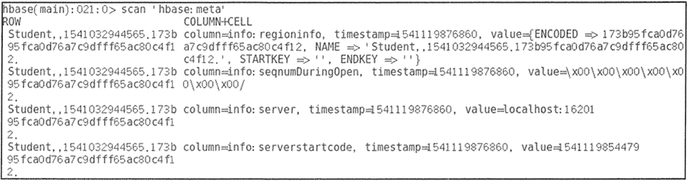
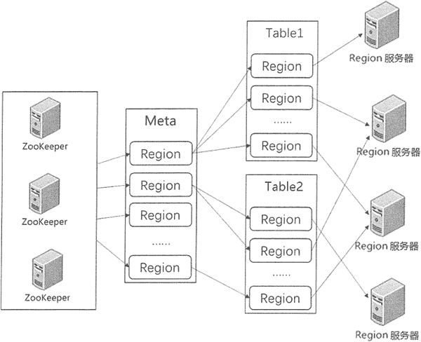

# HBase Region 分区及定位

> 原文：[`c.biancheng.net/view/6528.html`](http://c.biancheng.net/view/6528.html)

在 HBase 中，表的所有行都是按照 RowKey 的字典序排列的，表在行的方向上分割为多个分区（Region），如下图所示。

每张表一开始只有一个 Region，但是随着数据的插入，HBase 会根据一定的规则将表进行水平拆分，形成两个 Region。当表中的行越来越多时，就会产生越来越多的 Region，而这些 Region 无法存储到一台机器上时，则可将其分布存储到多台机器上。

Master 主服务器把不同的 Region 分配到不同的 Region 服务器上，同一个行键的 Region 不会被拆分到多个 Region 服务器上。每个 Region 服务器负责管理一个 Region，通常在每个 Region 服务器上会放置 10 ~ 1000 个 Region，HBase 中 Region 的物理存储如下图所示。

客户端在插入、删除、查询数据时需要知道哪个 Region 服务器上存储所需的数据，这个查找 Region 的过程称为 Region 定位。

HBase 中的每个 Region 由三个要素组成，包括 Region 所属的表、第一行和最后一行。其中，第一个 Region 没有首行，最后一个 Region 没有末行。每个 Region 都有一个 RegionlD 来标识它的唯一性，Region 标识符就可以表示成“表名+开始行键+RegionID”。

## Meta 表

有了 Region 标识符，就可以唯一标识每个 Region。为了定位每个 Region 所在的位置，可以构建一张映射表。

映射表的每个条目包含两项内容，一项是 Region 标识符，另一项是 Region 服务器标识。这个条目就表示 Region 和 Region 服务器之间的对应关系，从而就可以使用户知道某个 Region 存储在哪个 Region 服务器中。这个映射表包含了关于 Region 的元数据，因此也被称为“元数据表”，又名“Meta 表”。

使用 scan 命令可查看 Meta 表的结构，如图所示。

Meta 表中的每一行记录了一个 Region 的信息。RowKey 包含表名、起始行键和时间戳信息，中间用逗号隔开，第一个 Region 的起始行键为空。时间戳之后用`.`隔开的为分区名称的编码字符串，该信息是由前面的表名、起始行键和时间戳进行字符串编码后形成的。

Meta 表里有一个列族 info。info 包含了三个列，分别为 RegioninfoServer 和 Serverstartcode。Regionlnfo 中记录了 Region 的详细信息，包括行键范围 StartKey 和 EndKey、列族列表和属性。

Server 记录了管理该 Region 的 Region 服务器的地址，如 localhost:16201。Serverstartcode 记录了 Region 服务器开始托管该 Region 的时间。

当用户表特别大时，用户表的 Region 也会非常多。Meta 表存储了这些 Region 信息，也变得非常大。Meta 表也需要划分成多个 Region，每个 Meta 分区记录一部分用户表和分区管理的情况。

## Region 定位

在 HBase 的早期设计中，Region 的查找是通过三层架构来进行查询的，即在集群中有一个总入口 ROOT 表，记录了 Meta 表分区信息及各个入口的地址。这个 ROOT 表存储在某个 Region 服务器上，但是它的地址保存在 ZooKeeper 中。

这种早期的三层架构通过先找到 ROOT 表，从中获取分区 Meta 表位置；然后再获取分区 Meta 表信息，找出 Region 所在的 Region 服务器。

从 0.96 版本以后，三层架构被改为二层架构，去掉了 ROOT 表，同时 ZooKeeper 中的 /hbase/root-region-server 也被去掉。Meta 表所在的 Region 服务器信息直接存储在 ZooKeeper 中的 /hbase/meta-region-server 中。

下图为表和分区的分级管理机制。当客户端进行数据操作时, 根据操作的表名和行键，再按照一定的顺序即可寻找到对应的分区数据。

客户端通过 ZooKeeper 获取 Meta 表分区存储的地址，首先在对应的 Region 服务器上获取 Meta 表的信息，得到所需的表和行键所在的 Region 信息，然后从 Region 服务器上找到所需的数据。

一般客户端获取 Region 信息后会进行缓存，用户下次再查询不必从 ZooKeeper 开始寻址。