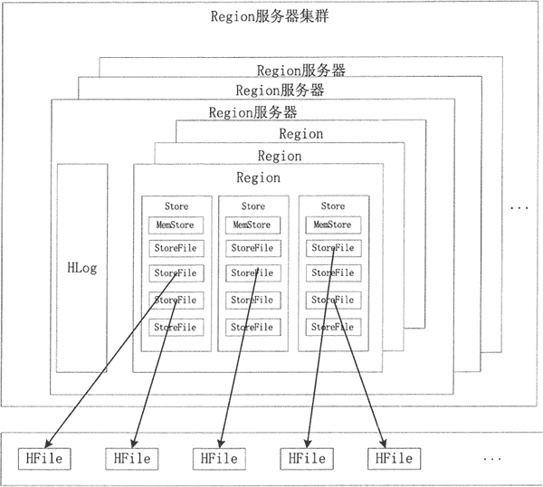
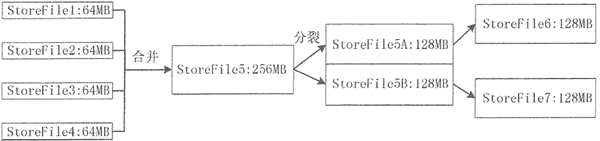
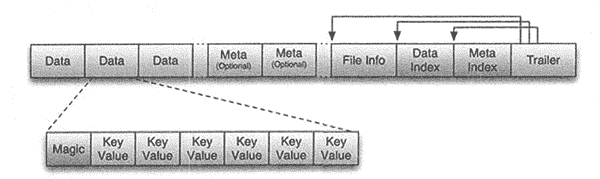
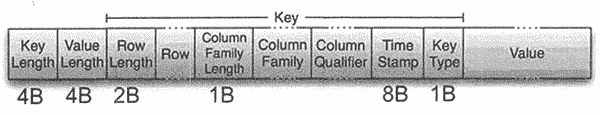

# HBase 数据的读写流程

> 原文：[`c.biancheng.net/view/6529.html`](http://c.biancheng.net/view/6529.html)

HBase 的核心模块是 Region 服务器。Region 服务器由多个 Region 块构成，Region 块中存储一系列连续的数据集。Region 服务器主要构成部分是 HLog 和 Region 块。HLog 记录该 Region 的操作日志。

Region 对象由多个 Store 组成，每个 Store 对应当前分区中的一个列族，每个 Store 管理一块内存，即 MemStoreo 当 MemStore 中的数据达到一定条件时会写入 StoreFile 文件中，因此每个 Store 包含若干个 StoreFile 文件。StoreFile 文件对应 HDFS 中的 HFile 文件。

HBase 群集数据的构成如图所示。

## MemStore

当 Region 服务器收到写请求的时候，Region 服务器会将请求转至相应的 Region。数据先被写入 MemStore，当到达一定的阈值时，MemStore 中的数据会被刷新到 HFile 中进行持久化存储。

HBase 将最近接收到的数据缓存在 MemStore 中，在持久化到 HDFS 之前完成排序，再顺序写入 HDFS，为后续数据的检索进行优化。因为 MemStore 缓存的是最近增加的数据，所以也提高了对近期数据的操作速度。

在持久化写入之前，在内存中对行键或单元格进行优化。例如，当数据的 version 被设为 1 时，对某些列族中的一些数据，MemStore 缓存单元格的最新数据，在写入 HFile 时，仅需要保存一个最新的版本。

## Store

Store 是 Region 服务器的核心，存储的是同一个列族下的数据，每个 Store 包含一块 MemStore 和 StoreFile（ 0 个或多个）。StoreFile 是 HBase 中最小的数据存储单元。

数据写入 MemStore 缓存，当 MemStore 缓存满时，内存中的数据会持久化到磁盘中一个 StoreFile 文件中，随着 StoreFile 文件数量的不断增加，数量达到一个阈值后，就会促使文件合并成一个大的 StoreFile 文件。

由于 StoreFile 文件的不断合并，造成 StoreFile 文件的大小超过一定的阈值，因此，会促使文件进行分裂操作。同时，当前的一个父 Region 会被分成两个子 Region, 父 Region 会下线，新分裂出的两个子 Region 会被 Master 分配到相应的 Regio n 服务器上。

Store 的合并和分裂过程如下图所示。

## HFile

将 MemStore 内存中的数据写入 StoreFile 文件中，StoreFile 底层是以 HFile 格式保存的。

HFile 的存储格式如下图所示。

HFile 文件是不定长的，长度固定的只有其中的两块：Trailer 和 File Info。Trailer 中有指针指向其他数据块的起始点，File Info 记录了文件的一些 Meta 信息。每个 Data 块的大小可以在创建一个 Table 的时候通过参数指定（默认块大小为 64KB）。每个 Data 块除了开头的 Magic 以外就是由一个键值对拼接而成的，Magic 内容是一些随机数字，用于防止数据损坏。

HFile 里面的每个键值对就是一个简单的 Byte 数组。但是这个 Byte 数组里面包含了很多项， 并且有固定的结构，其具体结构如图所示。

键值对结构以两个固定长度的数值开始，分别表示 Key 的长度和 Value 的长度。紧接着是 Key，Key 以 RowLength 开始，是固定长度的数值，表示 RowKey 的长度；接着是 Row，然后是固定长度的数值 ColumnFamilyLength，表示 Family 的长度；之后是 Family 列族，接着是 Qualifier 列标识符，Key 最后以两个固定长度的数值 Time Stamp 和 Key Type(Put/Delete) 结束。Value 部分没有这么复杂的结构，就是纯粹的二进制数据。

#### HBase 数据写入流程

1) 客户端访问 ZooKeeper，从 Meta 表得到写入数据对应的 Region 信息和相应 的 Region 服务器。

2) 客户端访问相应的 Region 服务器，把数据分别写入 HLog 和 MemStore。MemStore 数据容量有限，当达到一个阈值后，则把数据写入磁盘文件 StoreFile 中，在 HLog 文件中写入一个标记，表示 MemStore 缓存中的数据已被写入 StoreFile 中。如果 MemStore 中的数据丢失，则可以从 HLog 上恢复。

3) 当多个 StoreFile 文件达到阈值后，会触发 Store.compact() 将多个 StoreFile 文件合并为一个 大文件。

#### HBase 数据读取流程

1) 客户端先访问 ZooKeeper，从 Meta 表读取 Region 信息对应的服务器。

2) 客户端向对应 Region 服务器发送读取数据的请求，Region 接收请求后，先从 MemStore 查找数据；如果没有，再到 StoreFile 上读取，然后将数据返回给客户端。