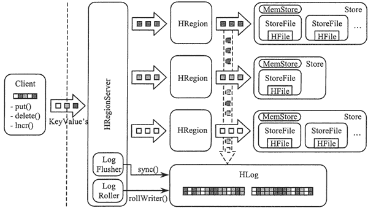

# HBase WAL 机制

> 原文：[`c.biancheng.net/view/6533.html`](http://c.biancheng.net/view/6533.html)

前面两节分别讲解了 HBase 原理的 Region 定位和 HBase 原理的数据存储与读取，本节将讲解 HBase 原理的 WAL 机制。

在分布式环境下，用户必须要考虑系统出错的情形，例如，Region 服务器发生故障时， MemStore 缓存中还没有被写入文件的数据会全部丢失。因此，HBase 采用 HLog 来保证系统发生故障时能够恢复到正常的状态。

如上图所示，每个 Region 服务器都有一个 HLog 文件，同一个 Region 服务器的 Region 对象共用一个 HLog，HLog 是一种预写日志（Write Ahead Log）文件。

也就是说，用户更新数据必须先被记入日志后才能写入 MemStore 缓存，当缓存内容对应的日志已经被写入磁盘后，即日志写成功后，缓存的内容才会被写入磁盘。

ZooKeeper 会实时监测每个 Region 服务器的状态，当某个 Region 服务器发生故障时，ZooKeeper 会通知 Master，Master 首先会处理该故障 Region 服务器上遗留的 HLog 文件。

由于一个 Region 服务器上可能会维护着多个 Region 对象，这些 Region 对象共用一个 HLog 文件，因此这个遗留的 HLog 文件中包含了来自多个 Region 对象的日志记录。

系统会根据每条日志记录所属的 Region 对象对 HLog 数据进行拆分，并分别存放到相应 Region 对象的目录下。再将失效的 Region 重新分配到可用的 Region 服务器中，并在可用的 Region 服务器中重新进行日志记录中的各种操作， 把日志记录中的数据写入 MemStore 然后刷新到磁盘的 StoreFile 文件中，完成数据恢复。

在 HBase 系统中每个 Region 服务器只需要一个 HLog 文件，所有 Region 对象共用一个 HLog，而不是每个 Region 使用一个 HLog。在这种 Region 对象共用一个 HLog 的方式中，多个 Region 对象在进行更新操作需要修改日志时，只需要不断地把日志记录追加到单个日志文件中，而不需要同时打开、写入多个日志文件中，因此可以减少磁盘寻址次数，提高对表的写操作性能。