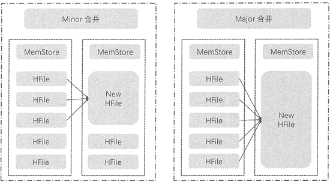
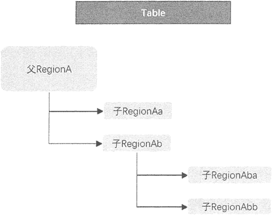

# HBase Region 管理（拆分+合并+负载均衡）

> 原文：[`c.biancheng.net/view/6539.html`](http://c.biancheng.net/view/6539.html)

前面章节讲到 Region 的概念，它是 HBase 集群的负载均衡和数据分发的基本单元。当 HBase 中 表的容量非常庞大时，用户就需要将表中的内容分布到多台机器上。那么，需要根据行键的值对表中的行进行划分，每个行区间构成一个 Region，一个 Region 包含了位于某个阈值区间的所有数据。

下面将介绍 Region 在集群运行过程中进行合并、拆分及分配的过程。

## HFile 合并

每个 RegionServer 包含多个 Region，而每个 Region 又对应多个 Store，每一个 Store 对应表中一个列族的存储，且每个 Store 由一个 MemStore 和多个 StoreFile 文件组成。

StoreFile 在底层文件系统中由 HFile 实现，也可以把 Store 看作由一个 MemStore 和多个 HFile 文件组成。MemStore 充当内存写缓存，默认大小 64MB，当 MemStore 超过阈值时，MemStore 中的数据会刷新到一个新的 HFile 文件中来持久化存储。

久而久之，每个 Store 中的 HFile 文件会越来越多，I/O 操作的速度也随之变慢，读写也会延时，导致慢操作。因此，需要对 HFile 文件进行合并，让文件更紧凑，让系统更有效率。

HFile 的合并分为两种类型，分别是 Minor 合并和 Major 合并。这两种合并都发生在 Stow 内部，不是 Region 的合并，如下图所示。

图 1：Minor 合并与 Major 合并

#### Minor 合并

Minor 合并是把多个小 HFile 合并生成一个大的 HFile。

执行合并时，HBase 读出已有的多个 HFile 的内容，把记录写入一个新文件中。然后把新文件设置为激活状态，并标记旧文件为删除。

在 Minor 合并中，这些标记为删除的旧文件是没有被移除的，仍然会出现在 HFile 中，只有在进行 Major 合并时才会移除这些旧文件。对需要进行 Minor 合并的文件的选择是触发式的，当达到触发条件才会进行 Minor 合并，而触发条件有很多，例如， 在将 MemStore 的数据刷新到 HFile 时会申请对 Store 下符合条件的 HFile 进行合并，或者定期对 Store 内的 HFile 进行合并。

另外对选择合并的 HFile 也是有条件的，如下表所示。

Minor 合并的 HFile 条件

| 参数名 | 配置项 | 默认值 | 备注 |
| minFileToCompact | hbase.hstore.compaction.min | 3 | 至少需要三个满足条件的 HFile 才启动合并 |
| minFileToCompact | hbase.hstore.compaction.max | 10 | 一次合并最多选择 10 个 |
| maxCompactSize | hbase.hstore.compaction.max.size | Long.MAX_VALUE | HFile 大于此值时被排除合并，避免对大文件的合并 |
| minCompactSize | hbase.hstore.compaction.min.size | MemStoreFlushSize | HFile 小于 MemStore 的默认值时被加入合并队列 |

在执行 Minor 合并时，系统会根据上述配置参数选择合适的 HFile 进行合并。Minor 合并对 HBase 的性能是有轻微影响的，因此，合并的 HFile 数量是有限的，默认最多为 10 个。

#### Major 合并

Major 合并针对的是给定 Region 的一个列族的所有 HFile，如图 1 所示。它将 Store 中的所有 HFile 合并成一个大文件，有时也会对整个表的同一列族的 HFile 进行合并，这是一个耗时和耗费资源的操作，会影响集群性能。

一般情况下都是做 Minor 合并，不少集群是禁止 Major 合并的，只有在集群负载较小时进行手动 Major 合并操作，或者配置 Major 合并周期，默认为 7 天。另外，Major 合并时会清理 Minor 合并中被标记为删除的 HFile。

## Region 拆分

Region 拆分是 HBase 能够拥有良好扩展性的最重要因素。一旦 Region 的负载过大或者超过阈值时，它就会被分裂成两个新的 Region，如图 2 所示。

图 2：Region 拆分
这个过程是由 RegionServer 完成的，其拆分流程如下。

1.  将需要拆分的 Region 下线，阻止所有对该 Region 的客户端请求，Master 会检测到 Region 的状态为 SPLITTING。
2.  将一个 Region 拆分成两个子 Region，先在父 Region 下建立两个引用文件，分别指向 Region 的首行和末行，这时两个引用文件并不会从父 Region 中复制数据。
3.  之后在 HDFS 上建立两个子 Region 的目录，分别复制上一步建立的引用文件，每个子 Region 分别占父 Region 的一半数据。复制登录完成后删除两个引用文件。
4.  完成子 Region 创建后，向 Meta 表发送新产生的 Region 的元数据信息。
5.  将 Region 的拆分信息更新到 HMaster，并且每个 Region 进入可用状态。

以上是 Region 的拆分过程，那么，Region 在什么时候才会触发拆分呢？常用的拆分策略如下表所示

Region 拆分策略

| 策略 | 原理 | 描述 |
| ConstantSizeRegionSplitPolicy | Region 中最大 Store 的大小大于设置阈值（hbase.hregion.max.filesize）之后才会触发拆分。 拆分策略原理相同，只是阈值的设置不同 | 拆分策略对于大表和小表没有明显的区分。阈值设置较大时小表可能不会触发分裂。如果阈值设置较小，大表就会在整个集群产生大量的 Region，影响整个集群的性能 |
| IncreasingToUpper BoundRegionSplitPolicy | 阈值在一定条件下不断调整，调整规则与 Region 所属表在当前 Region 服务器上的 Region 个数有关系 | 很多小表会在大集群中产生大量小 Region，分散在整个集群中 |
| SteppingSplitPolicy | 阈值可变。如果 Region 个数等于 1，则拆分阈值为 flushsize × 2；否则为 MaxRegionFileSize | 小表不会再产生大量的小 Region，而是适可而止 |
| DisabledRegionSplitPolicy | 关闭策略，手动拆分 | 可控制拆分时间，选择集群空闲时间 |

上表中列举的拆分策略中，拆分点的定义是一致的，即当 Region 中最大 Store 的大小大于设置阈值之后才会触发拆分。而在不同策略中，阈值的定义是不同的，且对集群中 Region 的分布有很大的影响。

## Region 合并

从 Region 的拆分过程中可以看到，随着表的增大，Region 的数量也越来越大。如果有很多 Region，它们中 MemStore 也过多，会频繁出现数据从内存被刷新到 HFile 的操作，从而会对用户请求产生较大的影响，可能阻塞该 Region 服务器上的更新操作。过多的 Region 会增加 ZooKeeper 的负担。

因此，当 Region 服务器中的 Region 数量到达阈值时，Region 服务器就会发起 Region 合并，其合并过程如下。

1.  客户端发起 Region 合并处理，并发送 Region 合并请求给 Master。
2.  Master 在 Region 服务器上把 Region 移到一起，并发起一个 Region 合并操作的请求。
3.  Region 服务器将准备合并的 Region 下线，然后进行合并。
4.  从 Meta 表删除被合并的 Region 元数据，新的合并了的 Region 的元数据被更新写入 Meta 表中。
5.  合并的 Region 被设置为上线状态并接受访问，同时更新 Region 信息到 Master。

## Region 负载均衡

当 Region 分裂之后，Region 服务器之间的 Region 数量差距变大时，Master 便会执行负载均衡来调整部分 Region 的位置，使每个 Region 服务器的 Region 数量保持在合理范围之内，负载均衡会引起 Region 的重新定位，使涉及的 Region 不具备数据本地性。

Region 的负载均衡由 Master 来完成，Master 有一个内置的负载均衡器，在默认情况下，均衡器每 5 分钟运行一次，用户可以配置。负载均衡操作分为两步进行：首先生成负载均衡计划表， 然后按照计划表执行 Region 的分配。

执行负载均衡前要明确，在以下几种情况时，Master 是不会执行负载均衡的。

*   均衡负载开关关闭。
*   Master 没有初始化。
*   当前有 Region 处于拆分状态。
*   当前集群中有 Region 服务器出现故障。

Master 内部使用一套集群负载评分的算法，来评估 HBase 某一个表的 Region 是否需要进行重新分配。这套算法分别从 Region 服务器中 Region 的数目、表的 Region 数、MenStore 大小、 StoreFile 大小、数据本地性等几个维度来对集群进行评分，评分越低代表集群的负载越合理。

确定需要负载均衡后，再根据不同策略选择 Region 进行分配，负载均衡策略有三种，如下表所示。

负载均衡策略

| 策略 | 原理 |
| RandomRegionPicker | 随机选出两个 Region 服务器下的 Region 进行交换 |
| LoadPicker | 获取 Region 数目最多或最少的两个 Region 服务器，使两个 Region 服务器最终的 Region 数目更加平均 |
| LocalityBasedPicker | 选择本地性最强的 Region |

根据上述策略选择分配 Region 后再继续对整个表的所有 Region 进行评分，如果依然未达到标准，循环执行上述操作直至整个集群达到负载均衡的状态。