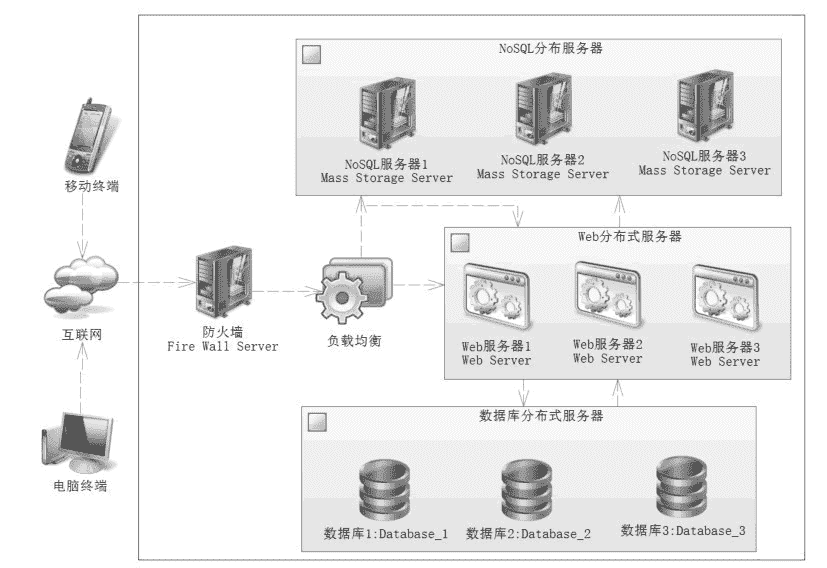

# 互联网系统应用架构基础分析

> 原文：[`c.biancheng.net/view/4586.html`](http://c.biancheng.net/view/4586.html)

在互联网系统中包含许多的工具，每个企业都有自己的架构，正如没有完美的程序一样，也不会有完美的架构。本节分析的架构严格来说并不严谨，但是却包含了互联网的思想，互联网架构如图 1 所示。

图 1  互联网架构
这不是一个严谨的架构，但是它包含了互联网的许多特性。对于防火墙，无非是防止互联网上的病毒和其他攻击，正常的请求通过防火墙后，最先到达的就是负载均衡器，这是关注的核心。

负载均衡器有以下几个功能：

1）对业务请求做初步的分析，决定分不分发请求到 Web 服务器，这就好比一个把控的关卡，常见的分发软件比如 Nginx 和 Apache 等反向代理服务器，它们在关卡处可以通过配置禁止一些无效的请求。

比如封禁经常作弊的 IP 地址，也可以使用 Lua、C 语言联合 NoSQL 缓存技术进行业务分析，这样就可以初步分析业务，决定是否需要分发到服务器。

2）提供路由算法，它可以提供一些负载均衡的算法，根据各个服务器的负载能力进行合理分发，每一个 Web 服务器得到比较均衡的请求，从而降低单个服务器的压力，提高系统的响应能力。

3）限流，对于一些高并发时刻，如双十一、新产品上线，需要通过限流来处理，因为可能某个时刻通过上述的算法让有效请求过多到达服务器，使得一些 Web 服务器或者数据库服务器产生宕机。

当某台机器宕机后，会使得其他服务器承受更大的请求量，这样就容易产生多台服务器连续宕机的可能性，持续下去就会引发服务器雪崩。

因此在这种情况下，负载均衡器有限流的算法，对于请求过多的时刻，可以告知用户系统繁忙，稍后再试，从而保证系统持续可用。

如果顺利通过了防火墙和负载均衡器的请求，那么负载均衡器就会通过设置的算法进行计算后，将请求分发到某一台 Web 服务器上，由 Web 服务器通过分布式的 NoSQL 和数据库提供服务，这样就能够高效响应客户端的请求了。

从上面的分析可以知道，系统完全可以在负载均衡器中进行初步鉴别业务请求，使得一些不合理的业务请求在进入 Web 服务器之前就被排除掉，而为了应对复杂的业务，可以把业务存储在 NoSQL（往往是 Redis）上，通过 C 语言或者 Lua 语言进行逻辑判断，它们的性能比 Web 服务器判断的性能要快速得多。

通过这些简单的判断就能够快速发现无效请求，并把它们排除在 Web 服务器之外，从而降低 Web 服务器的压力，提高互联网系统的响应速度，不过在进一步分析之前，我们还要鉴别无效请求，教程后面会讨论有效请求和无效请求。