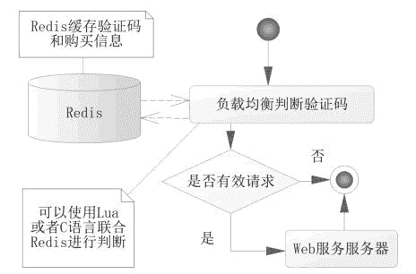
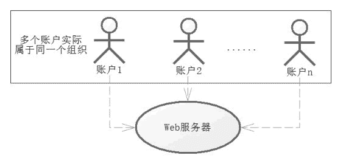
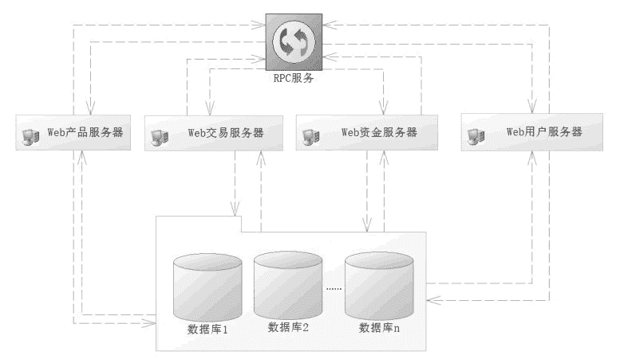
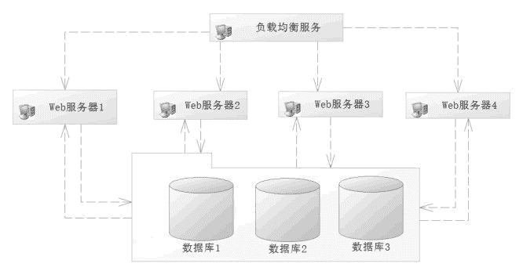
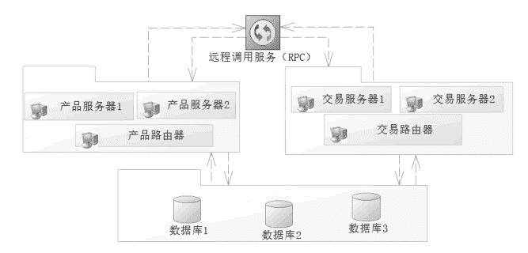
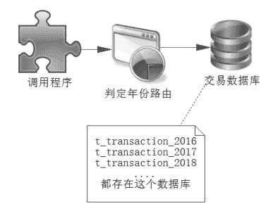
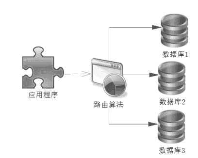
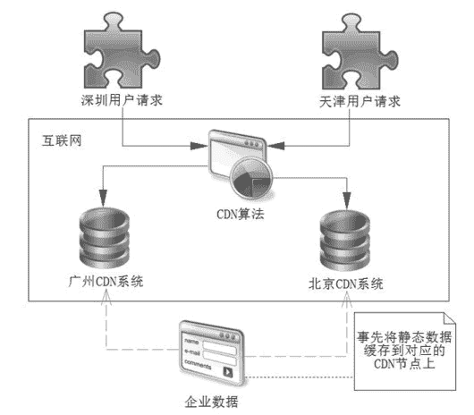

# 高并发系统的分析和设计

> 原文：[`c.biancheng.net/view/4590.html`](http://c.biancheng.net/view/4590.html)

任何系统都不是独立于业务进行开发的，真正的系统是为了实现业务而开发的，所以开发高并发网站抢购时，都应该先分析业务需求和实际的场景，在完善这些需求之后才能进入系统开发阶段。

没有对业务进行分析就贸然开发系统是开发者的大忌。对于业务分析，首先是有效请求和无效请求，有效请求是指真实的需求，而无效请求则是虚假的抢购请求。

## 有效请求和无效请求

无效请求有很多种类，比如通过脚本连续刷新网站首页，使得网站频繁访问数据库和其他资源，造成性能持续下降，还有一些为了得到抢购商品，使用刷票软件连续请求的行为。

鉴别有效请求和无效请求是获取有效请求的高并发网站业务分析的第一步，我们现在来分析哪些是无效请求的场景，以及应对方法。

首先，一个账号连续请求，对于一些懂技术或者使用作弊软件的用户，可以使用软件对请求的服务接口连续请求，使得后台压力变大，甚至在一秒内发送成百上千个请求到服务器。

这样的请求显然可以认为是无效请求，应对它的方法很多，常见的做法是加入验证码。一般而言，首次无验证码以便用户减少录入，第二次请求开始加入验证码，可以是图片验证码、等式运算等。

使用图片验证码可能存在识别图片作弊软件的攻击，所以在一些互联网网站中，图片验证码还会被加工成为东倒西歪的形式，这样增加了图片识别作弊软件的辨别难度，以压制作弊软件的使用。简单的等式运算，也会使图片识别作弊软件更加难以辨认。

其次，使用短信服务，把验证码发送到短信平台以规避部分作弊软件。

在企业应用中，这类问题的逻辑判断，不应该放在 Web 服务器中实现，而应放在负载均衡器上完成，即在进入 Web 服务器之前完成，做完这一步就能避免大量的无效请求，对保证高并发服务器可用性很有效果。

仅仅做这一步或许还不够，毕竟验证码或许还有其他作弊软件可以快速读取图片或者短信信息，从而发送大量的请求。进一步的限制请求，比如限制用户在单位时间的购买次数以压制其请求量，使得这些请求排除在服务器之外。判断验证码逻辑，如图 1 所示。
图 1  判断验证码逻辑
这里的判断是在负载均衡转发给 Web 服务器前，对验证码和单位时间单个账号请求数量进行判断。这里使用了 C 语言和 Redis 进行判断，那么显然这套方案会比 Java 语言和数据库机制的性能要高得多，通过这套体系，基本能够压制一个用户对系统的作弊，也提高了整个系统验证的性能。

这是对一个账号连续无效请求的压制，有时候有些用户可能申请多个账号来迷惑服务器，使得他可以避开对单个账户的验证，从而获得更多的服务器资源。

一个人多个账户的场景还是比较好应付的，可以通过提高账户的等级来压制多个请求，比如对于支付交易的网站，可以通过银行卡验证，实名制获取相关证件号码，从而使用证件号码使得多个账户归结为一人，通过这层关系来屏蔽多个账号的频繁请求，这样就有效地规避了一个人多个账号的频繁请求。

对于有组织的请求，则不是那么容易了，因为对于一些黄牛组织，可能通过多人的账号来发送请求，统一组织伪造有效请求，如图 2 所示。
图 2  统一组织伪造有效请求
对于这样的请求，我们会考虑使用僵尸账号排除法对可交易的账号进行排除，所谓僵尸账号，是指那些平时没有任何交易的账号，只是在特殊的日子交易，比如春运期间进行大批量抢购的账号。

当请求达到服务器，我们通过僵尸账号，排除掉一些无效请求。当然还能使用 IP 封禁，尤其是通过同一 IP 或者网段频繁请求的，但是这样也许会误伤有效请求，所以使用 IP 封禁还是要慎重一些。

## 系统设计

高并发系统往往需要分布式的系统分摊请求的压力，这就需要使用负载均衡服务了，它进行简易判断后就会分发到具体 Web 服务器。

我们要尽量根据 Web 服务器的性能进行均衡分配请求，使得单个 Web 服务器压力不至于过大，导致服务瘫痪，这可以参考 Nginx 的请求分发，这样使得请求能够均衡发布到服务器中去，服务器可以按业务划分。

比如当前的购买分为产品维护、交易维护、资金维护、报表统计和用户维护等模块，按照功能模块进行区分，使得它们相互隔离，就可以降低数据的复杂性，图 3 就是一种典型的按业务划分，或者称为水平分法。

图 3  按业务划分
按照业务划分的好处是：首先，一个服务管理一种业务，业务简单了，提高了开发效率，其次，数据库的设计也方便许多，毕竟各管各的东西。

但是，这也会带来很多麻烦，比如由于各个系统业务存在着关联，还要通过 RPC（Remote Procedure Call Protoco，远程过程调用协议）处理这些关联信息。

比较流行的 RPC 有 Dubbo、Thrift 和 Hessian 等。其原理是，每一个服务都会暴露一些公共的接口给 RPC 服务，这样对于任何一个服务器都能够通过 RPC 服务获取其他服务器对应的接口去调度各个服务器的逻辑来完成功能，但是接口的相互调用也会造成一定的缓慢。

有了水平分法也会有垂直分法，所谓垂直分法就是将一个很大的请求量，不按子系统分，而是将它们按照互不相干的几个同样的系统分摊下去。

比如一台服务器的最大负荷为每秒 1 万个请求，而测得系统高峰为每秒 2 万个请求，如果我们把各个请求按照一定的算法合理分配到 4 台服务器上，那么 4 台服务器平均 5 千个请求就属于正常服务了，这样的路由算法被称为垂直分法，如图 4 所示。
图 4  垂直分法
垂直分法不按业务分，对于负载均衡器的算法往往可以通过用户编号把路由分发到对应的服务器上。

每一个服务器处理自己独立的业务，互不干扰，但是每一个服务器都包含所有的业务逻辑功能，会造成开发上的业务困难，对于数据库设计而言也是如此。

对于大型网站还会有更细的分法，比如水平和垂直结合的分法，如图 5 所示。
图 5  水平和垂直结合分法
首先将系统按照业务区分为多个子系统，然后在每一个子系统下再分多个服务器，通过每一个子系统的路由器找到对应的子系统服务器提供服务。

分法是多样性的，每一个企业都会根据自己的需要而进行不同的设计，但是无论系统如何分，秉承的原则是不变的。

首先，服务器的负载均衡，要使得每一个服务器都能比较平均地得到请求数量，从而提高系统的吞吐和性能。其次，业务简化，按照模块划分可以使得系统划分为各个子系统，这样开发者的业务单一化，就更容易理解和开发了。

## 数据库设计

对于数据库的设计而言，为了得到高性能，可以使用分表或分库技术，从而提高系统的响应能力。

分表是指在一个数据库内本来一张表可以保存的数据，设计成多张表去保存，比如交易表 t_transaction。

由于存储数据多会造成查询和统计的缓慢，这个时候可以使用多个表存储，比如 2016 年的数据用表 t_transaction_2016 存储，2017 年的数据使用表 t_transaction_2017 存储，2018 年的数据则用表 t_transaction_2018 存储，依此类推，开发者只要根据查询的年份确定需要查找哪张表就可以了，如图 6 所示。
图 6  通过年份路由分表
分库则不一样，它把表数据分配在不同的数据库中，比如上述的交易表 t_transaction 可以存放在多个数据库中，如图 7 所示。
图 7  分库设计
分库数据库首先需要一个路由算法确定数据在哪个数据库上，然后才能进行查询，比如我们可以把用户和对应业务的数据库的信息缓存到 Redis 中，这样路由算法就可以通过 Redis 读取的数据来决定使用哪个数据库进行查询了。

一些会员很多的网站还可以区分活跃会员和非活跃会员。活跃会员可以通过数据迁徙的手段，也就是先记录在某个时间段（比如一个月的月底）会员的活跃度，然后通过数据迁徙，将活跃会员较平均分摊到各个数据库中，以避免某个库过多的集中活跃会员，而导致个别数据库被访问过多，从而达到数据库的负载均衡。

做完这些还可以考虑优化 SQL，建立索引等优化，提高数据库的性能。性能低下的 SQL 对于高并发网站的影响是很大的，这些对开发者提出了更高的要求。

在开发网站中使用更新语句和复杂查询语句要时刻记住更新是表锁定还是行锁定，比如 id 是主键，而 user_name 是用户名称，也是唯一索引，更新用户的生日，可以使用以下两条 SQL 中的任何一条：

update t_user set birthday = #{birthday} where id = #{id};
update t_user set birthday = #{birthday} where user_name = #{userName};

上述逻辑都是正确的，但是优选使用主键更新，其原因是在 MySQL 的运行过程中，第二句 SQL 会锁表，即不仅锁定更新的数据，而且锁定其他表的数据，从而影响并发，而使用主键的更新则是行锁定。

对于 SQL 的优化还有很多细节，比如可以使用连接查询代替子查询。查询一个没有分配角色的用户 id，可能有人使用这样的一个 SQL：

select u.id from t_user u
where u.id not in (select ur.user_id from t_user_role ur);

这是一个 not in 语句，性能低下，对于这样的 not in 和 not exists 语句，应该全部修改为连接语句去执行，从而极大地提高 SQL 的性能，比如这条 not in 语句可以修改为：

select u.id from t_user u left join t_user_role ur
on u.id = ur.user_id
where ur.user_id is null;

not in 语句消失了，使用了连接查询，大大提高了 SQL 的执行性能。

此外还可以通过读/写分离等技术，进行进一步的优化，这样就可以有一台主机主要负责写业务，一台或者多台备机负责读业务，有助于性能的提高。

对于分布式数据库而言，还会有另外一个麻烦，就是事务的一致性，事务的一致性比较复杂，目前流行的有两段提交协议，即 XA 协议、Paxos 协议。

## 动静分离技术

动静分离技术是目前互联网的主流技术，对于互联网而言大部分数据都是静态数据，只有少数使用动态数据，动态数据的数据包很小，不会造成网络瓶颈。

而静态的数据则不一样，静态数据包含图片、CSS（样式）、JavaScript（脚本）和视频等互联网的应用，尤其是图片和视频占据的流量很大，如果都从动态服务器（比如 Tomcat、WildFly 和 WebLogic 等）获取，那么动态服务器的带宽压力会很大，这个时候应该考虑使用动静分离技术。

对于一些有条件的企业也可以考虑使用 CDN（Content Delivery Network，即内容分发网络）技术，它允许企业将自己的静态数据缓存到网络 CDN 的节点中。比如企业将数据缓存在北京的节点上，当在天津的客户发送请求时，通过一定的算法，会找到北京 CDN 节点，从而把 CDN 缓存的数据发送给天津的客户，完成请求。

对于深圳的客户，如果企业将数据缓存到广州 CDN 节点上，那么它也可以从广州的 CDN 节点上取出数据，由于就近取出缓存节点的数据，所以速度会很快，如图 8 所示。
图 8  图解 CDN
一些企业也许需要自己的静态 HTTP 服务器，将静态数据分离到静态 HTTP 服务器上。其原理大同小异，就是将资源分配到静态服务器上，这样图片、HTML、脚本等资源都可以从静态服务器上获取，尽量使用 Cookie 等技术，让客户端缓存能够缓存数据，避免多次请求，降低服务器的压力。

对于动态数据，则需要根据会员登录来获取后台数据，这样的动态数据是高并发网站关注的重点。

## 锁和高并发

无论区分有效请求和无效请求，水平划分和垂直划分，动静分离技术，还是数据库分表、分库等技术的应用，都无法避免动态数据，而动态数据的请求最终也会落在一台 Web 服务器上。

对于一台 Web 服务器而言，如果是 Java 服务器，它极有可能采用 SSM 框架结合数据库和 Redis 等技术提供服务，那么它会面临何种困难呢？高并发系统存在的一个麻烦是并发数据不一致问题。

以抢红包为例，发放了一个总额为 20 万元的红包，它可以拆分为 2 万个可抢的小红包。假设每个小红包都是 10 元，供给网站会员抢夺，网站同时存在 3 万会员在线抢夺，这就是一个典型的高并发的场景。

以上会出现多个线程同时享有大红包数据的场景，在高并发的场景中，由于线程每一步完成的顺序不一样，这样会导致数据的一致性问题，比如在最后的一个红包，就可能出现如表 1 所示的场景。

注意表 1 中加粗的文字，由此可见，在高并发的场景下可能出现错扣红包的情况，这样就会导致数据错误。由于在一个瞬间产生很高的并发，因此除了保证数据一致性，我们还要尽可能地保证系统的性能，加锁会影响并发，而不加锁就难以保证数据的一致性，这就是高并发和锁的矛盾。

表 1 最后一个红包出现多扣现象

| 时刻 | 线程一 | 线程二 | 备注 |
| T0 | —— | —— | 存在最后一个红包可抢 |
| T1 | 读取大红包信息，存在最后一个红包，可抢 | —— | —— |
| T2 | —— | 读取大红包信息，存在最后一个红包，可抢 | —— |
| T3 | 扣减最后一个红包 | —— | 此时已经不存在红包可抢 |
| T4 | —— | **扣减红包** | **错误发生了，超扣了** |
| T5 | 记录用户获取红包信息 | —— | —— |
| T6 | —— | **记录用户获取红包信息** | **因为错误扣减红包而引发的错误** |

为了解决这对矛盾，在当前互联网系统中，大部分企业提出了悲观锁和乐观锁的概念，而对于数据库而言，如果在那么短的时间内需要执行大量 SQL，对于服务器的压力可想而知，需要优化数据库的表设计、索引、SQL 语句等。

有些企业提出了使用 Redis 事务和 Lua 语言所提供的原子性来取代现有的数据库的技术，从而提高数据的存储响应，以应对高并发场景，严格来说它也属于乐观锁的概念。教程后面会讨论关于数据不一致的方案，悲观锁、乐观锁和 Redis 实现的场景。