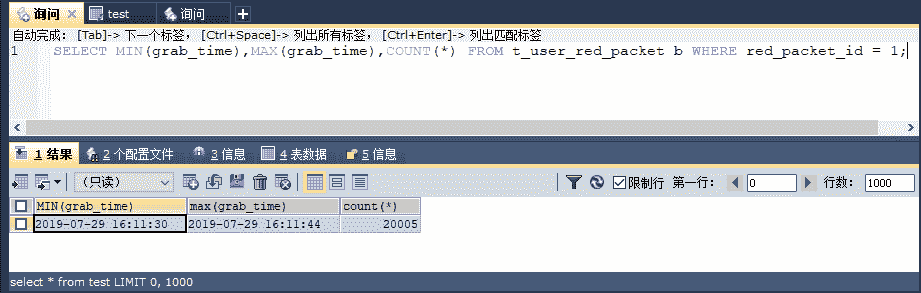

# 使用 Redis 和 SSM（Spring+Spring MVC+MyBatis）搭建抢红包开发环境和超发现象完整实例

> 原文：[`c.biancheng.net/view/4594.html`](http://c.biancheng.net/view/4594.html)

在《高并发系统的分析和设计》教程中介绍了抢红包的场景，现在模拟 20 万元的红包，共分为 2 万个可抢的小红包，有 3 万人同时抢夺的场景，模拟讲解出现超发和如何保证数据一致性的问题。

在高并发的场景下，除了数据的一致性外，还要关注性能的问题，因为一般而言，超过 5 秒用户体验就不太好了，所以要测试数据一致性和系统的性能。

## 搭建 Service 层和 DAO 层

首先要在数据库建表，一个是红包表，另一个是用户抢红包表，如图 1 所示。
图 1  抢红包表设计
这里的红包表表示存放红包的是一个大红包的信息，它会分为若干个小红包，为了业务简单，假设每一个红包是等额的。而对于抢红包而言，就是从大红包中抢夺那些剩余的小红包，剩余红包数会被记录在红包表中，下面给出这两个表的建表 SQL 和数据，代码如下所示。

```

DROP TABLE IF EXISTS `t_red_packet`;

CREATE TABLE `t_red_packet` (
  `id` int(12) NOT NULL AUTO_INCREMENT,
  `user_id` int(12) NOT NULL,
  `amount` decimal(16,2) NOT NULL,
  `send_date` timestamp NOT NULL DEFAULT CURRENT_TIMESTAMP ON UPDATE CURRENT_TIMESTAMP,
  `total` int(12) NOT NULL,
  `unit_amount` decimal(12,0) NOT NULL,
  `stock` int(12) NOT NULL,
  `version` int(12) NOT NULL DEFAULT '0',
  `note` varchar(256) DEFAULT NULL,
  PRIMARY KEY (`id`)
) ENGINE=InnoDB AUTO_INCREMENT=2 DEFAULT CHARSET=utf8;

/*插入一个 20 万元金额，2 万个小红包，每个 10 元的红包数据 */

insert  into `t_red_packet`(`user_id`,`amount`,`send_date`,`total`,`unit_amount`,`stock`,`version`,`note`) values (1,'200000.00','2019-07-29 10:47:20',20000,'10',20000,0,'20 万元金额，2 万个小红包，每个 10 元');

/*Table structure for table `t_user_red_packet` */

DROP TABLE IF EXISTS `t_user_red_packet`;

CREATE TABLE `t_user_red_packet` (
  `id` int(12) NOT NULL AUTO_INCREMENT,
  `red_packet_id` int(12) NOT NULL,
  `user_id` int(12) NOT NULL,
  `amount` decimal(16,2) NOT NULL,
  `grab_time` timestamp NOT NULL DEFAULT CURRENT_TIMESTAMP ON UPDATE CURRENT_TIMESTAMP,
  `note` varchar(256) DEFAULT NULL,
  PRIMARY KEY (`id`)
) ENGINE=InnoDB DEFAULT CHARSET=utf8;
```

这样就建好了两个表，并且将一个 20 万元金额，2 万个小红包，每个 10 元的红包信息插入到了红包表中，将来可以用来模拟测试。

有了这两个表，我们就可以为这两个表建两个 POJO 了，让这两个表和 POJO 对应起来，这两个 POJO 为 RedPacket 和 UserRedPacket，RedPacket 代码如下所示。

```

package com.pojo;

import java.io.Serializable;
//实现 Serializable 接口，这样便可序列化对象
import java.sql.Timestamp;

public class RedPacket implements Serializable {
    private Long id;
    private Long userId;
    private Double amount;
    private Timestamp sendDate;
    private Integer total;
    private Double unitAmount;
    private Integer stock;
    private Integer version;
    private String note;
    /**省略 getter 和 setter 方法**/
}
```

UserRedPacket 代码如下所示：

```

package com.pojo;

import java.io.Serializable;
import java.sql.Timestamp;

public class UserRedPacket implements Serializable {
    private Long id;
    private Long redPacketId;
    private Long userId;
    private Double amount;
    private Timestamp grabTime;
    private String note;
    /**省略 getter 和 setter 方法**/
}
```

这两个 POJO，它们一个是红包信息，一个是抢红包信息。使用 MyBatis 开发它们，先来完成大红包信息的查询，此时先来定义一个 DAO 对象，代码如下所示。

```

package com.dao;
import org.springframework.stereotype.Repository;
import com.pojo.RedPacket;

@Repository
public interface RedPacketDao {
    /**
     * 获取红包信息
     *
     * @param id 红包 id
     * @return 红包具体信息
     */
    public RedPacket getRedPacket(Long id);

    /**
     * 扣减抢红包数
     *
     * @param id -- 红包 id
     * @return 更新记录条数
     */
    public int decreaseRedPacket(Long id);
}
```

其中的两个方法，一个是查询红包，另一个是扣减红包库存。抢红包的逻辑是，先查询红包的信息，看其是否拥有存量可以扣减。如果有存量，那么可以扣减它，否则就不扣减，现在用一个映射 XML 实现这两个方法，代码如下所示。

```

<?xml version="1.0" encoding="UTF-8"?>
<!DOCTYPE mapper
PUBLIC "-//mybatis.org//DTD Mapper 3.0//EN"
"http://mybatis.org/dtd/mybatis-3-mapper.dtd">
<mapper namespace="com.dao.RedPacketDao">
    <!-- 查询红包具体信息 -->
    <select id="getRedPacket" parameterType="long"
        resultType="com.pojo.RedPacket">
        select id, user_id as userId, amount, send_date as sendDate, total,
        unit_amount as unitAmount, stock, version, note from T_RED_PACKET
        where id =#{id}
    </select>
    <!-- 扣减抢红包库存 -->
    <update id="decreaseRedPacket">
        update T_RED_PACKET set stock = stock - 1 where id = #{id}
    </update>
</mapper>
```

这里并没有加锁这类动作，目的是为了演示超发红包的情况，让大家能够明确在高并发下所面临的问题。然后是抢红包的设计了，先来定义插入抢红包的 DAO，代码如下所示。

```

package com.dao;

import org.springframework.stereotype.Repository;
import com.pojo.UserRedPacket;

@Repository
public interface UserRedPacketDao {
    /**
     * 插入抢红包信息
     *
     * @Param userRedPacket 抢红包信息
     * @return 影响记录数
     */
    public int grapRedPacket(UserRedPacket userRedPacket);
}
```

同样的，我们也要使用一个映射 XML 实现接口所定义的插入抢红包的 grapRedPacket 方法，代码如下所示。

```

<?xml version="1.0" encoding="UTF-8"?>
<!DOCTYPE mapper
PUBLIC "-//mybatis.org//DTD Mapper 3.0//EN"
"http://mybatis.org/dtd/mybatis-3-mapper.dtd">
<mapper namespace="com.dao.UserRedPacketDao">
    <!--插入抢红包信息 -->
    <insert id="grapRedPacket" useGeneratedKeys="true"
        keyProperty="id" parameterType="com.pojo.UserRedPacket">
        insert into
        T_USER_RED_PACKET(red_packet_id, user_id, amount,
        grab_time,note)
        values (#{redPacketId}, #{userId}, #{amount}, now(),#{note})
    </insert>
</mapper>
```

这里使用了 useGeneratedKeys 和 keyProperty，这就意味着会返回数据库生成的主键信息，这样就可以拿到插入记录的主键了，关于 DAO 层就基本完成了。

接下来定义两个 Service 层接口，分别是 UserRedPacketService 和 RedPacketService，RedPacketService 代码如下所示。

```

package com.service;

import com.pojo.RedPacket;

public interface RedPacketService {
    /**
     * 获取红包
     *
     * @param id 编号
     * @return 红包信息
     */
    public RedPacket getRedPacket(Long id);

    /**
     * 扣减红包
     *
     * @param id 编号
     * @return 影响条数
     */
    public int decreaseRedPacket(Long id);
}
```

UserRedPacketService 代码如下所示：

```

package com.service;

public interface UserRedPacketService {
    /**
     * 保存抢红包
     *
     * @param redPacketId 红包编号
     * @param userId      抢红包用户编号
     * @return 影响记录数
     */
    public int grapRedPacket(Long redPacketId, Long userId);
}
```

它的两个实现类，比较简单的 RedPacketService 的实现类，代码如下所示。

```

package com.service.impl;

import org.springframework.beans.factory.annotation.Autowired;
import org.springframework.stereotype.Service;
import org.springframework.transaction.annotation.Isolation;
import org.springframework.transaction.annotation.Propagation;
import org.springframework.transaction.annotation.Transactional;

import com.dao.RedPacketDao;
import com.pojo.RedPacket;
import com.service.RedPacketService;

@Service
public class RedPacketServiceImpl implements RedPacketService {
    @Autowired
    private RedPacketDao redPacketDao = null;

    @Override
    @Transactional(isolation = Isolation.READ_COMMITTED, propagation = Propagation.REQUIRED)
    public RedPacket getRedPacket(Long id) {
        return redPacketDao.getRedPacket(id);
    }

    @Override
    @Transactional(isolation = Isolation.READ_COMMITTED, propagation = Propagation.REQUIRED)
    public int decreaseRedPacket(Long id) {
        return redPacketDao.decreaseRedPacket(id);
    }
}
```

配置了事务注解 @Transactional，让程序能够在事务中运行，以保证数据的一致性，这里采用的是读/写提交的隔离级别，之所以不采用更高的级别，主要是提高数据库的并发能力，而对于传播行为则采用 Propagation.REQUIRED，这样调用这个方法的时候，如果没有事务则会创建事务，如果有事务则沿用当前事务。

实现 UserRedPacketService 接口的方法 grapRedPacket，它是核心的接口方法，代码如下所示。

```

package com.service.impl;

import org.springframework.beans.factory.annotation.Autowired;
import org.springframework.transaction.annotation.Isolation;
import org.springframework.transaction.annotation.Propagation;
import org.springframework.transaction.annotation.Transactional;

import com.dao.RedPacketDao;
import com.dao.UserRedPacketDao;
import com.pojo.RedPacket;
import com.pojo.UserRedPacket;
import com.service.UserRedPacketService;

public class UserRedPacketServiceImpl implements UserRedPacketService {
    @Autowired
    private UserRedPacketDao userRedPacketDao = null;
    @Autowired
    private RedPacketDao redPacketDao = null;
    // 失败
    private static final int FAILED = 0;

    @Override
    @Transactional(isolation = Isolation.READ_COMMITTED, propagation = Propagation.REQUIRED)
    public int grapRedPacket(Long redPacketId, Long userId) {
        // 获取红包信息
        RedPacket redPacket = redPacketDao.getRedPacket(redPacketId);
        // 当前小红包库存大于 0
        if (redPacket.getStock() > 0) {
            redPacketDao.decreaseRedPacket(redPacketId);
            // 生成抢红包信息
            UserRedPacket userRedPacket = new UserRedPacket();
            userRedPacket.setRedPacketId(redPacketId);
            userRedPacket.setUserId(userId);
            userRedPacket.setAmount(redPacket.getUnitAmount());
            userRedPacket.setNote("抢红包 " + redPacketId);
            // 插入抢红包信息
            int result = userRedPacketDao.grapRedPacket(userRedPacket);
            return result;
        }
        // 失败返回
        return FAILED;
    }
}
```

grapRedPacket 方法的逻辑是首先获取红包信息，如果发现红包库存大于 0，则说明还有红包可抢，抢夺红包并生成抢红包的信息将其保存到数据库中。

要注意的是，数据库事务方面的设置，代码中使用注解 @Transactional，说明它会在一个事务中运行，这样就能够保证所有的操作都是在一个事务中完成的。在高并发中会发生超发的现象，后面会看到超发的实际测试。

## 使用全注解搭建 SSM 开发环境

这里将使用注解的方式来完成 SSM 开发的环境，可以通过继承 AbstractAnnotation ConfigDispatcherServletInitializer 去配置其他内容，因此首先来配置 WebAppInitializer，代码如下所示。

```

package com.config;

import javax.servlet.FilterRegistration.Dynamic;
import javax.servlet.MultipartConfigElement;

import org.springframework.web.servlet.support.AbstractAnnotationConfigDispatcherServletInitializer;

public class WebAppInitializer extends AbstractAnnotationConfigDispatcherServletInitializer {
    // Spring IoC 环境配置
    @Override
    protected Class<?>[] getRootConfigClasses() {
        // 配置 Spring IoC 资源
        return new Class<?>[] { RootConfig.class };
    }

    // DispatcherServlet 环境配置
    protected Class<?>[] getServletConfigClasses() {
        // 加载 Java 配置类
        return new Class<?>[] { WebConfig.class };
    }

    // DispatchServlet 拦截请求配置
    @Override
    protected String[] getServletMappings() {
        return new String[] { "*.do" };
    }

    /**
     * @param dynamic Servlet 上传文件配置.
     */
    protected void customizeRegistration(Dynamic dynamic) {
        // 配置上传文件路径
        String filepath = "e:/mvc/uploads";
        // 5MB
        Long singleMax = (long) (5 * Math.pow(2, 20));
        // 10MB
        Long totalMax = (long) (10 * Math.pow(2, 20));
        // 设置上传文件配置
        dynamic.setMultipartConfig(new MultipartConfigElement(filepath, singleMax, totalMax, 0));
    }
}
```

这个类继承了 AbstractAnnotationConfigDispatcherServletInitializer，它实现了 3 个抽象方法，并且覆盖了父类的 customizeRegistration 方法，作为上传文件的配置。实现的 3 个方法为：

*   getRootConfigClasses 是一个配置 Spring IoC 容器的上下文配置，此配置在代码中将会由类 RootConfig 完成。
*   getServletConfigClasses 配置 DispatcherServlet 上下文配置，将会由 WebConfig 完成。
*   getServletMappings 配置 DispatcherServlet 拦截内容，拦截所有以 .do 结尾的请求。

通过这 3 个方法就可以配置 Web 工程中的 Spring IoC 资源和 DispatcherServlet 的配置内容，首先是配置 Spring IoC 容器，配置类 RootConfig，代码如下所示。

```

package com.config;

import java.security.Provider.Service;
import java.util.Properties;

import javax.sql.DataSource;

import org.apache.commons.dbcp.BasicDataSourceFactory;
import org.apache.tools.ant.types.selectors.TypeSelector.FileType;
import org.aspectj.apache.bcel.Repository;
import org.mybatis.spring.SqlSessionFactoryBean;
import org.mybatis.spring.mapper.MapperScannerConfigurer;
import org.springframework.context.annotation.Bean;
import org.springframework.context.annotation.ComponentScan;
import org.springframework.context.annotation.ComponentScan.Filter;
import org.springframework.context.annotation.Configuration;
import org.springframework.core.io.ClassPathResource;
import org.springframework.core.io.Resource;
import org.springframework.jdbc.datasource.DataSourceTransactionManager;
import org.springframework.transaction.PlatformTransactionManager;
import org.springframework.transaction.annotation.EnableTransactionManagement;
import org.springframework.transaction.annotation.TransactionManagementConfigurer;

@Configuration
// 定义 Spring 扫描的包
@ComponentScan(value = "com.*", includeFilters = { @Filter(type = FileType.ANNOTATION, value = { Service.class }) })
// 使用事务驱动管理器
@EnableTransactionManagement
// 实现接口 TransactionManagementConfigurer，这样可以配置注解驱动事务
public class RootConfig implements TransactionManagementConfigurer {
    private DataSource dataSource = null;

    /**
     * 配置数据库
     *
     * @return 数据连接池
     */
    @Bean(name = "dataSource")
    public DataSource initDataSource() {
        if (dataSource != null) {
            return dataSource;
        }
        Properties props = new Properties();
        props.setProperty("driverClassName", "com.mysql.jdbc.Driver");
        props.setProperty("url", "jdbc:mysql://localhost:3306/redis");
        props.setProperty("username", "root");
        props.setProperty("password", "1128");
        try {
            dataSource = BasicDataSourceFactory.createDataSource(props);
        } catch (Exception e) {
            e.printStackTrace();
        }
        return dataSource;
    }

    /**
     * 配置 SqlSessionFactoryBean
     *
     * @return SqlSessionFactoryBean
     */
    @Bean(name = "SqlSessionFactory")
    public SqlSessionFactoryBean initSqlSessionFactory() {
        SqlSessionFactoryBean SqlSessionFactory = new SqlSessionFactoryBean();
        SqlSessionFactory.setDataSource(initDataSource());
        // 配置 MyBatis 配置文件
        Resource resource = new ClassPathResource("mybatis/mybatis-config.xml");
        SqlSessionFactory.setConfigLocation(resource);
        return SqlSessionFactory;
    }

    /**
     * 通过自动扫描，发现 MyBatis Mapper 接口
     *
     * @return Mapper 扫描器
     */
    @Bean
    public MapperScannerConfigurer initMapperScannerConfigurer() {
        MapperScannerConfigurer msc = new MapperScannerConfigurer();
        // 扫描包
        msc.setBasePackage("com.*");
        msc.setSqlSessionFactoryBeanName("SqlSessionFactory");
        // 区分注解扫描
        msc.setAnnotationClass(Repository.class);
        return msc;
    }

    /**
     * 实现接口方法，注册注解事务，当@Transactional 使用的时候产生数据库事务
     */
    @Override
    @Bean(name = "annotationDrivenTransactionManager")
    public PlatformTransactionManager annotationDrivenTransactionManager() {
        DataSourceTransactionManager transactionManager = new DataSourceTransactionManager();
        transactionManager.setDataSource(initDataSource());
        return transactionManager;
    }
}
```

这个类和之前论述的有所不同，它标注了注解 @EnableTransactionManagement，实现了接口 TransactionManagementConfigurer，这样的配置是为了实现注解式的事务，将来可以通过注解 @Transactional 配置数据库事务。

它有一个方法定义，这个方法就是 annotationDrivenTransactionManager，这需要将一个事务管理器返回给它就可以了。

除了配置数据库事务外，还配置了数据源 SqlSessionFactoryBean 和 MyBatis 的扫描类，并把 MyBatis 的扫描类通过注解 @Repository 和包名（"com.*"）限定。

这样 MyBatis 就会通过 Spring 的机制找到对应的接口和配置，Spring 会自动把对应的接口装配到 IoC 容器中。

有了 Spring IoC 容器后，还需要配置 DispatcherServlet 上下文，从 WebAppInitializer 配置类来看，完成这个任务的便是类 WebConfig，代码如下所示。

```

package com.config;

import java.util.ArrayList;
import java.util.List;

import org.springframework.context.annotation.Bean;
import org.springframework.context.annotation.ComponentScan;
import org.springframework.context.annotation.ComponentScan.Filter;
import org.springframework.context.annotation.Configuration;
import org.springframework.context.annotation.FilterType;
import org.springframework.http.MediaType;
import org.springframework.http.converter.json.MappingJackson2HttpMessageConverter;
import org.springframework.stereotype.Controller;
import org.springframework.web.servlet.HandlerAdapter;
import org.springframework.web.servlet.ViewResolver;
import org.springframework.web.servlet.config.annotation.EnableWebMvc;
import org.springframework.web.servlet.mvc.method.annotation.RequestMappingHandlerAdapter;
import org.springframework.web.servlet.view.InternalResourceViewResolver;

@Configuration
//定义 Spring MVC 扫描的包
@ComponentScan(value = "com.*", includeFilters = { @Filter(type = FilterType.ANNOTATION, value = Controller.class) })
//启动 Spring MVC 配置
@EnableWebMvc
public class WebConfig {
    /**
     * 通过注解@Bean 初始化视图解析器
     *
     * @return ViewResolver 视图解析器
     */
    @Bean(name = "internalResourceViewResolver")
    public ViewResolver initViewResolver() {
        InternalResourceViewResolver ViewResolver = new InternalResourceViewResolver();
        ViewResolver.setPrefix("/WEB-INF/jsp/");
        ViewResolver.setSuffix(".jsp");
        return ViewResolver;
    }

    /**
     * 初始化 RequestMmppingHandlerAdmpter，并加载 Http 的 Json 转换器
     *
     * @return RequestMappingHandlerAdapter 对象
     */
    @Bean(name = "requestMappingHandlerAdapter")
    public HandlerAdapter initRequestMappingHandlerAdapter() {
        // 创建 RequestMappingHandlerAdapter 适配器
        RequestMappingHandlerAdapter rmhd = new RequestMappingHandlerAdapter();
        // HTTP JSON 转换器
        MappingJackson2HttpMessageConverter jsonConverter = new MappingJackson2HttpMessageConverter();
        // Mapping Jackson2HttpMessageConverter 接收 JSON 类型消息的转换
        MediaType mediaType = MediaType.APPLICATION_JSON_UTF8;
        List<MediaType> mediaTypes = new ArrayList<MediaType>();
        mediaTypes.add(mediaType);
        // 加入转换器的支持类型
        jsonConverter.setSupportedMediaTypes(mediaTypes);
        // 往适配器加入 json 转换器
        rmhd.getMessageConverters().add(jsonConverter);
        return rmhd;
    }
}
```

这里配置了一个视图解析器，通过它找到对应 JSP 文件，然后使用数据模型进行渲染，采用自定义创建 RequestMappingHandlerAdapter，为了让它能够支持 JSON 格式（@ResponseBody）的转换，所以需要创建一个关于对象和 JSON 的转换消息类，那就是 MappingJackson2HttpMessageConverter 类对象。

创建它之后，把它注册给 RequestMapping HandlerAdapter 对象，这样当控制器遇到注解 @ResponseBody 的时候就知道采用 JSON 消息类型进行应答，那么在控制器完成逻辑后，由处理器将其和消息转换类型做匹配，找到 MappingJackson2HttpMessageConverter 类对象，从而转变为 JSON 数据。

通过上面的 3 个类就搭建好了 Spring MVC 和 Spring 的开发环境，但是没有完成对 MyBatis 配置文件，从 RootConfig 类中可以看出，使用文件 /mybatis/mybatis-config.xml 进行配置，它的源码也很简单，如下所示。

```

<?xml version="1.0" encoding="utf-8"?>
<!DOCTYPE configuration PUBLIC "-//mybatis.org//DTD Config 3.0//EN"
"http://mybatis.org/dtd/mybatis-3-config.dtd">
<configuration>
    <mappers>
        <mapper resource="com/dao/RoleMapper.xml" />
        <mapper resource="com/dao/UserRedPacket.xml" />
        <mapper resource="com/dao/RedPacket.xml" />
    </mappers>
</configuration>
```

这样关于后台的逻辑就已经完成，接下来就要开发控制器，进行页面测试了。

## 开发控制器和超发现象测试

有了上述的内容就可以开发控制器，并进行测试。首先要给出一个控制器，用来完成基础的逻辑，代码如下所示。

```

package com.controller;

import java.util.HashMap;
import java.util.Map;

import org.springframework.beans.factory.annotation.Autowired;
import org.springframework.stereotype.Controller;
import org.springframework.web.bind.annotation.RequestMapping;
import org.springframework.web.bind.annotation.ResponseBody;

import com.service.UserRedPacketService;

@Controller
@RequestMapping("/userRedPacket")
public class UserRedPacketController {
    @Autowired
    private UserRedPacketService UserRedPacketService = null;

    @RequestMapping(value = "/grapRedPacket")
    @ResponseBody
    public Map<String, Object> grapRedPacket(Long redPacketId, Long userId) {
        // 抢红包
        int result = UserRedPacketService.grapRedPacket(redPacketId, userId);
        Map<String, Object> retMap = new HashMap<String, Object>();
        boolean flag = result > 0;
        retMap.put("success", flag);
        retMap.put("message", flag ? "抢红包成功" : "抢红包失败");
        return retMap;
    }
}
```

这样就完成了控制器的开发，对于控制器而言，它将抢夺一个红包，并且将一个 Map 返回，由于使用了注解 @ResponseBody 标注方法，所以最后它会转变为一个 JSON 返回给前端请求，编写 JSP 对其进行测试，代码如下所示。

```

<%@ page language="java" contentType="text/html; charset=utf-8"
    pageEncoding="utf-8"%>
<!DOCTYPE html>
<html>
<head>
<meta charset="utf-8">
<title>参数</title>
<!-- Query 文件 -->
<script src="https://code.jquery.com/jquery-3.2.1.min.js"></script>
<script type="text/javascript">
    $(document).ready(function() {
        //模拟 30000 个异步请求，进行并发
        var max = 30000;
        for (var i = 1; i <= max; i++) {
            //jQuery 的 post 请求，请注意这是异步请求
            $.post({
                //请求抢 id 为 1 的红包
                url : "./userRedPacket/grapRedPacket.do?redPacketId=1&userId=" + i,
                //成功后的方法
                success : function(result) {}
            });
        }
    });
</script>
</head>
<body>
</body>
</html>
```

这里我们使用了 JavaScript 去模拟 3 万人同时抢红包的场景，在实际的测试中，笔者使用了 FireFox 浏览器进行测试（使用 Chrome 浏览器时，发现很多请求丢失，而 IE 浏览器又太慢）。

JavaScript 的 post 请求是一个异步请求，所以这是一个高并发的场景，它将抢夺 id 为 1 的红包，依据之前 SQL 的插入，这是一个 20 万元的红包，一共有两万个，那么在这样高并发场景下会有什么问题发生呢？注意两个点：一个是数据的一致性，另外一个是性能问题。

启动服务器，然后运行 UserRedPacketController 模拟高并发程序，观察数据库的数据，就会发现超发现象，如图 2 所示。


图 2  超发现象
使用 SQL 去查询红包的库存、发放红包的总个数、总金额，我们发现了错误，红包总额为 20 万元，两万个小红包，结果发放了 200 050 元的红包，20 005 个红包，现有库存为 −5，超出了之前的限定，这就是高并发的超发现象，这是一个错误的逻辑。

上面讨论了超发现象，我们还需要考虑性能问题，不妨查看最后一个红包和第一个红包的时间间隔，可以通过 SQL 进行插入测试，如图 3 所示。


图 3  性能测试
一共使用了 14 秒的时间，完成 20 005 个红包的抢夺，性能还是不错的，但是逻辑上存在超发错误，还需要解决超发问题。

超发现象是由多线程下数据不一致造成的，对于此类问题，当前互联网主要通过悲观锁和乐观锁来处理，下面将通过悲观锁和乐观锁来消除高并发下的超发现象，以保证数据的一致性，这两种方法的性能是不一样的。

由于篇幅有限，大家可点击下方链接学习如何通过悲观锁和乐观锁来消除高并发下的超发现象：

*   Redis 悲观锁解决高并发抢红包的问题
*   Redis 乐观锁解决高并发抢红包的问题