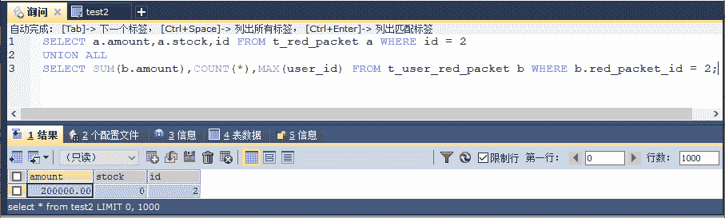
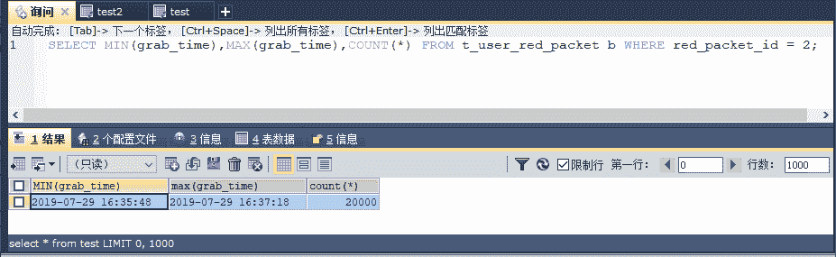
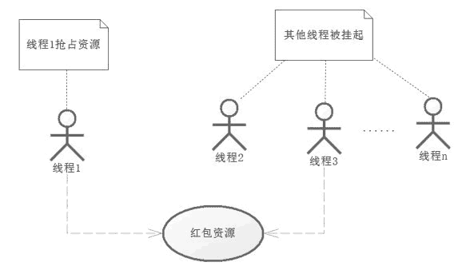
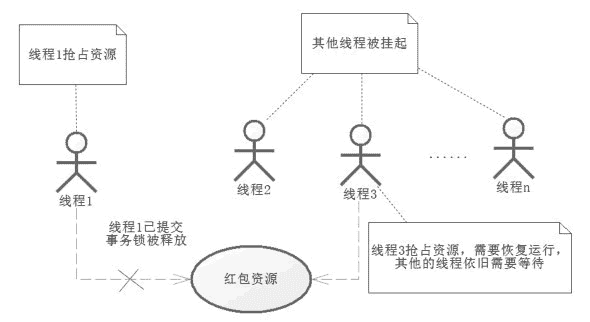

# Redis 悲观锁解决高并发抢红包的问题

> 原文：[`c.biancheng.net/view/4601.html`](http://c.biancheng.net/view/4601.html)

悲观锁是一种利用数据库内部机制提供的锁的方法，也就是对更新的数据加锁，这样在并发期间一旦有一个事务持有了数据库记录的锁，其他的线程将不能再对数据进行更新了，这就是悲观锁的实现方式。

首先在 RedPacket.xml 中增加一个 id 为 getRedPacketForUpdate 的 SQL，修改为下面的代码：

<!-- 查询红包具体信息 -->
<select id="getRedPacketForUpdate" parameterType="long"
    resultType="com.pojo.RedPacket">
    select id, user_id as userId, amount, send_date as sendDate, total,
        unit_amount as unitAmount, stock, version, note from T_RED_PACKET
        where id =#{id} for update
</select>

注意，在 SQL 中加入的 for update 语句，意味着将持有对数据库记录的行更新锁（因为这里使用主键查询，所以只会对行加锁。如果使用的是非主键查询，要考虑是否对全表加锁的问题，加锁后可能引发其他查询的阻塞），那就意味着在高并发的场景下，当一条事务持有了这个更新锁才能往下操作，其他的线程如果要更新这条记录，都需要等待，这样就不会出现超发现象引发的数据一致性问题了。

再插入一条新记录到数据库里，如下面的代码所示。

insert  into `t_red_packet`(`id`,`user_id`,`amount`,`send_date`,`total`,`unit_amount`,`stock`,`version`,`note`)
values (1,1,'200000.00','2019-07-29 16:35:20',20000,'10',20000,0,'20 万元金额，2 万个小红包，每个 10 元');

还是以 20 万元的红包，每个 10 元，共两万个红包为例。插入这条数据后，获取其编号，同时在 RedPacketDao 中加入对应的查询方法。

/**
  * 使用 for update 语句加锁
  *
  * @param id 红包 id
  * @return 红包信息
  */
public RedPacket getRedPacketForUpdate(Long id);

接下来，将 UserRedPacketServiceImpl 代码中的”RedPacket redPacket = redPacketDao.getRedPacket(redPacketId);“的代码修改为以下代码：

Redpacket redpacket = redpacketDao.getRedPacketForUpdate(redpacketId);

做完这些修改后，再次进行测试，便能够得到如图 1 所示的结果。

图 1  悲观锁测试结果
这里已经解决了超发的问题，所以结果是正确的，这点很让人欣喜，但是对于互联而言，除了结果正确，我们还需要考虑性能问题，下面先看看测试的结果，如图 2 所示。

图 2  悲观锁性能测试
图 2 显示了，花费 100 多秒完成了两万个红包的抢夺。相对于不使用锁的 10 多秒而言，性能下降了不少，要知道目前只是对数据库加了一个锁，当加的锁比较多的时候，数据库的性能还会持续下降，讨论一下性能下降的原因。

对于悲观锁来说，当一条线程抢占了资源后，其他的线程将得不到资源，那么这个时候，CPU 就会将这些得不到资源的线程挂起，挂起的线程也会消耗 CPU 的资源，尤其是在高并发的请求中，如图 3 所示。
图 3  高并发抢占资源
只能有一个事务占据资源，其他事务被挂起等待持有资源的事务提交并释放资源。当图中的线程 1 提交了事务，那么红包资源就会被释放出来，此时就进入了线程 2，线程 3……线程 n，开始抢夺资源的步骤了，这里假设线程 3 抢到资源，如图 4 所示。
图 4  多线程竞争资源和恢复
一旦线程 1 提交了事务，那么锁就会被释放，这个时候被挂起的线程就会开始竞争红包资源，那么竞争到的线程就会被 CPU 恢复到运行状态，继续运行。

于是频繁挂起，等待持有锁线程释放资源，一旦释放资源后，就开始抢夺，恢复线程，周而复始直至所有红包资源抢完。试想在高并发的过程中，使用悲观锁就会造成大量的线程被挂起和恢复，这将十分消耗资源，这就是为什么使用悲观锁性能不佳的原因。

有些时候，我们也会把悲观锁称为独占锁，毕竟只有一个线程可以独占这个资源，或者称为阻塞锁，因为它会造成其他线程的阻塞。无论如何它都会造成并发能力的下降，从而导致 CPU 频繁切换线程上下文，造成性能低下。

为了克服这个问题，提高并发的能力，避免大量线程因为阻塞导致 CPU 进行大量的上下文切换，程序设计大师们提出了乐观锁机制，乐观锁已经在企业中被大量应用了。