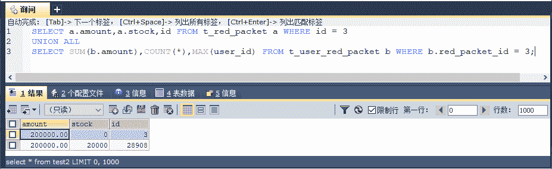

# Redis 乐观锁解决高并发抢红包的问题

> 原文：[`c.biancheng.net/view/4603.html`](http://c.biancheng.net/view/4603.html)

乐观锁是一种不会阻塞其他线程并发的机制，它不会使用数据库的锁进行实现，它的设计里面由于不阻塞其他线程，所以并不会引发线程频繁挂起和恢复，这样便能够提高并发能力，所以也有人把它称为非阻塞锁，那么它的机制是怎么样的呢？

乐观锁使用的是 CAS 原理，所以我们先来讨论 CAS 原理的内容。

## CAS 原理概述

在 CAS 原理中，对于多个线程共同的资源，先保存一个旧值（Old Value），比如进入线程后，查询当前存量为 100 个红包，那么先把旧值保存为 100，然后经过一定的逻辑处理。

当需要扣减红包的时候，先比较数据库当前的值和旧值是否一致，如果一致则进行扣减红包的操作，否则就认为它已经被其他线程修改过了，不再进行操作，CAS 原理流程如图 1 所示。

图 1  CAS 原理
CAS 原理并不排斥并发，也不独占资源，只是在线程开始阶段就读入线程共享数据，保存为旧值。当处理完逻辑，需要更新数据的时候，会进行一次比较，即比较各个线程当前共享的数据是否和旧值保持一致。

如果一致，就开始更新数据；如果不一致，则认为该数据已经被其他线程修改了，那么就不再更新数据，可以考虑重试或者放弃。有时候可以重试，这样就是一个可重入锁，但是 CAS 原理会有一个问题，那就是 ABA 问题，下面先来讨论一下 ABA 问题。

## ABA 问题

对于乐观锁而言，我们之前讨论了存在 ABA 的问题，那么什么是 ABA 问题呢？下面看看表 1 的两个线程发生的场景。

表 1 ABA 问题

| 时 刻 | 线程 1 | 线程 2 | 备 注 |
| T0 | —— | —— | 初始化 X=A |
| T1 | 读入 X=A | —— | —— |
| T2 | —— | 读入 X=A | —— |
| T3 | 处理线程 1 的业务逻辑 | X=B | 修改共享变量为 B |
| T4 | 处理线程 2 业务逻辑第一段 | 此时线程 1 在 X=B 的情况下运行逻辑 |
| T5 | X=A | 还原变量为 A |
| T6 | 因为判断 X=A，所以更新数据 | 处理线程 2 业务逻辑第二段 | 此时线程 1 无法知道线程 2 是否修改过 X，引发业务逻辑错误 |
| T7 | —— | 更新数据 | —— |

在 T3 时刻，由于线程 2 修改了 X=B，此时线程 1 的业务逻辑依旧执行，但是到了 T5 时刻，线程 2 又把 X 还原为 A，那么到了 T6 时刻，使用 CAS 原理的旧值判断，线程 1 就会认为 X 值没有被修改过，于是执行了更新。

我们难以判定的是在 T4 时刻，线程 1 在 X=B 的时候，对于线程 1 的业务逻辑是否正确的问题。由于 X 在线程 2 中的值改变的过程为 A->B->A，才引发这样的问题，因此人们形象地把这类问题称为 ABA 问题。

ABA 问题的发生，是因为业务逻辑存在回退的可能性。如果加入一个非业务逻辑的属性，比如在一个数据中加入版本号（version），对于版本号有一个约定，就是只要修改 X 变量的数据，强制版本号（version）只能递增，而不会回退，即使是其他业务数据回退，它也会递增，那么 ABA 问题就解决了，如表 2 所示。

表 2 用版本号消除 ABA 问题

| 时刻 | 线程 1 | 线程 2 | 备 注 |
| T0 | —— | —— | 初始化 X=A，version=0 |
| T1 | 读入 X=A | —— | 线程 1 旧值：version=0 |
| T2 | —— | 读入 X=A | 线程 2 旧值：version=0 |
| T3 | 处理线程 1 的业务逻辑 | X=B | 修改共享变量为 B，version=1 |
| T4 | 处理线程 2 业务逻辑第一段 | —— |
| T5 | —— | X=A | 还原变量为 A，version=2 |
| T6 | 判断 version == 0，由于线程 2 两次更新数据，导致数据 version=2，所以不再更新数据  | 处理线程 2 业务逻辑第二段 | 此时线程 1 知道旧值 version 和当前 version 不一致，将不更新数据 |
| T7 | —— | 更新数据 | —— |

只是这个 version 变量并不存在什么业务逻辑，只是为了记录更新次数，只能递增，帮助我们克服 ABA 问题罢了，有了这些理论，我们就可以开始使用乐观锁来完成抢红包业务了。

## 乐观锁实现抢红包业务

通过上述的讨论，我们清楚了 CAS 原理如何避免数据的不一致，如何规避 CAS 原理产生的 ABA 问题，在高并发的应用中使用 CAS 原理，我们称之为乐观锁。

为了顺利使用乐观锁，需要先在红包表（T_RED_PACKET）加入一个新的列版本号（version），这个字段在建表的时候已经建了，只是我们还没有使用，那么在 UserRedPacket.xml 的代码中加入新的方法，代码如下所示。

<!--
通过版本号扣减抢红包
每更新一次，版本增 1,
其次增加对版本号的判断
-->
<update id="decreaseRedPacketForVersion">
  update T_RED_PACKET
  set stock = stock - 1,
  **version = version + 1**
  where id = #{id}
  **and version = #{version}**
</update>

注意加粗的代码，在扣减红包的时候，增加了对版本号的判断，其次每次扣减都会对版本号加一，这样保证每次更新在版本号上有记录，从而避免 ABA 问题。

对于查询也不使用 for update 语句，避免锁的发生，这样就没有线程阻塞的问题了，这里在对应的 UserRedPacketDao 接口上加入对应方法，然后就可以在类 UserRedPacketServiceImpl 中新增方法 grapRedPacketForVersion（需要在其接口 UserRedPacketService 加上同样的方法），完成对应的逻辑即可，代码如下所示。

```

@Transactional(isolation = Isolation.READ_COMMITTED, propagation = Propagation.REQUIRED)
public int grapRedPacketForVersion(Long redPacketId, Long userId) {
    // 获取红包信息，注意 version 值
    RedPacket redPacket = redPacketDao.getRedPacket(redPacketId);
    // 当前小红包库存大于 0
    if (redPacket.getstock() > 0) {
        // 再次传入线程保存的 version 旧值给 SQL 判断，是否有其他线程修改过数据
        int update = redPacketDao.decreaseRedPacketForVersion(redPacketId,redPacket.getVersion());
        // 如果没有数据更新，则说明其他线程已经修改过数据，本次抢红包失败
        if (update == 0) {
            return FAILED;
        }
        // 生成抢红包信息
        UserRedPacket userRedPacket = new UserRedPacket();
        userRedPacket.setRedPacketId(redPacketId);
        userRedPacket.setUserId(userId);
        userRedPacket.setAmount(redPacket.getUnitAmount());
        userRedPacket.setNote ("抢红包"+ redPacketId);
        //插入抢红包信息
        int result = userRedPacketDao.grapRedPacket(userRedPacket);
            return result;
    }
    //失败返回
    return FAILED;
}
```

version 值一开始就保存到了对象中，当扣减的时候，再次传递给 SQL，让 SQL 对数据库的 version 和当前线程的旧值 version 进行比较。如果一致则插入抢红包的数据，否则就不进行操作。

为了进行测试，在控制器 UserRedPacketController 内新建方法，代码如下所示。

```

@RequestMapping(value = "/grapRedPacketForVersion")
@ResponseBody
public Map<String, Object> grapRedPacketForVersion(Long redPacketId, Long userId) {
    // 抢红包
    int result = UserRedPacketService.grapRedPacketForVersion(redPacketId, userId);
    Map<String, Object> retMap = new HashMap<String, Object>();
    boolean flag = result > 0;
    retMap.put("success", flag);
    retMap.put("message", flag ? "抢红包成功" : "抢红包失败");
    return retMap;
}
```

修改 test.jsp 的 JSP 文件中 JavaScript 的 POST 请求地址和红包，id 对应上新增控制器的方法，便可以进行测试，结果如图 2 所示。
 
图 2  乐观锁测试结果
从图 2 中我们看到，经过 3 万次的抢夺，还会存在大量的红包，也就是存在大量的因为版本不一致的原因造成抢红包失败的请求，不过这个失败率太高了一点。有时候会容忍这个失败，这取决于业务的需要，因为允许用户自己再发起抢夺红包，比如微信抢红包也常常发生错误返回。再次对性能进行测试，如图 3 所示。


图 3  测试乐观锁性能
33 秒完成所有抢红包的功能，这个结果和不使用任何锁一样，但是还存在大量的红包因为版本并发的原因而没有被抢到，而且这个概率比较高，下面解决这个问题。

为了克服这个问题，提高成功率，还会考虑使用重入机制。也就是一旦因为版本原因没有抢到红包，则重新尝试抢红包，但是过多的重入会造成大量的 SQL 执行，所以目前流行的重入会加入两种限制，一种是按时间戳的重入，也就是在一定时间戳内（比如说 100 毫秒），不成功的会循环到成功为止，直至超过时间戳，不成功才会退出，返回失败。

另外一种是按次数，比如限定 3 次，程序尝试超过 3 次抢红包后，就判定请求失效，这样有助于提高用户抢红包的成功率，下面讨论如何重入。

## 乐观锁重入机制

因为乐观锁造成大量更新失败的问题，使用时间戳执行乐观锁重入，是一种提高成功率的方法，比如考虑在 100 毫秒内允许重入，把 UserRedPacketServiceImpl 中的方法 grapRedPacketForVersion 修改为以下代码。

```

@Transactional(isolation = Isolation.READ_COMMITTED, propagation = Propagation.REQUIRED)
public int grapRedPacketForVersion(Long redPacketId, Long userId) {
    // 记录开始时间
    long start = System.currentTimeMillis();
    // 无限循环，等待成功或者时间满 100 亳秒退岀
    while (true) {
        // 获取循环当前时间
        long end = System.currentTimeMillis();
        // 当前时间己经超过 100 毫秒，返回失败
        if (end - start > 100) {
            return FAILED;
        }
        // 获取红包信息，注意 version 值
        RedPacket redPacket = redPacketDao.getRedPacket(redPacketId);
        // 当前小红包库存大于 0
        if (redPacket.getStock() > 0) {
            // 再次传入线程保存的 version 旧值给 SQL 判断，是否有其他线程修改过数据
            int update = redPacketDao.decreaseRedPacketForVersion(redPacketId, redPacket.getVersion());
            // 如果没有数据更新，则说明其他线程已经修改过数据，则重新抢夺
            if (update == 0) {
                continue;
            }
            // 生成抢红包信息
            UserRedPacket UserRedPacket = new UserRedPacket();
            UserRedPacket.setRedPacketId(redPacketId);
            UserRedPacket.setUserId(userId);
            UserRedPacket.setAmount(redPacket.getUnitAmount());
            UserRedPacket.setNote("抢红包" + redPacketId);
            // 插入抢红包信息
            int result = userRedPacketDao.grapRedPacket(UserRedPacket);
            return result;
        } else {
            // 一旦没有库存，则马上返回
            return FAILED;
        }
    }
}
```

当因为版本号原因更新失败后，会重新尝试抢夺红包，但是会实现判断时间戳，如果时间戳在 100 毫秒内，就继续，否则就不再重新尝试，而判定失败，这样可以避免过多的 SQL 执行，维持系统稳定。乐观锁按时间戳重入，如图 4 所示。


图 4  乐观锁按时间戳重入
从结果来看，之前大量失败的场景消失了，也没有超发现象，3 万次尝试抢光了所有的红包，避免了总是失败的结果，但是有时候时间戳并不是那么稳定，也会随着系统的空闲或者繁忙导致重试次数不一。

有时候我们也会考虑限制重试次数，比如 3 次。下面再次改写 UserRedPacketServiceImpl 中的方法 grapRedPacketForVersion，代码如下所示。

```

@Transactional(isolation = Isolation.READ_COMMITTED, propagation = Propagation.REQUIRED)
public int grapRedPacketForVersion(Long redPacketId, Long userId) {
    for (int i = 0; i < 3; i++) {
        // 获取红包信息，注意 version 值
        RedPacket redPacket = redPacketDao.getRedPacket(redPacketId);
        // 当前小红包库存大于 0
        if (redPacket.getStock() > 0) {
            // 再次传入线程保存的 version 旧值给 SQL 判断，是否有其他线程修改过数据
            int update = redPacketDao.decreaseRedPacketForVersion(redPacketId, redPacket.getVersion());
            // 如果没有数据更新，则说明其他线程已经修改过数据，则重新抢夺
            if (update == 0) {
                continue;
            }
            // 生成抢红包信息
            UserRedPacket UserRedPacket = new UserRedPacket();
            UserRedPacket.setRedPacketId(redPacketId);
            UserRedPacket.setUserId(userId);
            UserRedPacket.setAmount(redPacket.getUnitAmount());
            UserRedPacket.setNote("抢红包" + redPacketId);
            // 插入抢红包信息
            int result = userRedPacketDao.grapRedPacket(UserRedPacket);
            return result;
        } else {
            // 一旦没有库存，则马上返回
            return FAILED;
        }
    }
    return FAILED;
}
```

通过 for 循环限定重试 3 次，3 次过后无论成败都会判定为失败而退出，这样就能避免过多的重试导致过多 SQL 被执行的问题，从而保证数据库的性能。为此笔者也进行了测试，如图 5 所示。


图 5  乐观锁按重试次数重入
显然效果很好，3 万次请求，所有红包都被抢到了，也没有发生超发现象，这样就可以消除大量的请求失败，避免非重入的时候大量请求失败的场景。

但是现在是使用数据库的情况，有时候并不想使用数据库作为抢红包时刻的数据保存载体，而是选择性能优于数据库的 Redis。

之前我们学习过 Redis 事务，也学习过 Redis 的 Lua 语言，它是一种原子性的操作，为此我们将绕开数据库用 Redis 处理高并发的请求。