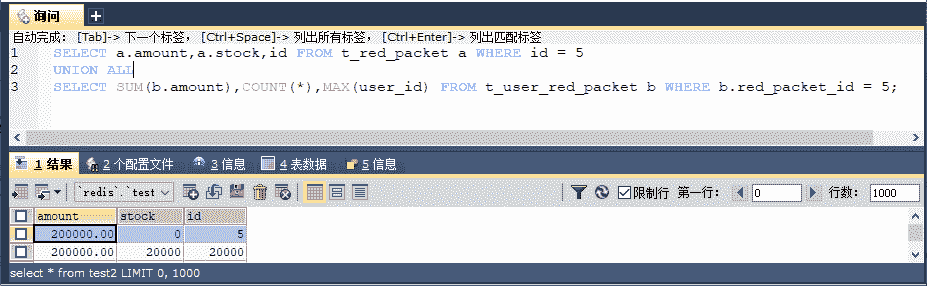
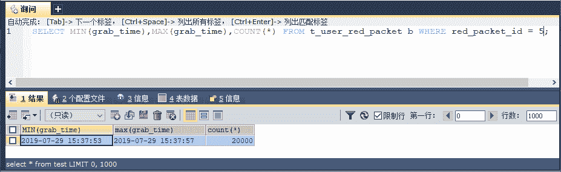
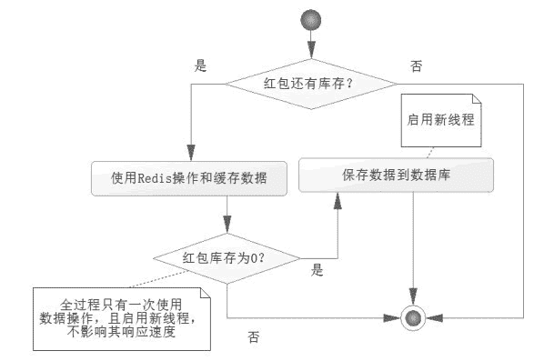

# 使用 Redis 和 Lua 的原子性实现抢红包功能

> 原文：[`c.biancheng.net/view/4607.html`](http://c.biancheng.net/view/4607.html)

数据库最终会将数据保存到磁盘中，而 Redis 使用的是内存，内存的速度比磁盘速度快得多，所以这里将讨论使用 Redis 实现抢红包。

对于使用 Redis 实现抢红包，首先需要知道的是 Redis 的功能不如数据库强大，事务也不完整，因此要保证数据的正确性，数据的正确性可以通过严格的验证得以保证。

而 Redis 的 Lua 语言是原子性的，且功能更为强大，所以优先选择使用 Lua 语言来实现抢红包。

但是无论如何对于数据而言，在 Redis 当中存储，始终都不是长久之计，因为 Redis 并非一个长久储存数据的地方，它存储的数据是非严格和安全的环境，更多的时候只是为了提供更为快速的缓存。

所以当红包金额为 0 或者红包超时的时候（超时操作可以使用定时机制实现），会将红包数据保存到数据库中，这样才能够保证数据的安全性和严格性。

## 使用注解方式配置 Redis

首先在类 RootConfig 上创建一个 RedisTemplate 对象，并将其装载到 Spring IoC 容器中，代码如下所示。

```

@Bean(name = "redisTemplate")
public RedisTemplate initRedisTemplate() {
    JedisPoolConfig poolConfig = new JedisPoolConfig();
    // 最大空闲数
    poolConfig.setMaxIdle(50);
    // 最大连接数
    poolConfig.setMaxTotal(100);
    // 最大等待毫秒数
    poolConfig.setMaxWaitMillis(20000);
    // 创建 Jedis 链接工厂
    JedisConnectionFactory connectionFactory = new JedisConnectionFactory(poolConfig);
    connectionFactory.setHostName("localhost");
    connectionFactory.setPort(6379);
    // 调用后初始化方法，没有它将抛出异常
    connectionFactory.afterPropertiesSet();
    // 自定 Redis 序列化器
    RedisSerializer jdkSerializationRedisSerializer = new JdkSerializationRedisSerializer();
    RedisSerializer stringRedisSerializer = new StringRedisSerializer(); // 定义 RedisTemplate,并设置连接工厂
    RedisTemplate redisTemplate = new RedisTemplate();
    redisTemplate.setConnectionFactory(connectionFactory);
    // 设置序列化器
    redisTemplate.setDefaultSerializer(stringRedisSerializer);
    redisTemplate.setKeySerializer(stringRedisSerializer);
    redisTemplate.setValueSerializer(stringRedisSerializer);
    redisTemplate.setHashKeySerializer(stringRedisSerializer);
    redisTemplate.setHashValueSerializer(stringRedisSerializer);
    return redisTemplate;
}
```

这样 RedisTemplate 就可以在 Spring 上下文中使用了。注意，JedisConnectionFactory 对象在最后的时候需要自行调用 afterPropertiesSet 方法，它实现了 InitializingBean 接口。

如果将其配置在 Spring IoC 容器中，Spring 会自动调用它，但是这里我们是自行创建的，因此需要自行调用，否则在运用的时候会抛出异常，从而出现错误。

## 数据存储设计

Redis 并不是一个严格的事务，而且事务的功能也是有限的。加上 Redis 本身的命令也比较有限，功能性不强，为了增强功能性，还可以使用 Lua 语言。

Redis 中的 Lua 语言是一种原子性的操作，可以保证数据的一致性。依据这个原理可以避免超发现象，完成抢红包的功能，而且对于性能而言，Redis 会比数据库快得多。

第一次运行 Lua 脚本的时候，先在 Redis 中编译和缓存脚本，这样就可以得到一个 SHA1 字符串，之后通过 SHA1 字符串和参数就能调用 Lua 脚本了。先来编写 Lua 脚本，代码如下所示。

--缓存抢红包列表信息列表 key
local listKey = 'red_packet_list_'..KEYS[1]
--当前被抢红包 key
local redPacket = 'red_packet_'..KEYS[1]
--获取当前红包库存
local stock = tonumber(redis.call('hget', redPacket, 'stock'))
--没有库存，返回为 0
if stock <= 0 then return 0 end
--库存减 1
stock = stock -1
--保存当前库存
redis.call('hset',redPacket,'stock', tostring(stock))
--往链表中加入当前红包信息
redis.call('rpush', listKey, ARGV[1])
--如果是最后一个红包，则返回 2，表示抢红包已经结束，需要将列表中的数据保存到数据库中
if stock == 0 then return 2 end
--如果并非最后一个红包，则返回 1，表示抢红包成功
return 1

这里可以看到这样一个流程：

*   判断是否存在可抢的库存，如果已经没有可抢夺的红包，则返回为 0，结束流程。
*   有可抢夺的红包，对于红包的库存减一，然后重新设置库存。
*   将抢红包数据保存到 Redis 的链表当中，链表的 key 为 red_packet_list_{id}。
*   如果当前库存为 0，那么返回 2，这说明可以触发数据库对 Redis 链表数据的保存，链表的 key 为 red_packet_list_{id}，它将保存抢红包的用户名和抢的时间。
*   如果当前库存不为 0，那么将返回 1，这说明抢红包信息保存成功。

当返回为 2 的时候（现实中如果抢不完红包，可以使用超时机制触发，这比较复杂，本书不讨论这样的情况），说明红包已经没有库存，会触发数据库对链表数据的保存，这是一个大数据量的保存。

为了不影响最后一次抢红包的响应，在实际的操作中往往会考虑使用 JMS 消息发送到别的服务器进行操作，这样会比较复杂，而 JMS 消息不属于本教程讨论的范围，所以这里只是创建一条新的线程去运行保存 Redis 链表数据到数据库，为此我们需要一个新的服务类，代码如下所示。

```

package com.service;

public interface RedisRedPacketService {
    /**
     * 保存 redis 抢红包列表
     *
     * @param redPacketId ―抢红包编号
     * @param unitAmount  --红包金额
     */
    public void saveUserRedPacketByRedis(Long redPacketId, Double unitAmount);
}
```

还需要这个接口的实现类，代码如下所示。

```

package com.service.impl;

import java.beans.*;
import java.sql.SQLException;
import java.sql.Timestamp;
import java.util.ArrayList;
import java.util.List;

import javax.sql.DataSource;

import org.springframework.beans.factory.annotation.Autowired;
import org.springframework.data.redis.core.BoundListOperations;
import org.springframework.data.redis.core.RedisTemplate;
import org.springframework.scheduling.annotation.Async;
import org.springframework.stereotype.Service;

import com.pojo.UserRedPacket;
import com.service.RedisRedPacketService;

@Service
public class RedisRedPacketServiceImpl implements RedisRedPacketService {
    private static final String PREFIX = "red_packet_list_";
    // 每次取出 1000 条，避免一次取出消耗太多内存
    private static final int TIME_SIZE = 1000;
    @Autowired
    private RedisTemplate redisTemplate = null; // RedisTemplate
    @Autowired
    private DataSource datasource = null; // 数据源

    @Override
    // 开启新线程运行
    @Async
    public void saveUserRedPacketByRedis(Long redPacketId, Double unitAmount) {
        System.err.println("开始保存数据");
        Long start = System.currentTimeMillis();
        // 获取列表操作对象
        BoundListOperations ops = redisTemplate.boundListOps(PREFIX + redPacketId);
        Long size = ops.size();
        Long times = size % TIME_SIZE == 0 ? size / TIME_SIZE : size / TIME_SIZE + 1;
        int count = 0;
        List<UserRedPacket> userRedPacketList = new ArrayList<UserRedPacket>(TIME_SIZE);
        for (int i = 0; i < times; i++) {
            // 获取至多 TIME_SIZE 个抢红包信息
            List userIdList = null;
            if (i == 0) {
                userIdList = ops.range(i * TIME_SIZE, (i + 1) * TIME_SIZE);
            } else {
                userIdList = ops.range(i * TIME_SIZE, (i + 1) * TIME_SIZE);
            }
            userRedPacketList.clear();
            // 保存红包信息
            for (int j = 0; j < userIdList.size(); j++) {
                String args = userIdList.get(j).toString();
                String[] arr = args.split("_");
                String userIdStr = arr[0];
                String timeStr = arr[1];
                Long userId = Long.parseLong(userIdStr);
                Long time = Long.parseLong(timeStr);
                // 生成抢红包信息
                UserRedPacket UserRedPacket = new UserRedPacket();
                UserRedPacket.setRedPacketId(redPacketId);
                UserRedPacket.setUserId(userId);
                UserRedPacket.setAmount(unitAmount);
                UserRedPacket.setGrabTime(new Timestamp(time));
                UserRedPacket.setNote("抢红包 " + redPacketId);
                userRedPacketList.add(UserRedPacket);
            }
            // 插入抢红包信息
            count += executeBatch(userRedPacketList);
        }
        // 删除 Redis 列表
        redisTemplate.delete(PREFIX + redPacketId);
        Long end = System.currentTimeMillis();
        System.err.println("保存数据结束，耗时" + (end - start) + "毫秒，共" + count + "条记录被保存。");
    }

    /**
     * 使用 JDBC 批量处理 Redis 缓存数据.
     *
     * @param userRedPacketList --抢红包列表 @return 抢红包插入数量.
     */
    private int executeBatch(List<UserRedPacket> userRedPacketList) {
        Connection conn = null;
        Statement stmt = null;
        int[] count = null;
        try {
            conn = datasource.getConnection();
            conn.setAutoCommit(false);
            stmt = conn.createStmtement();
            for (UserRedPacket userRedPacket : userRedPacketList) {
                String sql1 = "update T_RED_PACKET set stock = stock-1 where id=" + userRedPacket.getRedPacketId();
                DateFormat df = new SimpleDateFormat("yyyy-MM-dd HH:mm:ss");
                String sql2 = "insert into T_USER_RED_PACKET (red_packet_id,user_id," + "amount, grab_time, note)"
                        + " values (" + userRedPacket.getRedPacketId() + "," + userRedPacket.getUserId() + ", "
                        + userRedPacket.getAmount() + "," + "'" + df.format(userRedPacket.getGrabTime()) + "'"
                        + userRedPacket.getNote() + "')";
                stmt.addBatch(sql1);
                stmt.addBatch(sql2);
            }
            // 执行批量
            count = stmt.executeBatch();
            // 提交事务
            conn.commit();
        } catch (SQLException e) {
            /********* 错误处理逻辑 ********/
            throw new RuntimeException("抢红包批量执行程序错误");
        } finally {
            try {
                if (conn != null && !conn.isClosed()) {
                    conn.close();
                }
            } catch (SQLException e) {
                e.printStackTrace();
            }
        }
        // 返冋插入抢红包数据记录
        return count.length / 2;
    }
}
```

注意，注解 @Async 表示让 Spring 自动创建另外一条线程去运行它，这样它便不在抢最后一个红包的线程之内。因为这个方法是一个较长时间的方法，如果在同一个线程内，那么对于最后抢红包的用户需要等待的时间太长，影响其体验。

这里是每次取出 1 000 个抢红包的信息，之所以这样做是为了避免取出的数据过大，导致 JVM 消耗过多的内存影响系统性能。

对于大批量的数据操作，这是我们在实际操作中要注意的，最后还会删除 Redis 保存的链表信息，这样就帮助 Redis 释放内存了。对于数据库的保存，这里采用了 JDBC 的批量处理，每 1 000 条批量保存一次，使用批量有助于性能的提高。

在笔者的实际测试中，2 万条数据 6 秒就可以保存到数据库中了，性能还是不错的。

用注解 @Async 的前提是提供一个任务池给 Spring 环境，这个时候要在原有的基础上改写配置类 WebConfig，如下面代码所示。

```

......
@EnableAsync
public class WebConfig extends AsyncConfigurerSupport {
......
    public Executor getAsyncExecutor()  {
        ThreadPoolTaskExecutor taskExecutor = new ThreadPoolTaskExecutor();
        taskExecutor.setCorePoolSize(5);
        taskExecutor.setMaxPoolSize(10);
        taskExecutor.setQueueCapacity(200);
        taskExecutor.initialize();
        return taskExecutor;
    }
}
```

使用 @EnableAsync 表明支持异步调用，而我们实现了接口 AsyncConfigurerSupport 的 getAsyncExecutor 方法，它是获取一个任务池，当在 Spring 环境中遇到注解 @Async 就会启动这个任务池的一条线程去运行对应的方法，这样便能执行异步了。

## 使用 Redis 实现抢红包

有了 Redis 的配置，下面讨论一下如何使用 Redis 实现抢红包的逻辑，首先要自己编写 Lua 语言，然后通过对应的链接发送给 Redis 服务器，那么 Redis 会返回一个 SHA1 字符串，我们保存它，之后的发送可以只发送这个字符和对应的参数。下面在 UserRedPacketService 接口中加入一个新的方法：

```

/**
* 通过 Redis 实现抢红包
* @param redPacketId 红包编号
* @param userId 用户编号
* @return
* 0-没有库存，失败
* 1-成功，且不是最后一个红包
* 2-成功，且是最后一个红包
*/
public Long grapRedPacketByRedis(Long redPacketId, Long userId);
```

它的实现类 UserRedPacketServiceImpl 也要加入其实现方法，代码如下所示。

```

@Autowired
private RedisTemplate redisTemplate = null;
@Autowired
private RedisRedPacketService redisRedPacketService = null;
// Lua 脚本
String script = "local listKey = 'red_packet_list_'..KEYS[1] \n" + "local redPacket = 'red_packet_'..KEYS[1] \n"
        + "local stock = tonumber(redis.call('hget', redPacket, 'stock'))\n" + "if stock <= 0 then return 0 end \n"
        + "stock = stock -1 \n" + "redis . call ('hset', redPacket, 'stock', tostring (stock)) \n"
        + "redis.call('rpush', listKey, ARGV[1]) \n" + "if stock == 0 then return 2 end \n" + "return 1 \n";
// 在缓存 Lua 脚本后，使用该变量保存 Redis 返回的 32 位的 SHA1 编码，使用它去执行缓存的 Lua 脚本
String sha1 = null;

@Override
public Long grapRedPacketByRedis(Long redPacketId, Long userId) {
    // 当前抢红包用户和日期信息
    String args = userId + "_" + System.currentTimeMillis();
    Long result = null;
    // 获取底层 Redis 操作对象
    Jedis jedis = (Jedis) redisTemplate.getConnectionFactory().getConnection().getNativeConnection();
    try {
        // 如果脚本没有加载过，那么进行加载，这样就会返回一个 sha1 编码
        if (sha1 == null) {
            sha1 = jedis.scriptLoad(script);
        }
        // 执行脚本，返回结果
        Object res = jedis.evalsha(sha1, 1, redPacketId + args);
        result = (Long) res;
        // 返回 2 时为最后一个红包，此时将抢红包信息通过异步保存到数据库中
        if (result == 2) {
            // 获取单个小红包金额
            String unitAmountStr = jedis.hget("red_pmcket_" + redPacketId, "unit_amount");
            // 触发保存数据库操作
            Double unitAmount = Double.parseDouble(unitAmountstr);
            System.err.println("thread_name    =    " + Thread.currentThread().getName());
            redisRedPacketService.saveUserRedPacketByRedis(redPacketId, unitAmount);
        }
    } finally {
        // 确保 jedis 顺利关闭
        if (jedis != null && jedis.isConnected()) {
            jedis.close();
        }
    }
    return result;
}
```

这里使用了保存脚本返回的 SHA1 字符串，所以只会发送一次脚本到 Redis 服务器，之后只传输 SHA1 字符串和参数到 Redis 就能执行脚本了，当脚本返回为 2 的时候，表示此时所有的红包都已经被抢光了，那么就会触发 redisRedPacketService 的 saveUserRedPacketByRedis 方法。

由于在 saveUserRedPacketByRedis 加入注解 @Async，所以 Spring 会创建一条新的线程去运行它，这样就不会影响最后抢一个红包用户的响应时间了。

此时重新在控制器 UserRedPacketController 上加入新的方法作为响应便可以了，代码如下所示。

```

@RequestMapping(value = "/grapRedPacketByRedis")
@ResponseBody
public Map<String, Object> grapRedPacketByRedis(Long redPacketId, Long userId) {
    Map<String, Object> resultMap = new HashMap<String, Object>();
    Long result = userRedPacketService.grmpRedPmcketByRedis(redPacketId, userId);
    boolean flag = result > 0;
    resultMap.put("result", flag);
    resultMap.put("message", flag ? "抢红包成功" : "抢红包失败");
    return resultMap;
}
```

为了测试它，我们先在 Redis 上添加红包信息，于是执行这样的命令：

hset red_packet_5 stock 20000
hset red_packet_5 unit_amount 10

初始化了一个编号为 5 的大红包，其中库存为 2 万个，每个 10 元，读者在自己操作的时候，需要保证数据库的红包表内也有对应的记录。然后写一个 JSP 文件，对其进行测试，代码如下所示。

```

<%@ page language="java" contentType="text/html; charset=utf-8"
pageEncoding="utf-8"%>
<!DOCTYPE html>
<html>
<head>
<meta charset="utf-8">
<title>参数</title>
<!-- Query 文件 -->
<script src="https://code.jquery.com/jquery-3.2.1.min.js"></script>
<script type="text/javascript">
    $(document).ready(function() {
        //jQuery 的 post 请求，请注意这是异步请求
        var max = 30000;
        for (var i = 1; i <= max; i++) {
            //jQuery 的 post 请求，请注意这是异步请求
            $.post({
                //请求抢 id 为 5 的红包
                url : "./userRedPacket/grapRedPacketByRedis.do?redPacketId=5&userId=" + i,
                //成功后的方法
                success : function(result) {}
            });
        }
    });
</script>
</head>
<body>
</body>
</html>
```

这样运行服务器，使用 JSP 便能够进行测试了，下面是笔者测试的结果，如图 1 所示。


图 1  Redis 实现抢红包测试
结果正确，那么它的性能如何呢？再次进行查询，如图 2 所示。


图 2  查询 Redis 抢红包性能
2 万个红包只要 4 秒便完成了，而且没有发生超发的状况，性能远远超过乐观锁的 33 秒，更是远超使用悲观锁的 100 多秒，可见使用 Redis 是多么高效。

注意，在一个普通请求的过程中，并没有去操作任何数据库，而只是使用 Redis 缓存数据而已，这就是程序能够高速运行的原因。Redis 抢红包流程图，如图 3 所示。
图 3  Redis 抢红包流程图