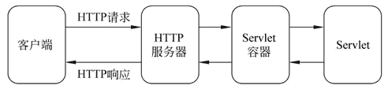

# Java Servlet 是什么？它有哪些特点？

> 原文：[`c.biancheng.net/view/3980.html`](http://c.biancheng.net/view/3980.html)

Servlet（Server Applet）是 Java Servlet 的简称，是使用 Java 语言编写的运行在服务器端的程序。具有独立于平台和协议的特性，主要功能在于交互式地浏览和生成数据，生成动态 Web 内容。

通常来说，Servlet 是指所有实现了 Servlet 接口的类。

Servlet 主要用于处理客户端传来的 HTTP 请求，并返回一个响应，它能够处理的请求有 doGet() 和 doPost() 等。

Servlet 由 Servlet 容器提供，Servlet 容器是指提供了 Servlet 功能的服务器（如 Tomcat）。

Servlet 容器会将 Servlet 动态加载到服务器上，然后通过 HTTP 请求和 HTTP 应与客户端进行交互。

Servlet 应用程序的体系结构如图 1 所示。
图 1  Servlet 应用程序的体系结构
在图 1 中，Servlet 的请求首先会被 HTTP 服务器（如 Apache）接收，HTTP 服务器只负责静态 HTML 页面的解析，而 Servlet 的请求会转交给 Servlet 容器，Servlet 容器会根据 web.xml 文件中的映射关系，调用相应的 Servlet，Servlet 再将处理的结果返回给 Servlet 容器，并通过 HTTP 服务器将响应传输给客户端。

Servlet 技术具有如下特点。

#### 1）方便

Servlet 提供了大量的实用工具例程，如处理很难完成的 HTML 表单数据、读取和设置 HTTP 头，以及处理 Cookie 和跟踪会话等。

#### 2）跨平台

Servlet 使用 Java 类编写，可以在不同的操作系统平台和不同的应用服务器平台运行。

#### 3）灵活性和可扩展性强

采用 Servlet 开发的 Web 应用程序，由于 Java 类的继承性及构造函数等特点，使得应用灵活，可随意扩展。

除了上述几点以外，Servlet 还具有功能强大、能够在各个程序之间共享数据、安全性强等特点，此处不再详细说明，读者简单了解即可。