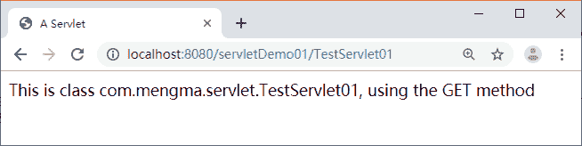

# 第一个 Servlet 程序

> 原文：[`c.biancheng.net/view/3985.html`](http://c.biancheng.net/view/3985.html)

为了帮助读者快速学习 Servlet 开发，下面分步骤实现一个 Servlet 程序。

#### 1．创建 Web 项目

选择 MyEclipse 上方工具栏中的 File→New→Other 选项，在 Select a wizard 窗口中选择 Dynamic Web Project 选项（如果没有 Dynamic Web Project 选项，可直接选择 Web Project 或者勾选 Show All Wizards 选项，如图 1 左边第一张图片），单击 Next 按钮，进入填写项目信息的界面，选择的运行环境是 Tomcat 7.0，动态 Web 模块版本为 2.5，持续单击 Next 按钮，直到进入 Configure web module settings 配置界面，如图 1 所示。
图 1  新建项目
在图 2 中，Context root 选项用于指定 Web 项目的根目录，Content directory 选项用于指定存放 Web 资源的目录。这里采用默认设置的目录，将 servletDemo01 作为 Web 资源的根目录，将 WebContent 作为存放 Web 资源的目录。单击 Finish 按钮，完成 Web 项目的配置。

需要注意的是，如果 MyEclipse 中使用的是 Java 视图，则单击 Finish 后，会弹出 Open Associated Perspective 确认提示框（如图 2 所示），出现此窗口的原因是所创建的 Web 项目关联了 Java EE 视图，由于两种视图在开发使用时区别不大，而且在 MyEclipse 中可做相应设置，所以此处依照个人习惯选择相应视图即可。

图 2  开启关联视图确认框
本教程为了能够更清晰地展示项目结构，所以均使用 Java 视图，单击 No 按钮后，Web 应用目录如图 3 所示。

图 3  创建好的 Web 应用目录

#### 2．创建 Servlet 程序

创建好 Web 项目后，接下来就可以开始创建 Servlet 了。右击图 4 所示的 servletDemo01 项目的 src 文件，选择 New→Other 选项，弹出 Select a wizard 窗口，在 Web 文件夹中选择 Servlet，单击 Next 按钮，进入填写 Servlet 信息的界口，在 Web 文件夹中选择 Servlet，单击 Next 按钮，进入填写 Servlet 信息的界面。

其中，Java package 用于指定 Servlet 所在包的名称，Class name 用于指定 Servlet 的名称，在该界面下边可以选择需要的创建方法，这里只选择 Inherited abstract methods、doGet 和 doPost 方法填写完成后单击 Next 按钮，进入配置 Servlet 的界面，如图 4 所示。

在图 4 中，Servlet 的配置界面的 Name 选项用于指定 web.xml 文件中 <servlet-name> 元素的内容，URL mapping 文本框用于指定 web.xml 文件中 <url-pattern> 元素的内容，这两个选项的内容都是可以修改的，此处不做任何修改，采用默认设置的内容，单击 Finish 按钮，即可完成 Servlet 的创建。

TestServlet01 创建后的内容如图 5 所示。
图 4  填写 Servlet 的界面
图 5  创建后的 TestServlet01 类
由于 MyEclipse 工具在创建 Servlet 时会自动将 Servlet 的相关配置文件添加到 web.xml 中，因此打开 web.xml 文件后可以看到 TestServlet01 的虚拟映射路径已自动进行了配置，如图 6 所示。
图 6  web.xml 文件
从图 6 中可以看到，TestServlet01 的配置信息已在 web.xml 中被创建，至此，第一个 Servlet 创建成功。

#### 3．部署和访问 Servlet

打开 Servers 选项卡（Java 视图中如果未显示此项，则可选择切换 Myecplise Java Enterprise perspective 视图），选中部署 Web 应用的 Tomcat 服务器（关于 Tomcat 服务器的配置方式可参阅《JSP 环境搭建》教程），右击并选择 Add  deployment... 选项，如图 7 所示。
图 7  Add  deployment... 选项
单击图 7 所示的 Add  deployment... 选项后，进入部署 Web 应用的界面，如图 8 所示。
图 8  部署 Web 应用的界面
在图 8 中，project 选项中的内容是还没有部署到 Tomcat 服务器的 Web 项目，project 选项中的内容是已经部署到 Tomcat 服务器的 Web 项目，选中 servletDemo01，单击 Finish 按钮，即可完成 Web 应用的部署。

启动 Tomcat 服务器，在浏览器的地址栏中输入地址 http://localhost:8080/servletDemo01/TestServlet01 访问 TestServlet01，浏览器的显示结果如图 9 所示。
图 9  访问 Servlet
从图 9 中可以看出，浏览器中已经显示出了 TestServlet01 中 doGet() 方法需要输出的内容，至此，已经完成了使用 MyEclipse 工具开发的第一个 Servlet 程序。

需要注意的是，不同版本的 MyEclipse 创建 Servlet 后的 doGet() 和 doPost() 方法中的内容可能有所不同，如果这两个方法中没有编写输出代码，那么使用浏览器访问时不会显示任何内容，此时读者可仿照图 9 中的内容自行编写输出语句。