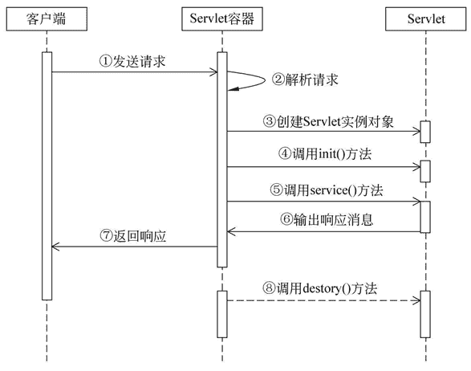

# Servlet 生命周期详解

> 原文：[`c.biancheng.net/view/3989.html`](http://c.biancheng.net/view/3989.html)

在 Java 中，任何对象都有生命周期，Servlet 也不例外。Servlet 的生命周期如图 1 所示。
图 1  Servlet 生命周期
图 1 描述了 Servlet 的生命周期。按照功能的不同，大致可以将 Servlet 的生命周期分为三个阶段，分别是初始化阶段、运行阶段和销毁阶段。

#### 1）初始化阶段

当客户端向 Servlet 容器发出 HTTP 请求要求访问 Servlet 时，Servlet 容器首先会解析请求，检查内存中是否已经有了该 Servlet 对象，如果有，则直接使用该 Servlet 对象，如果没有，则创建 Servlet 实例对象，然后通过调用 init() 方法实现 Servlet 的初始化工作。需要注意的是，在 Servlet 的整个生命周期内，它的 init() 方法只能被调用一次。

#### 2）运行阶段

这是 Servlet 生命周期中最重要的阶段，在这个阶段中，Servlet 容器会为这个请求创建代表 HTTP 请求的 ServletRequest 对象和代表 HTTP 响应的 ServletResponse 对象，然后将它们作为参数传递给 Servlet 的 service() 方法。

service() 方法从 ServletRequest 对象中获得客户请求信息并处理该请求，通过 ServletResponse 对象生成响应结果。

在 Servlet 的整个生命周期内，对于 Servlet 的每一次访问请求，Servlet 容器都会调用一次 Servlet 的 service() 方法，并且创建新的 ServletRequest 和 ServletResponse 对象，也就是说，service() 方法在 Servlet 的整个生命周期中会被调用多次。

#### 3）销毁阶段

当服务器关闭或 Web 应用被移除出容器时，Servlet 随着 Web 应用的关闭而销毁。在销毁 Servlet 之前，Servlet 容器会调用 Servlet 的 destroy() 方法，以便让 Servlet 对象释放它所占用的资源。在 Servlet 的整个生命周期中，destroy() 方法也只能被调用一次。

需要注意的是，Servlet 对象一旦创建就会驻留在内存中等待客户端的访问，直到服务器关闭或 Web 应用被移除出容器时，Servlet 对象才会销毁。