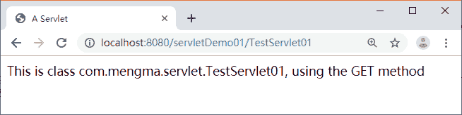
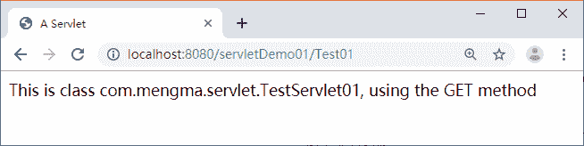

# Servlet 配置虚拟路径映射

> 原文：[`c.biancheng.net/view/3996.html`](http://c.biancheng.net/view/3996.html)

在 web.xml 文件中，一个 <servlert-mapping> 元素用于映射一个 Servlet 的对外访问路径，该路径也称为虚拟路径。例如，在《第一个 Servlet 程序》教程中，TestServlet01 所映射的虚拟路径为“/TestServlet01”。

创建好的 Servlet 只有映射成虚拟路径，客户端才能对其进行访问。但是在映射 Servlet 时，还有内容需要学习，如 Servlet 的多重映射、在映射路径中使用通配符、配置默认的 Servlet 等。本节将对这些内容进行讲解。

## Servlet 的多重映射

Servlet 的多重映射指同一个 Servlet 可以被映射成多条虚拟路径。也就是说，客户端可以通过多条路径实现对同一个 Servlet 的访问。Servlet 多重映射的实现方式有以下两种。

#### 1）配置多个 <servlet-mapping> 元素

以《第一个 Servlet 程序》教程中的 TestServlet01 为例，在 web.xml 文件中的 <servlet-mapping> 元素下，增加一个 <servlet-mapping> 元素配置，其增加后的代码如下所示：

```

<servlet-mapping>
    <!-- 映射为 Test01 -->
    <servlet-name>TestServlet01</servlet-name>
    <url-pattern>/Test01</url-pattern>
</servlet-mapping>
```

重启 Tomcat 服务器，在浏览器的地址栏中输入地址 http://localhost:8080/servletDemo01/TestServlet01 访问 TestServlet01，浏览器的显示结果如图 1 所示。


图 1  运行结果
在浏览器的地址栏中输入地址 http://localhost:8080/servletDemo01/Test01 访问 TestServlet01，浏览器显示的结果如图 2 所示。


图 2  运行结果
通过图 1 和图 2 的比较，发现使用两个 URL 地址都可以正常访问 TestServlet01。由此可见，通过配置多个 <servlet-mapping> 元素可以实现 Servlet 的多重映射。

#### 2）配置多个 <url-pattern> 子元素

同样以 TestServlet01 为例，在 web.xml 文件中对 TestServlet01 的 <servlet-mapping> 元素进行修改，在该元素中配置多个 <url-pattern>，修改后的代码如下所示：

```

<servlet-mapping>
    <!-- 映射为 TestServlet01 和 Test02 -->
    <servlet-name>TestServlet01</servlet-name>
    <url-pattern>/TestServlet01</url-pattern>
    <url-pattern>/Test02</url-pattern>
</servlet-mapping>
```

重启 Tomcat 服务器，在浏览器的地址栏中输入地址 http://localhost:8080/servletDemo01/TestServlet01 访问 TestServlet01，浏览器的显示结果如图 3 所示。


图 3  运行结果
在浏览器的地址栏中输入地址 http://localhost:8080/servletDemo01/Test02 访问 TestServlet01，浏览器的显示结果如图 4 所示。


图 4  运行结果
通过图 3 和图 4 的比较，发现使用两个 URL 地址也可以正常访问 TestServlet01。由此可见，在一个 <servlet-mapping> 元素下配置多个 <url-pattern> 子元素同样可以实现 Servlet 的多重映射。

## Servlet 映射路径中使用通配符

在实际开发过程中，开发者有时会希望某个目录下的所有路径都可以访问同一个 Servlet，这时，可以在 Servlet 映射的路径中使用通配符*。通配符的格式有两种，具体如下。

*   格式为“*.扩展名”，例如 *.do 匹配以 .do 结尾的所有 URL 地址。
*   格式为 /*，例如 /abc/* 匹配以 /abc 开始的所有 URL 地址。

需要注意的是，这两种通配符的格式不能混合使用，例如，/abc/*.do 是不合法的映射路径。另外，当客户端访问一个 Servlet 时，如果请求的 URL 地址能够匹配多条虚拟路径，那么 Tomcat 将采取最具体匹配原则查找与请求 URL 最接近的虚拟映射路径。例如，对于如下所示的一些映射关系：

/abc/*  映射到 Servlet1
/*         映射到 Servlet2
/abc     映射到 Servlet3
*.do     映射到 Servlet4

*   当请求 URL 为 /abc/a.html，/abc/* 和 /* 都可以匹配这个 URL，Tomcat 会调用 Servlet1。
*   当请求 URL 为 /abc、/*、/abc/* 和 /abc 都可以匹配这个 URL，Tomcat 会调用 Servlet3。
*   当请求 URL 为 /abc/a.do、/*、*.do 和 /abc/* 都可以匹配这个 URL，Tomcat 会调用 Servlet1。
*   当请求 URL 为 /a.do，/* 和 *.do 都可以匹配这个 URL，Tomcat 会调用 Servlet2。
*   当请求 URL 为 /xxx/yyy/a.do，*.do 和 /* 都可以匹配这个 URL，Tomcat 会调用 Servlet2。

## 默认 Servlet

如果某个 Servlet 的映射路径仅仅是一个正斜线（/），那么这个 Servlet 就是当前 Web 应用的默认 Servlet。Servlet 服务器在接收到访问请求时，如果在 web.xml 文件中找不到匹配的 <servlet-mapping> 元素的 URL，则会将访问请求交给默认 Servlet 处理，也就是说，默认 Servlet 用于处理其他 Servlet 都不处理的访问请求。

下面对《第一个 Servlet 程序》教程中的 web.xml 文件进行修改，将其设置为默认的 Servlet，具体如下：

```

<servlet>
    <servlet-name>TestServlet01</servlet-name>
    <servlet-class>com.mengma.servlet.TestServlet01</servlet-class>
</servlet>
<servlet-mapping>
    <servlet-name>TestServlet01</servlet-name>
    <url-pattern>/</url-pattern>
</servlet-mapping>
```

启动 Tomcat 服务器，在浏览器的地址栏中输入任意地址，如 http://localhost:8080/servletDemo01/abcde，浏览器的显示结果如图 5 所示。


图 5  运行结果
从图 5 中可以看出，当 URL 地址和 TestServlet01 的虚拟路径不匹配时，浏览器仍然可以正常访问 TestServlet01。

需要注意的是，在 Tomcat 安装目录下的 web.xml 文件中也配置了一个默认的 Servlet，配置信息如下所示：

```

<servlet>
    <servlet-name>default</servlet-name>
    <serlet-class>org.apache.catalina.servlets.DefaultServlet</serlet-class>
    <load-on-startup>1</load-on-startup>
</servlet>
<servlet-mapping>
    <servlet-name>default</servlet-name>
    <url-pattern>/</url-pattern>
</servlet-mapping>
```

在上面的配置信息中，org.apache.catalina.servlets.DefaultServlet 被设置为默认的 Servlet，它对 Tomcat 服务器上所有的 Web 应用都起作用。

当 Tomcat 服务器中的某个 Web 应用没有默认 Servlet 时，都会将 DefaultServlet 作为默认的 Servlet。当客户端访问 Tomcat 服务器中的某个静态 HTML 文件时，DefaultServlet 会判断 HTML 是否存在，如果存在，则会将数据以流的形式回送给客户端，否则会报告 404 错误。