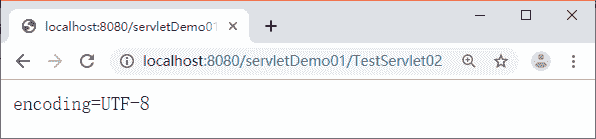
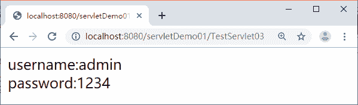
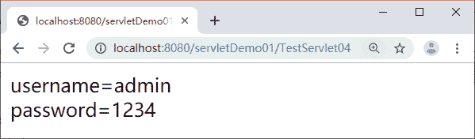

# ServletConfig 和 ServletContext 接口及其使用方法详解（附带实例）

> 原文：[`c.biancheng.net/view/3998.html`](http://c.biancheng.net/view/3998.html)

这一节我们学习 ServletConfig 和 ServletContext 两个接口。下面我们先介绍 ServletConfig 接口。

## ServletConfig 接口

在运行 Servlet 程序时，可能需要一些辅助信息，例如，文件使用的编码、使用 Servlet 程序的共享信息等，这些信息可以在 web.xml 文件中使用一个或多个 <init-param> 元素进行配置。当 Tomcat 初始化一个 Servlet 时，会将该 Servlet 的配置信息封装到 ServletConfig 对象中，此时可以通过调用 init（ServletConfig config）方法将 ServletConfig 对象传递给 Servlet。

ServletConfig 接口中定义了一系列获取配置信息的方法，如表 1 所示。

表 1 ServletConfig 接口的常用方法

| 方法说明 | 功能描述 |
| --- | --- |
| String getInitParameter(String name) | 根据初始化参数名返回对应的初始化参数值 |
| Enumeration getInitParameterNames() | 返回一个 Enumeration 对象，其中包含了所有的初始化参数名 |
| ServletContext getServletContext() | 返回一个代表当前 Web 应用的 ServletContext 对象 |
| String getServletName() | 返回 Servlet 的名字，即 web.xml 中 <servlet-name>元素的值 |

下面以 getInitParameter() 方法为例，分步骤讲解该方法的使用。

#### 1）创建 Servlet

在 com.mengma.servlet 包中创建一个名称为 TestServlet02 的 Servlet 类，并在类中编写用于读取 web.xml 文件中参数信息的代码，如下所示。

```

package com.mengma.servlet;

import java.io.IOException;
import java.io.PrintWriter;

import javax.servlet.ServletConfig;
import javax.servlet.ServletException;
import javax.servlet.http.HttpServlet;
import javax.servlet.http.HttpServletRequest;
import javax.servlet.http.HttpServletResponse;

public class TestServlet02 extends HttpServlet {

    protected void doGet(HttpServletRequest request,HttpServletResponse response) throws ServletException, IOException {
        PrintWriter out = response.getWriter();
        ServletConfig config = this.getServletConfig();
        String param = config.getInitParameter("encoding");
        out.println("encoding=" + param);
    }

    protected void doPost(HttpServletRequest request,HttpServletResponse response) throws ServletException, IOException {
        this.doGet(request, response);
    }

}
```

#### 2）配置参数信息

在 web.xml 文件中为 Servlet 配置一些参数信息，具体的配置代码如下所示：

```

<servlet>
  <servlet-name>TestServlet02</servlet-name>
  <servlet-class>com.mengma.servlet.TestServlet02</servlet-class>
  <init-param>
      <param-name>encoding</param-name>
      <param-value>UTF-8</param-value>
  </init-param>
</servlet>
<servlet-mapping>
  <servlet-name>TestServlet02</servlet-name>
  <url-pattern>/TestServlet02</url-pattern>
</servlet-mapping>
```

在上面的参数信息中，<init-param> 节点表示要设置的参数，该节点中的 <param-name> 表示参数的名称，<param-value> 表示参数的值，在 <init-param> 节点中为 TestServlet02 配置了一个名为 encoding 的参数，并设置其参数的值为 UTF-8。

#### 3）运行项目并查看结果

启动 Tomcat 服务器，在浏览器的地址栏中输入地址 http://localhost:8080/servletDemo01/TestServlet02 访问 TestServlet02，结果如图 1 所示。


图 1  运行结果
从图 1 中可以看出，web.xml 文件中为 TestServlet02 配置的编码信息被读取了出来。由此可见，通过 ServletConfig 对象可以获得 web.xml 文件中的参数信息。

## ServletContext 接口

当 Tomcat 启动时，Tomcat 会为每个 Web 应用创建一个唯一的 ServletContext 对象代表当前的 Web 应用，该对象封装了当前 Web 应用的所有信息。可以利用该对象获取 Web 应用程序的初始化信息、读取资源文件等。下面对 ServletContext 接口的不同作用分别进行讲解。

#### 1\. 获取 Web 应用程序的初始化参数

在 web.xml 文件中，不仅可以配置 Servlet 的映射信息，还可以配置整个 Web 应用的初始化信息。Web 应用初始化参数的配置方式具体如下所示：

```

<context-param>
    <param-name>XXX</param-name>
    <param-value>xxx</param-value>
</context-param>
<context-param>
    <param-name>AAA</param-name>
    <param-value>aaa</param-value>
</context-param>
```

在上面的示例中，<context-param> 元素位于根元素 <web-app> 中，它的子元素 <param-name> 和 <param-value> 分别用于指定参数的名字和参数值。要想获取这些参数名和参数值的信息，可以使用 ServletContext 接口中定义的 getInitParameterNames() 和 getInitParameter（String name）方法分别获取。

下面通过案例演示如何使用 ServletContext 接口获取 Web 应用程序的初始化参数。

1）在 servletDemo01 项目的 web.xml 文件中配置初始化参数信息和 Servlet 信息，其代码如下所示：

```

<context-param>
    <param-name>username</param-name>
    <param-value>admin</param-value>
</context-param>
<context-param>
    <param-name>password</param-name>
    <param-value>1234</param-value>
</context-param>
<servlet>
    <servlet-name>TestServlet03</servlet-name>
    <servlet-class>com.mengma.servlet.TestServlet03</servlet-class>
</servlet>
<servlet-mapping>
    <servlet-name>TestServlet03</servlet-name>
    <url-pattern>/TestServlet03</url-pattern>
</servlet-mapping>
```

2）在项目的 com.mengma.servlet 包中创建一个名称为 TestServlet03 的类，该类中使用 ServletContext 接口获取 web.xml 中的配置信息，如下所示。

```

package com.mengma.servlet;

import java.io.IOException;
import java.io.PrintWriter;
import java.util.Enumeration;

import javax.servlet.ServletContext;
import javax.servlet.ServletException;
import javax.servlet.http.HttpServlet;
import javax.servlet.http.HttpServletRequest;
import javax.servlet.http.HttpServletResponse;

public class TestServlet03 extends HttpServlet {

    public void doGet(HttpServletRequest request, HttpServletResponse response)
      throws ServletException, IOException {

        response.setContentType("text/html;charset=utf-8");
        PrintWriter out = response.getWriter();
        // 得到 ServletContext 对象
        ServletContext context = this.getServletContext();
        // 得到包含所有初始化参数名的 Enumeration 对象
        Enumeration<String> paramNames = context.getInitParameterNames();
        // 遍历所有的初始化参数名，得到相应的参数值并打印
        while (paramNames.hasMoreElements()) {
          String name = paramNames.nextElement();
          String value = context.getInitParameter(name);
          out.println(name + ":" + value);
          out.println("<br/>");
    }
}

    public void doPost(HttpServletRequest request, HttpServletResponse response)
      throws ServletException, IOException {
        this.doGet(request, response);
    }
}
```

上述代码中，当通过 this.getServletContext() 方法获取到 ServletContext 对象后，首先调用 getInitParameterNames() 方法，获取到包含所有初始化参数名的 Enumeration 对象，然后遍历 Enumeration 对象，根据获取到的参数名，通过 getInitParamter（String name）方法得到对应的参数值。

3）启动 Tomcat 服务器，在浏览器的地址栏中输入地址 http://localhost:8080/servletDemo01/TestServlet03 访问 TestServlet03，浏览器的显示结果如图 2 所示。


图 2  运行结果
从图 2 中可以看出，web.xml 文件中配置的信息被读取了出来。由此可见，通过 ServletContext 对象可以获取 Web 应用的初始化参数。

#### 2\. 读取 Web 应用下的资源文件

在实际开发中，有时会需要读取 Web 应用中的一些资源文件，如配置文件和日志文件等。为此，在 ServletContext 接口中定义了一些读取 Web 资源的方法，这些方法是依靠 Servlet 容器实现的。Servlet 容器根据资源文件相对于 Web 应用的路径，返回关联资源文件的 I/O 流或资源文件在系统的绝对路径等。

表 2 中列举了 ServletContext 接口中用于获取资源路径的相关方法。

表 2 ServletContext 接口的常用方法

| 方法说明 | 功能描述 |
| --- | --- |
| Set getResourcePaths(String path) |  返回一个 Set 集合，集合中包含资源目录中子目录和文件的路径名 称。参数 path 必须以正斜线（/）开始，指定匹配资源的部分路径 |
| String getRealPath(String path)  | 返回资源文件在服务器文件系统上的真实路径（文件的绝对路径）。参数 path 代表资源文件的虚拟路径，它应该以正斜线（/）开始，/ 表示当前 Web 应用的根目录，如果 Servlet 容器不能将虚拟路径转换为文 件系统的真实路径，则返回 null |
|  URL getResource(String path) | 返回映射到某个资源文件的 URL 对象。参数 path 必须以正斜线（/）开始，/ 表示当前 Web 应用的根目录 |
| InputStream getResourceAsStream(String path) | 返回映射到某个资源文件的 InputStream 输入流对象。参数 path 的传递规则和 getResource() 方法完全一致 |

了解了 ServletContext 接口中用于获得 Web 资源路径的方法后，下面通过案例分步骤演示如何使用 ServletContext 对象读取资源文件。

案例分步骤演示如何使用 ServletContext 对象读取资源文件。

1）在 servletDemo01 项目的 src 目录中创建一个名称为 itcast.properties 的文件，在创建好的文件中输入如下所示的配置信息：

username=admin
password=1234

2）在 com.mengma.servlet 包中创建一个名称为 TestServlet04 的 Servlet 类，使用该类读取 itcast.properties 资源文件的内容，其实现代码如下所示。

```

package com.mengma.servlet;

import java.io.IOException;
import java.io.InputStream;
import java.io.PrintWriter;
import java.util.Properties;

import javax.servlet.ServletContext;
import javax.servlet.ServletException;
import javax.servlet.http.HttpServlet;
import javax.servlet.http.HttpServletRequest;
import javax.servlet.http.HttpServletResponse;

public class TestServlet04 extends HttpServlet {

    public void doGet(HttpServletRequest request, HttpServletResponse response)
        throws ServletException, IOException {

        response.setContentType("text/html;charset=utf-8");
        ServletContext context = this.getServletContext();
        PrintWriter out = response.getWriter();
        // 获取相对路径中的输入流对象
        InputStream in = context
            .getResourceAsStream("/WEB-INF/classes/itcast.properties");
        Properties pros = new Properties();
        pros.load(in);
        out.println("username=" + pros.getProperty("username") + "<br/>");
        out.println("password=" + pros.getProperty("password") + "<br/>");
    }

    public void doPost(HttpServletRequest request, HttpServletResponse response)
      throws ServletException, IOException {

        this.doGet(request, response);
    }
}
```

在上述代码中，使用 ServletContext 的 getResourceAsStream（String path）方法获得了关联 itcast.properties 资源文件的输入流对象，其中的 path 参数必须以正斜线（/）开始，表示 itcast.properties 文件相对于 Web 应用的相对路径。

3）启动 Tomcat 服务器，在浏览器的地址栏中输入地址 http://localhost:8080/servletDemo01/TestServlet04 访问 TestServlet04，浏览器的显示结果如图 3 所示。


图 3  运行结果
从图 3 中可以看出，itcast.properties 资源文件中的内容已经被读取了出来。由此可见，使用 ServletContext 可以读取 Web 应用中的资源文件。