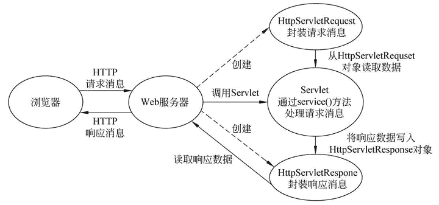

# servlet 处理用户请求的完整流程

> 原文：[`c.biancheng.net/view/4005.html`](http://c.biancheng.net/view/4005.html)

针对 Servlet 的每次请求，Web 服务器在调用 service() 方法之前，都会创建 HttpServletRequest 和 HttpServletResponse 对象。其中，HttpServletRequest 对象用于封装 HTTP 请求消息，简称 request 对象。HttpServletResponse 对象用于封装 HTTP 响应消息，简称 response 对象。浏览器访问 Servlet 的交互过程如图 1 所示。
图 1  浏览器访问 Servlet 过程
在图 1 中，首先浏览器向 Web 服务器发送了一个 HTTP 请求，Web 服务器根据收到的请求，会先创建一个 HttpServletRequest 和 HttpServletResponse 对象，然后再调用相应的 Servlet 程序。

在 Servlet 程序运行时，它首先会从 HttpServletRequest 对象中读取数据信息，然后通过 service() 方法处理请求消息，并将处理后的响应数据写入到 HttpServletResponse 对象中。最后，Web 服务器会从 HttpServletResponse 对象中读取到响应数据，并发送给浏览器。

需要注意的是，在 Web 服务器运行阶段，每个 Servlet 都只会创建一个实例对象，针对每次 HTTP 请求，Web 服务器都会调用所请求 Servlet 实例的 service（HttpServletRequest request，HttpServletResponse response）方法，并重新创建一个 request 对象和一个 response 对象。