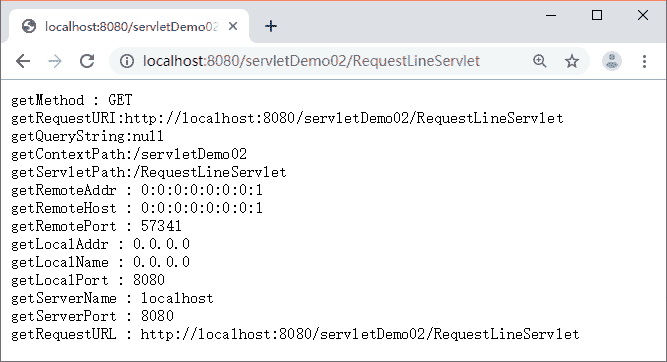
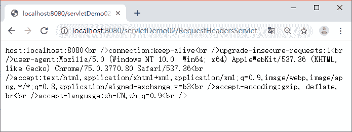

# HttpServletRequest 详解：获取 HTTP 请求消息

> 原文：[`c.biancheng.net/view/4008.html`](http://c.biancheng.net/view/4008.html)

HttpServletRequest 接口继承自 ServletRequest 接口，其主要作用是封装 HTTP 请求消息。由于 HTTP 请求消息分为请求行、请求消息头和请求消息体三部分。因此，在 HttpServletRequest 接口中定义了获取请求行、请求头和请求消息体的相关方法。

本节将针对常用的获取请求行和请求消息头的相关方法进行讲解，下节《Java servlet 获取 form 表单数据（参数）》继续讲解如何通过 HttpServletRequest 接口获取用户提交的 form 表单数据。

## 获取请求行信息的相关方法

当访问 Servlet 时，所有请求消息将被封装到 HttpServletRequest 对象中，请求消息的请求行中包含请求方法、请求资源名、请求路径等信息，为了获取这些信息，HttpServletRequest 接口定义了一系列方法，如表 1 所示。

表 1 获取请求行信息的常用方法

| 方法声明 | 功能描述 |
| --- | --- |
| String getMethod() | 该方法用于获取 HTTP 请求消息中的请求方式（如 GET、POST 等） |
| String getRequestURI() | 该方法用于获取请求行中的资源名称部分即位于 URL 的主机和端门之后、参数部分之前的部分 |
| String getQueryString() | 该方法用于获取请求行中的参数部分，也就是资源路径后问号（？）以后的所有内容 |
| String getContextPath() | 该方法用于获取请求 URL 中属于 Web 应用程序的路径，这个路径以 / 开头，表示相对于整个 Web 站点的根目录，路径结尾不含 /。如果请求 URL 属于 Web 站点的根目录，那么返回结果为空字符串（""） |
| String getServletPath() | 该方法用于获取 Servlet 的名称或 Servlet 所映射的路径 |
| String getRemoteAddr() | 该方法用于获取请求客户端的 IP 地址，其格式类似于 192.168.0.3 |
| String getRemoteHost() | 该方法用于获取请求客户端的完整主机名，其格式类似于 pcl.mengma.com。需要注意的是，如果无法解析出客户机的完整主机名，那么该方法将会返回客户端的 IP 地址 |
| int getRemotePort() | 该方法用于获取请求客户端网络连接的端口号 |
| String getLocaIAddr() | 该方法用于获取 Web 服务器上接收当前请求网络连接的 IP 地址 |
| String getLocalName() |  该方法用于获取 Web 服务器上接收当前网络连接 IP 所对应的主机名 |
| int getLocalPort() | 该方法用于获取 Web 服务器上接收当前网络连接的端口号 |
| String getServerName() | 该方法用于获取当前请求所指向的主机名，即 HTTP 请求消息中 Host 头字段所对应的主机名部分 |
| int gctServcrPort() | 该方法用于获取当前请求所连接的服务器端口号，即 HTTP 请求消息中 Host 头字段所对应的端口号部分 |
| StringBuffcr getRequestURL() | 该方法用于获取客户端发出请求时的完整 URL，包括协议、服务器名、端口号、 资源路径等信息，但不包括后面的査询参数部分。注意，getRequcstURL() 方法返冋的结果是 StringBuffer 类型，而不是 String 类型，这样更便于对结果进行修改 |

表 1 列出了一系列用于获取请求消息行信息的方法，为了使读者更好地理解这些方法，下面通过案例演示这些方法的使用。

在 MyEclipse 中创建一个名称为 servletDemo02 的项目，在 src 下新建一个名称为 com.mengma.request 的包，在包中创建一个名为 RequestLineServlet 的 Servlet 类，在该类中编写用于获取请求行中相关信息的方法，如下所示。

```

package com.mengma.request;

import java.io.*;
import javax.servlet.*;
import javax.servlet.http.*;

public class RequestLineServlet extends HttpServlet {

    public void doGet(HttpServletRequest request,HttpServletResponse response) throws ServletException, IOException {
        PrintWriter out = response.getWriter();

        // 获取请求行的相关信息
        out.println("getMethod : " + request.getMethod());
        out.println("getRequestURI:" + request.getRequestURL());
        out.println("getQueryString:" + request.getQueryString());
        out.println("getContextPath:" + request.getContextPath());
        out.println("getServletPath:" + request.getServletPath());
        out.println("getRemoteAddr : " + request.getRemoteAddr());
        out.println("getRemoteHost : " + request.getRemoteHost());
        out.println("getRemotePort : " + request.getRemotePort());
        out.println("getLocalAddr : " + request.getLocalAddr());
        out.println("getLocalName : " + request.getLocalName());
        out.println("getLocalPort : " + request.getLocalPort());
        out.println("getServerName : " + request.getServerName());
        out.println("getServerPort : " + request.getServerPort());
        out.println("getRequestURL : " + request.getRequestURL());
    }
    public void doPost(HttpServletRequest request, HttpServletResponse response)
        throws ServletException, IOException {
      doGet(request, response);
    }
}
```

启动 Tomcat 服务器，在浏览器的地址栏中输入地址 http://localhost:8080/servletDemo02/RequestLineServlet 访问 RequestLineServlet，浏览器的显示结果如图 1 所示。

从图 1 中可以看出，浏览器显示出了请求 RequestLineServlet 时发送的请求行信息。由此可见，通过 HttpServletRequest 对象可以很方便地获取请求行的相关信息。


图 1  运行结果

## 获取请求消息头的相关方法

当浏览器发送 Servlet 请求时，需要通过请求消息头向服务器传递附加信息，例如，客户端可以接收的数据类型、压缩方式、语言等。为此，在 HttpServletRequest 接口中定义了一系列用于获取 HTTP 请求头字段的方法，如表 2 所示。

表 2 获取请求消息头的方法

| 方法声明 | 功能描述 |
| --- | --- |
| String getHeader(String name) | 该方法用于获取一个指定头字段的值，如果请求消息中没有包含指定的头字段，则 getHeader() 方法返回 null；如果请求消息中包含多个指定名称的头字段，则 getHeader() 方法返回其中第一个头字段的值 |
| Enumeration getHeaders(String name) |  该方法返回一个 Enumeration 集合对象，该集合对象由请求消息中出现的某个指定名称的所有头字段值组成。在多数情况下，一个头字段名在请求消息中只出现一次，但有时可能会出现多次 |
| Enumeration getHeaderNames() | 该方法用于获取一个包含所有请求头字段的 Enumeration 对象 |
| int getIntHeader(String name) | 该方法用于获取指定名称的头字段，并且将其值转为 int 类型。需要注意的是，如果指定名称的头字段不存在，则返回值为 -1；如果获取到的头字段的值不能转为 int 类型，则将发生 NumberFormatException 异常 |
| long getDateHeader(String name) | 该方法用于获取指定头字段的值，并将其按 GMT 时间格式转换为一个代表日期/时间的长整数，该长整数是自 1970 年 1 月 1 日 0 时 0 分 0 秒算起的以毫秒为单位的时间值 |
| String getContentType() | 该方法用于获取 Content-Type 头字段的值，结果为 String 类型 |
| int getContentLength() | 该方法用于获取 Content-Length 头字段的值，结果为 int 类型 |
| String getCharacterEncoding() | 该方法用于返回请求消息的实体部分的字符集编码，通常是从 Content-Type 头字段中进行提取，结果为 String 类型 |

表 2 列出了一系列用于读取 HTTP 请求消息头字段的方法，为了更好地掌握这些方法，下面通过案例学习这些方法的使用。

在 com.mengma.request 包中创建一个名为 RequestHeadersServlet 的 Servlet 类，该类中使用 getHeaderNames() 方法获取请求消息头信息，如下所示。

```

package com.mengma.request;

import java.io.IOException;
import java.io.PrintWriter;
import java.util.Enumeration;
import javax.servlet.*;
import javax.servlet.http.*;

public class RequestHeadersServlet extends HttpServlet {

    public void doGet(HttpServletRequest request, HttpServletResponse response)
        throws ServletException, IOException {
        PrintWriter out = response.getWriter();
        // 获取请求消息中的所有头字段
        Enumeration headerNames = request.getHeaderNames();
        //用循环遍历所有请求头，并通过 getHeader() 方法获取一个指定名称的头字段
        while (headerNames.hasMoreElements()) {
            String headerName = (String) headerNames.nextElement();
            out.print(headerName + ":" + request.getHeader(headerName)
     + "<br />");
        }
    }

    public void doPost(HttpServletRequest request, HttpServletResponse response)
            throws ServletException, IOException {
        doGet(request, response);
    }
}
```

启动 Tomcat 服务器，在浏览器的地址栏中输入 http://localhost:8080/servletDemo02/RequestHeadersServlet 访问 RequestHeadersServlet，浏览器的显示结果如图 2 所示。


图 2  运行结果
下节内容：Java servlet 获取 form 表单数据（参数）