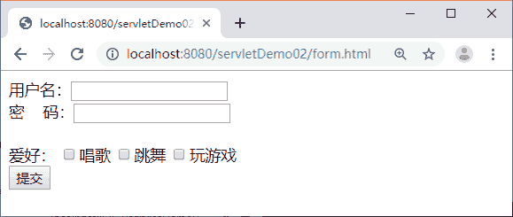
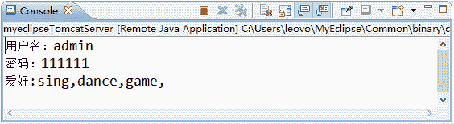

# Java servlet 获取 form 表单数据（参数）

> 原文：[`c.biancheng.net/view/4010.html`](http://c.biancheng.net/view/4010.html)

本节主要讲在 Servlet 中如何使用 HttpServletRequest 获取请求参数和 request 对象传递数据有哪些方法。

## 获取请求参数

在实际开发中，经常需要获取用户提交的表单数据，例如用户名和密码等，为了方便获取表单中的请求参数，在 HttpServletRequest 接口的父类 ServletRequest 中定义了一系列获取请求参数的方法，如表 1 所示。

| 方法声明 | 功能描述 |
| --- | --- |
| String getParameter(String name) | 该方法用于获取某个指定名称的参数值。 如果请求消息中没有包含指定名称的参数，则 getParameter() 方法返回 null。
如果指定名称的参数存在但没有设置值，则返回一个空串。
如果请求消息中包含多个该指定名称的参数，则 getParameter() 方法返回第一个出现的参数值。 |
|  String [] getParameterValues (String name) | HTTP 请求消息中可以有多个相同名称的参数（通常由一个包含多个同名的字段元素的 form 表单生成），如果要获得 HTTP 请求消息中的同一个参数名所对应的所有参数值，那么就应该使用 getParameterValues() 方法，该方法用于返回一个 String 类型的数组。 |
| Enumeration getParameterNames() | 方法用于返回一个包含请求消息中所有参数名的 Enumeration 对象，在此基础上，可以对请求消息中的所有参数进行遍历处理。 |
| Map getParameterMap() | getParameterMap() 方法用于将请求消息中的所有参数名和值装入一个 Map 对象中返回。 |

在表 1 中，getParameter() 方法用于获取某个指定的参数，而 getParameterValues() 方法用于获取多个同名的参数。下面通过具体的案例讲解这两个方法的使用：

在 servletDemo02 项目的 WebContent 根目录下创建一个表单文件 form.html，编辑后如下所示。

```

<!DOCTYPE HTML>
<html>
<head>
<meta charset="UTF-8">
<title>Insert title here</title>
</head>
<body>
    <form action="/servletDemo02/RequestsParamServlet" method="POST">
        用户名：<input type="text" name="username"><br/>
        密&nbsp;&nbsp;&nbsp;&nbsp;码：<input type="password" name="password"/><br/>
        <br/>
        爱好：
        <input type="checkbox" name="hobby" value="sing"/>唱歌
        <input type="checkbox" name="hobby" value="dance"/>跳舞
        <input type="checkbox" name="hobby" value="game"/>玩游戏
        <input type="submit" value="提交"/>
    </form>
</body>
</html>
```

在 com.mengma.request 包中编写一个名称为 RequestParamsServlet 的 Servlet 类，使用该 Servlet 获取请求参数，如下所示。

```

package com.mengma.servlet;

import java.io.IOException;
import java.io.PrintWriter;

import javax.servlet.ServletException;
import javax.servlet.http.HttpServlet;
import javax.servlet.http.HttpServletRequest;
import javax.servlet.http.HttpServletResponse;

public class RequestParamsServlet extends HttpServlet {

    public void doGet(HttpServletRequest request, HttpServletResponse response)throws ServletException, IOException {
        String name = request.getParameter("username");
        String password = request.getParameter("password");
        System.out.println("用户名" + name);
        System.out.println("密码" + password);
        // 获取参数名为"hobby"的值
        String[] hobbys = request.getParameterValues("hobby");
        System.out.println("爱好:");
        for (int i = 0; i < hobbys.length; i++) {
            System.out.println(hobbys[i] + ",");
        }

    }

    public void doPost(HttpServletRequest request, HttpServletResponse response)
            throws ServletException, IOException {
        doGet(request, response);
    }
}
```

在 html 中，由于参数名为 hobby 的值可能有多个，因此，需要使用 getParameterValues() 方法获取多个同名参数的值，返回一个 String 类型的数组，通过遍历数组，输出每个 hobby 参数对应的值。

启动 Tomcat 服务器，在浏览器的地址栏中输入地址 http://localhost:8080/servletDemo02/form.html 访问 form.html 页面，并填写表单的相关信息，填写后的页面如图 1 所示。


图 1  运行结果
单击图 1 中的提交按钮，在 MyEclipse 的控制台输出了每个参数的信息，如图 2 所示。


图 2  运行结果

## 通过 Request 对象传递数据

Request 对象不仅可以获取一系列数据，还可以通过属性传递数据。ServletRequest 接口中定义了一系列操作属性的方法。

#### 1）setAttribute() 方法

该方法用于将一个对象与一个名称关联后存储到 ServletRequest 对象中，其完整语法定义如下：

public void setAttribute(java.lang.String name,java.lang.Object o);

需要注意的是，如果 ServletRequest 对象中已经存在指定名称的属性，则 setAttribute() 方法将会先删除原来的属性，然后再添加新的属性。如果传递给 setAttribute() 方法的属性值对象为 null，则删除指定名称的属性，这时的效果等同于 removeAttribute() 方法。

#### 2）getAttribute() 方法

该方法用于从 ServletRequest 对象中返回指定名称的属性对象，其完整的语法定义如下：

public java.lang.Object getAttribute(java.lang.String name);

#### 3）removeAttribute() 方法

该方法用于从 ServletRequest 对象中删除指定名称的属性，其完整的语法定义如下：

public void removeAttribute(java.lang.String name);

#### 4）getAttributeNames() 方法

该方法用于返回一个包含 ServletRequest 对象中的所有属性名的 Enumeration 对象，在此基础上，可以对 ServletRequest 对象中的所有属性进行遍历处理。getAttributeNames() 方法的完整语法定义如下：

public java.util.Enumeration getAttributeNames();

需要注意的是，只有属于同一个请求中的数据才可以通过 ServletRequest 对象传递数据。关于 ServletRequest 对象操作属性的具体用法，教程将在后续章节进行详细讲解，在此读者只需了解即可。